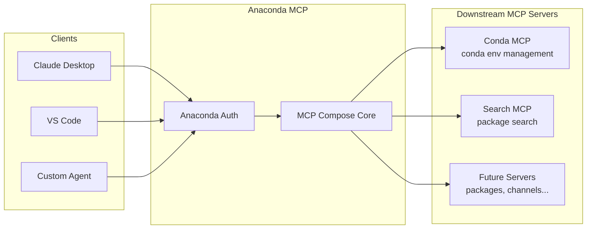
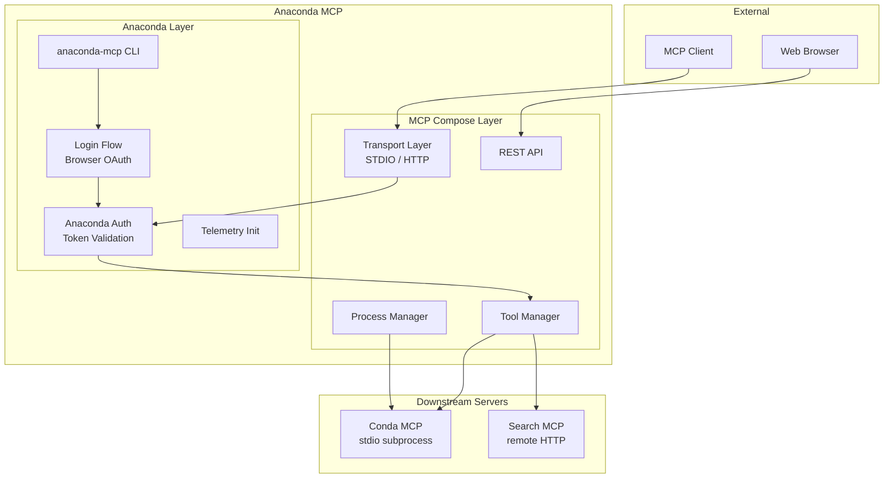
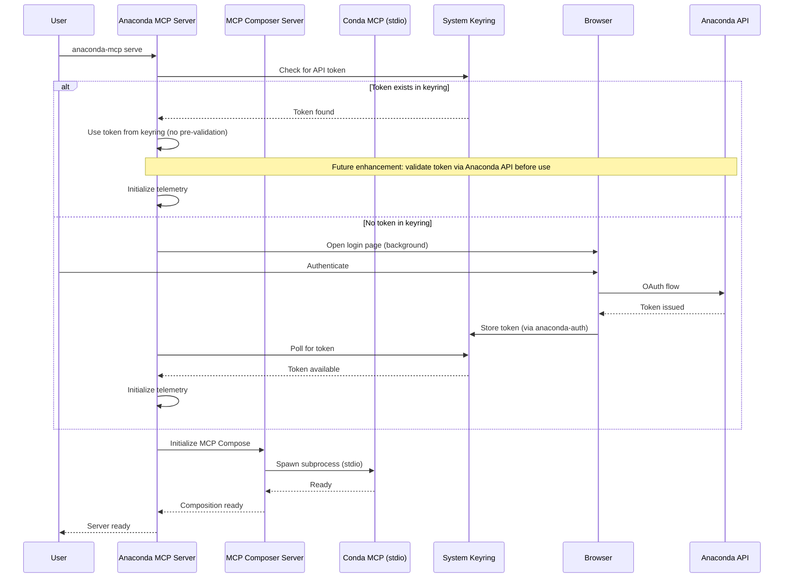
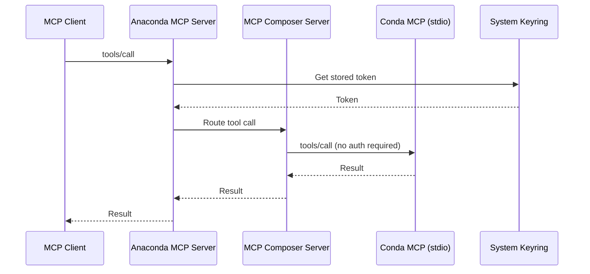
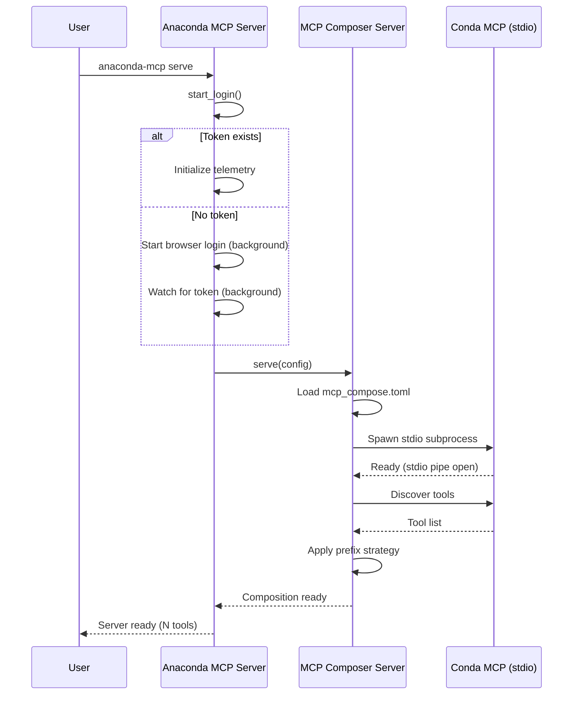

# Anaconda MCP Architecture

Anaconda MCP is a unified gateway for Anaconda-related AI tools, built on top of [MCP Compose](https://mcp-compose.datalayer.tech). It aggregates multiple downstream MCP servers into a single authenticated endpoint that MCP clients can connect to. Conda environment management is provided by a vendored `anaconda_mcp.conda_mcp_lite` module composed over stdio.

For the complete MCP Compose architecture reference, see the [MCP Compose Architecture Documentation](https://mcp-compose.datalayer.tech/architecture/).

## High-Level Overview

Anaconda MCP sits between MCP clients (Claude Desktop, VS Code, custom agents) and specialized Anaconda MCP servers, providing a single entry point with optional Anaconda authentication.



This architecture enables:
- **Single endpoint**: Clients connect once to access all Anaconda-related tools
- **Unified authentication**: Anaconda tokens validated at the gateway level
- **Extensibility**: New MCP servers can be added without client changes
- **Tool aggregation**: All tools from downstream servers appear in a single unified list

---

## Responsibilities

Anaconda MCP has clearly defined responsibilities that complement the underlying MCP Compose framework:

### Anaconda MCP Layer

| Responsibility | Description |
|----------------|-------------|
| **Anaconda Authentication** | Validates Anaconda bearer tokens against the Anaconda API |
| **Login Flow** | Provides non-blocking browser-based login via `anaconda-auth` |
| **Default Configuration** | Ships with pre-configured downstream servers for Anaconda tools |
| **CLI Wrapper** | Exposes `anaconda-mcp serve` command with sensible defaults |
| **Telemetry Integration** | Initializes Anaconda telemetry when authenticated |

### MCP Compose Layer (inherited)

| Responsibility | Description |
|----------------|-------------|
| **Server Composition** | Aggregates tools from multiple MCP servers |
| **Conflict Resolution** | Handles tool name collisions with prefixing |
| **Transport Management** | STDIO and Streamable HTTP client connections |
| **Process Management** | Lifecycle control for downstream STDIO servers |
| **REST API & Web UI** | Management interfaces for operations |

---

## Component Architecture



The **Anaconda Layer** handles authentication and provides CLI commands, while the **MCP Compose Layer** handles the core composition logic. Authentication is performed at the gateway—downstream servers don't need their own auth.

---

## Downstream MCP Servers

### Conda MCP (vendored, stdio)

The primary downstream server, providing tools for conda environment management. It runs as a vendored module (`anaconda_mcp.conda_mcp_lite`) composed over stdio — no local TCP port is bound in the default install.


The conda sub-server is invoked as `python -m anaconda_mcp.conda_mcp_lite` and communicates over stdin/stdout. It discovers the user's conda executable at startup — see [Conda Executable Discovery](#conda-executable-discovery) below.

### Search MCP (remote HTTP)

A remote Anaconda package search server proxied over Streamable HTTP. Tools are exposed under the `search_` prefix.

### Future Servers

The architecture supports adding additional MCP servers:

| Server | Purpose | Status |
|--------|---------|--------|
| **Conda MCP** | Conda environment management | ✅ Available (vendored stdio) |
| **Search MCP** | Package search | ✅ Available |
| **Jupyter MCP** | Notebook operations | 🔄 Planned |
| **Packages MCP** | Package info | 🔄 Planned |

---

## Authentication Flow

Anaconda MCP handles authentication at startup, not per-request. The server initiates the authentication flow and stores credentials securely in the system keyring using the `anaconda-auth` library.

### Browser-Based Login Flow

When Anaconda MCP starts, it checks for an existing API token in the system keyring (managed by `anaconda-auth`). If no token is found, it initiates a browser-based OAuth login flow. The user authenticates via the Anaconda website, and the token is securely stored in the keyring for subsequent requests.



Once authenticated, the token is persisted in the system keyring. Subsequent server starts will retrieve the stored token without requiring re-authentication. Users can also manually authenticate using `anaconda auth login` before starting the server.

### Token Retrieval for Requests

After startup, Anaconda MCP retrieves the token from the system keyring as needed for external API calls.



Note: Downstream MCP servers don't require authentication — they're accessed only through the Anaconda MCP gateway which has already authenticated the user at startup.

---

## Startup Sequence

When `anaconda-mcp serve` is executed:



Key points:
1. Login is **non-blocking** — the server starts regardless of auth state
2. The conda sub-server is spawned as a stdio subprocess (no TCP port bound)
3. Tool discovery happens after subprocess initialization
4. The prefix strategy is applied to avoid tool name collisions

---

## Configuration

Anaconda MCP uses the standard MCP Compose configuration format. The default configuration lives at `src/anaconda_mcp/mcp_compose.toml`:

```toml
[composer]
name = "anaconda-mcp"
conflict_resolution = "prefix"
# port applies only when streamable-http transport is enabled (opt-in)

[authentication]
enabled = false
providers = ["anaconda"]
default_provider = "anaconda"

[authentication.anaconda]
domain = "anaconda.com"

[[servers.proxied.stdio]]
name = "conda"
command = ["python", "-m", "anaconda_mcp.conda_mcp_lite"]
restart_policy = "on-failure"
max_restarts = 3
```

The conda sub-server is a vendored module — no separate package install or local port is required. For full configuration options, see the [Configuration Guide](./CONFIGURATION_GUIDE.md) and [MCP Compose Configuration](https://mcp-compose.datalayer.tech/configuration/).

---

## Conda Executable Discovery

The conda sub-server (`anaconda_mcp.conda_mcp_lite`) locates the user's conda executable at startup using a multi-step strategy that handles GUI-launched clients where the shell environment isn't inherited:

1. **`CONDA_EXE` env var** — set automatically by `conda activate`; most reliable when the client inherits a shell environment.
2. **`_CONDA_ROOT/bin/conda`** — set by the conda shell hook.
3. **`shutil.which("conda")`** — condabin on `PATH`.
4. **Platform-specific fallback:**
   - *Unix:* spawns `$SHELL -i -c 'echo <marker>$CONDA_EXE<marker>'` to source `.bashrc`/`.zshrc` and extract the value conda init injected there.
   - *Windows:* reads the `HKCU\Software\Microsoft\Command Processor` AutoRun key for the conda hook path, then falls back to the installer's Uninstall registry entry.

If discovery fails, the server logs a clear error to stderr and exits with a non-zero code. No stdout is written, so the stdio JSON-RPC stream stays clean.

### Setting `CONDA_EXE` for GUI clients

GUI clients (Claude Desktop, Cursor, VS Code) launch processes without an interactive shell, so conda's shell hook never runs and `CONDA_EXE` is not set. The shell probe (step 4) handles most cases, but the most reliable fix is to set `CONDA_EXE` explicitly in the client's `env` block:

```json
{
  "mcpServers": {
    "anaconda-mcp": {
      "command": "/path/to/anaconda-mcp/env/bin/python",
      "args": ["-m", "anaconda_mcp", "serve"],
      "env": {
        "CONDA_EXE": "/path/to/conda"
      }
    }
  }
}
```

On Windows, point to `conda.exe` in the `Scripts\` directory:

```json
"env": {
  "CONDA_EXE": "C:\\Users\\me\\miniconda3\\Scripts\\conda.exe"
}
```

---

## Extensibility

The `anaconda-mcp serve` command supports additional STDIO and Streamable HTTP transports (see details in the [CONFIGURATION_GUIDE](./CONFIGURATION_GUIDE.md)) and can auto-start them if configured.


### Adding a New Downstream Server

To add a new MCP server (e.g., Jupyter MCP):

1. Add the server configuration to `mcp_compose.toml`:

```toml
[[servers.proxied.streamable-http]]
name = "jupyter"
url = "http://localhost:8888/mcp"
auto_start = false  # Started separately
timeout = 30
```

2. The server's tools will automatically appear with the configured prefix (e.g., `jupyter_create_notebook`)

3. No changes to client code required—tools are discovered dynamically

### Creating Custom Downstream Servers

Custom MCP servers can be integrated if they support:
- **STDIO transport**: Run as subprocess, communicate via stdin/stdout
- **Streamable HTTP transport**: Run as HTTP server, expose `/mcp` endpoint

---

## Further Reading

- [MCP Compose Architecture](https://mcp-compose.datalayer.tech/architecture/) — Full architecture reference
- [MCP Compose Configuration](https://mcp-compose.datalayer.tech/configuration/) — Configuration options
- [Anaconda MCP Configuration Guide](./CONFIGURATION_GUIDE.md) — Quick configuration reference
