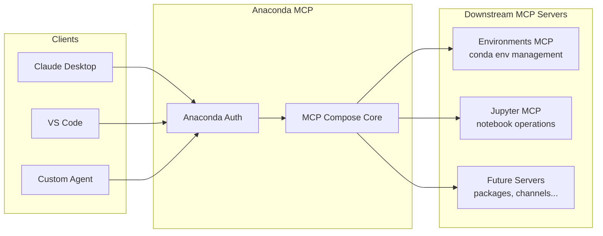
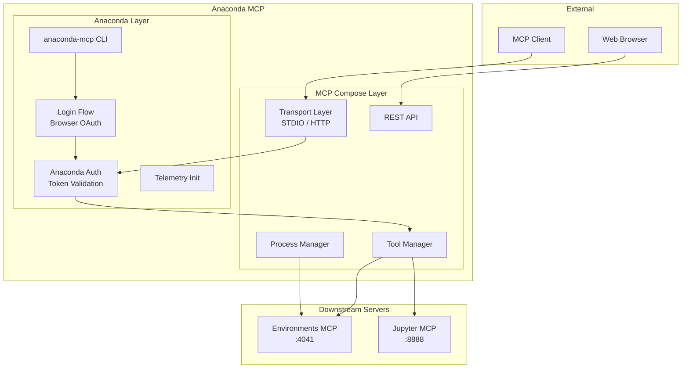
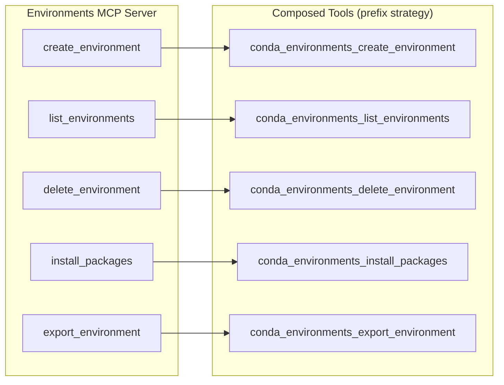
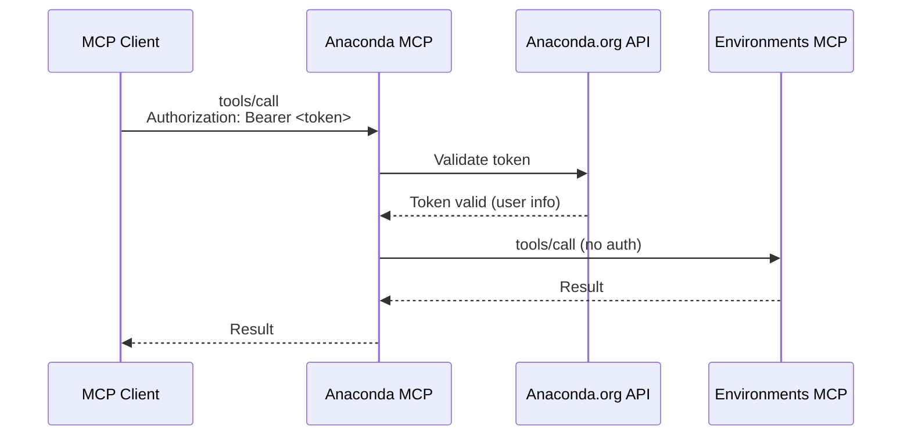
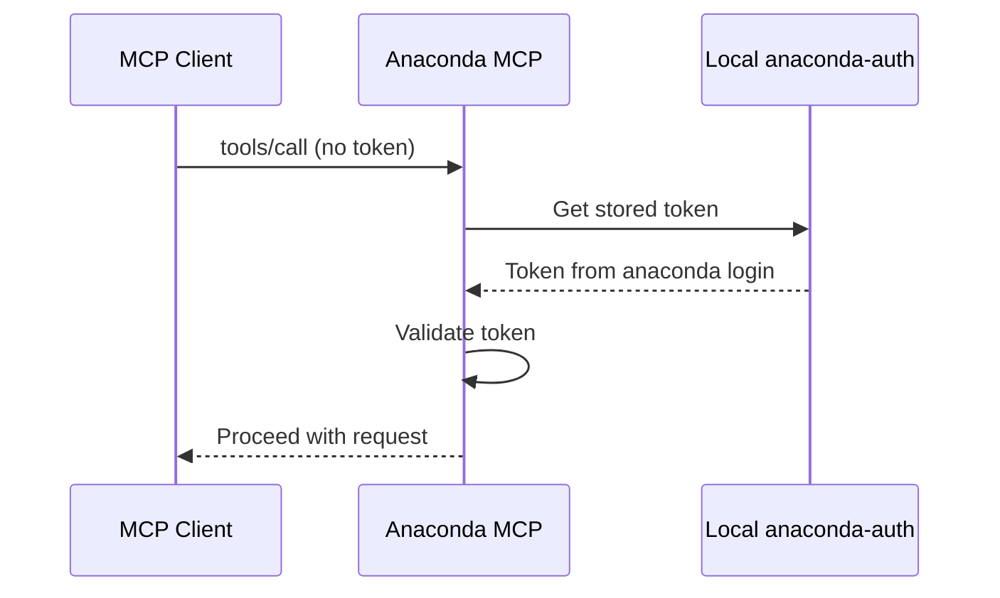
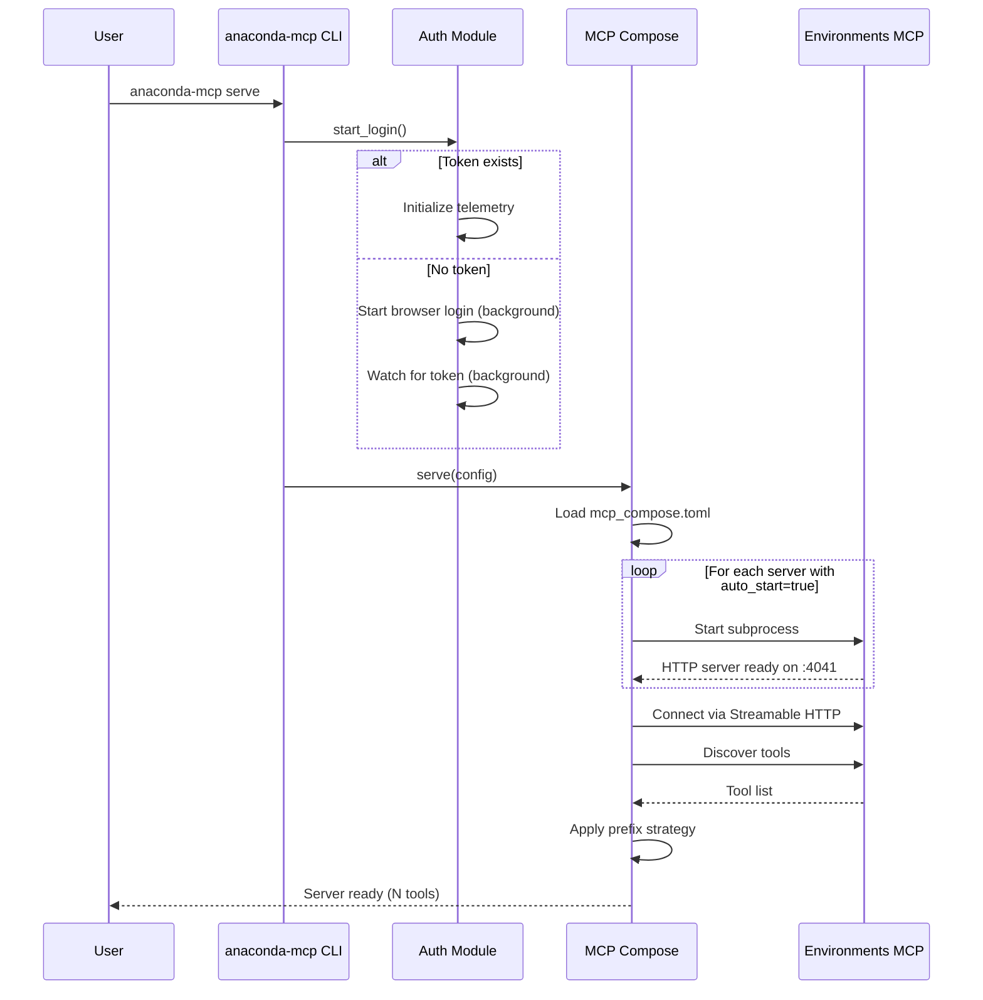

# Anaconda MCP Architecture

Anaconda MCP is a unified gateway for Anaconda-related AI tools, built on top of [MCP Compose](https://mcp-compose.datalayer.tech). It aggregates multiple downstream MCP servers—such as the Environments MCP server for conda environment management—into a single authenticated endpoint that MCP clients can connect to.

For the complete MCP Compose architecture reference, see the [MCP Compose Architecture Documentation](https://mcp-compose.datalayer.tech/architecture/).

## High-Level Overview

Anaconda MCP sits between MCP clients (Claude Desktop, VS Code, custom agents) and specialized Anaconda MCP servers, providing a single entry point with optional Anaconda authentication.



This architecture enables:
- **Single endpoint**: Clients connect once to access all Anaconda-related tools
- **Unified authentication**: Anaconda tokens validated at the gateway level
- **Extensibility**: New MCP servers can be added without client changes
- **Tool aggregation**: All tools from downstream servers appear in a single unified list

---

## Responsibilities

Anaconda MCP has clearly defined responsibilities that complement the underlying MCP Compose framework:

### Anaconda MCP Layer

| Responsibility | Description |
|----------------|-------------|
| **Anaconda Authentication** | Validates Anaconda bearer tokens against the Anaconda.org API |
| **Login Flow** | Provides non-blocking browser-based login via `anaconda-auth` |
| **Default Configuration** | Ships with pre-configured downstream servers for Anaconda tools |
| **CLI Wrapper** | Exposes `anaconda-mcp serve` command with sensible defaults |
| **Telemetry Integration** | Initializes Anaconda telemetry when authenticated |

### MCP Compose Layer (inherited)

| Responsibility | Description |
|----------------|-------------|
| **Server Composition** | Aggregates tools from multiple MCP servers |
| **Conflict Resolution** | Handles tool name collisions with prefixing |
| **Transport Management** | STDIO and Streamable HTTP client connections |
| **Process Management** | Lifecycle control for downstream STDIO servers |
| **REST API & Web UI** | Management interfaces for operations |

---

## Component Architecture



The **Anaconda Layer** handles authentication and provides CLI commands, while the **MCP Compose Layer** handles the core composition logic. Authentication is performed at the gateway—downstream servers don't need their own auth.

---

## Downstream MCP Servers

### Environments MCP Server

The primary downstream server, providing tools for conda environment management:



The Environments MCP server runs as a standalone HTTP service on port 4041. Anaconda MCP connects to it via Streamable HTTP transport and auto-starts it if configured.

### Future Servers

The architecture supports adding additional MCP servers:

| Server | Purpose | Status |
|--------|---------|--------|
| **Environments MCP** | Conda environment management | ✅ Available |
| **Jupyter MCP** | Notebook operations | 🔄 Planned |
| **Packages MCP** | Package search and info | 🔄 Planned |
| **Channels MCP** | Channel management | 🔄 Planned |

---

## Authentication Flow

Anaconda MCP supports two authentication modes:

### Bearer Token Authentication

Clients provide an Anaconda API token in the Authorization header. The token is validated against the Anaconda.org API.



### Fallback Mode (Local Development)

For local development, set `MCP_COMPOSE_ANACONDA_TOKEN="fallback"` to use locally stored credentials from `anaconda login`.



---

## Startup Sequence

When `anaconda-mcp serve` is executed:



Key points:
1. Login is **non-blocking**—the server starts regardless of auth state
2. Downstream servers with `auto_start=true` are spawned automatically
3. Tool discovery happens after subprocess initialization
4. The prefix strategy is applied to avoid tool name collisions

---

## Configuration

Anaconda MCP uses the standard MCP Compose configuration format. The default configuration lives at `src/anaconda_mcp/mcp_compose.toml`:

```toml
[composer]
name = "anaconda-mcp"
conflict_resolution = "prefix"
port = 8888

[authentication]
enabled = false  # Enable for production
providers = ["anaconda"]
default_provider = "anaconda"

[authentication.anaconda]
domain = "anaconda.com"

[[servers.proxied.streamable-http]]
name = "conda_environments"
url = "http://localhost:4041/mcp"
auto_start = true
command = ["environments-mcp-server", "start", "--transport", "streamable-http"]
startup_delay = 3
```

For full configuration options, see the [Configuration Guide](./CONFIGURATION_GUIDE.md) and [MCP Compose Configuration](https://mcp-compose.datalayer.tech/configuration/).

---

## Extensibility

### Adding a New Downstream Server

To add a new MCP server (e.g., Jupyter MCP):

1. Add the server configuration to `mcp_compose.toml`:

```toml
[[servers.proxied.streamable-http]]
name = "jupyter"
url = "http://localhost:8888/mcp"
auto_start = false  # Started separately
timeout = 30
```

2. The server's tools will automatically appear with the configured prefix (e.g., `jupyter_create_notebook`)

3. No changes to client code required—tools are discovered dynamically

### Creating Custom Downstream Servers

Custom MCP servers can be integrated if they support:
- **STDIO transport**: Run as subprocess, communicate via stdin/stdout
- **Streamable HTTP transport**: Run as HTTP server, expose `/mcp` endpoint

---

## Further Reading

- [MCP Compose Architecture](https://mcp-compose.datalayer.tech/architecture/) — Full architecture reference
- [MCP Compose Configuration](https://mcp-compose.datalayer.tech/configuration/) — Configuration options
- [Anaconda MCP Configuration Guide](./CONFIGURATION_GUIDE.md) — Quick configuration reference
