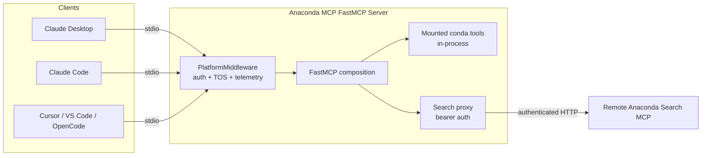
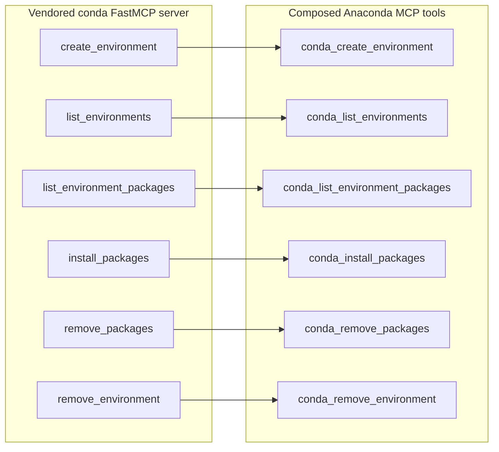
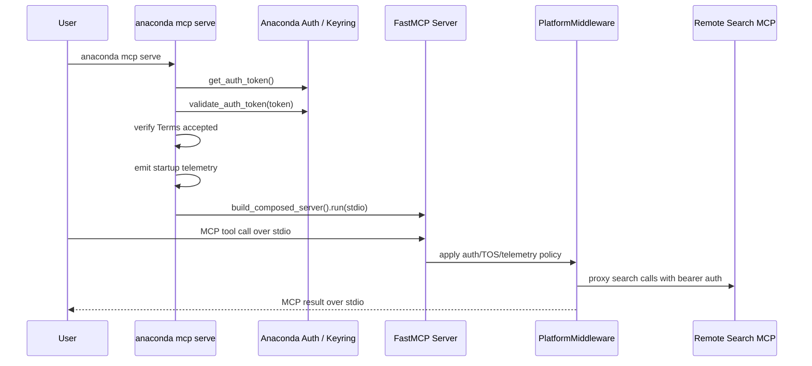
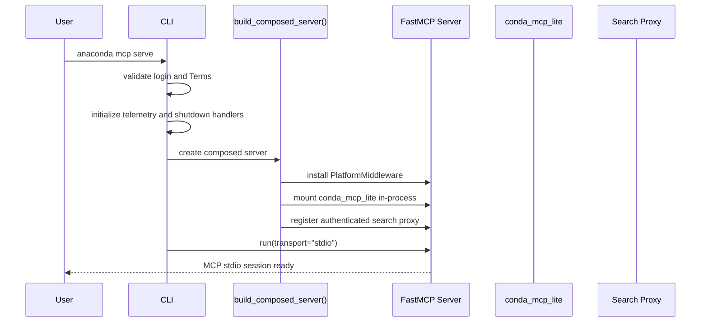

# Anaconda MCP Architecture

Anaconda MCP is a stdio MCP server for Anaconda-related AI tools. The `anaconda mcp serve` command builds one native FastMCP server in-process, mounts the vendored conda tools, proxies the remote package-search server with Anaconda bearer authentication, and applies one platform middleware layer for authentication, Terms of Service enforcement, and telemetry.

`serve` is stdio-only. It does not bind a local port, expose a separate HTTP endpoint, or load a composition TOML file. The `compose` and `discover` CLI subcommands still exist for dependency discovery and composition workflows, but they are separate from the runtime path used by `serve`.

## High-Level Overview



This architecture provides:

- **One stdio server**: MCP clients launch `anaconda mcp serve` directly.
- **In-process conda tools**: the vendored `anaconda_mcp.conda_mcp_lite` FastMCP server is mounted into the composed server rather than spawned through a generated config.
- **Remote search proxying**: package-search tools are proxied to Anaconda's hosted search MCP using the user's bearer token.
- **Shared platform policy**: `PlatformMiddleware` enforces authentication, Terms of Service acceptance, and telemetry for tool calls.
- **No local listener**: `serve` does not open a TCP port or require a separately managed server process.

---

## Runtime Components

| Component | Responsibility |
|-----------|----------------|
| `anaconda_mcp.cli.serve` | Validates login state, emits startup telemetry, installs shutdown handlers, and runs the composed FastMCP server with stdio transport. Deprecated `--config`, `--host`, and `--port` inputs are ignored. |
| `anaconda_mcp.composition.build_composed_server()` | Creates the FastMCP server, installs middleware, mounts conda tools, and registers the search proxy. |
| `PlatformMiddleware` | Checks authentication and Terms of Service state, adds telemetry around calls, and keeps platform policy in one place. |
| `anaconda_mcp.conda_mcp_lite` | Vendored conda environment-management server mounted in-process under conda-prefixed tool names. |
| Search proxy | FastMCP proxy client for Anaconda package search, authenticated with the current Anaconda bearer token. |

---

## Tool Composition

### Conda tools

The conda server is vendored in this package as `anaconda_mcp.conda_mcp_lite`. `build_composed_server()` imports its FastMCP server object and mounts it into the top-level FastMCP app. No subprocess, generated config file, or local port is required for the default `serve` flow.



The vendored conda tools discover the user's conda executable at startup; see [Conda Executable Discovery](#conda-executable-discovery).

### Search tools

The package-search server remains remote. Anaconda MCP creates a FastMCP proxy client for the hosted search MCP and supplies bearer authentication dynamically from the current Anaconda credentials. Search tools are exposed alongside conda tools in the same stdio session.

---

## Authentication, Terms, and Telemetry

Authentication and Terms of Service acceptance are required before `serve` can run successfully. Users should authenticate with `anaconda login` and accept the current MCP Terms before configuring an MCP client.



The middleware keeps platform checks consistent across mounted conda tools and proxied search tools.

---

## Startup Sequence

When `anaconda mcp serve` is executed:



Key points:

1. `serve` runs a native FastMCP server over stdio only.
2. Conda tools are mounted in-process from the vendored module.
3. Search tools are proxied to the remote Anaconda search service with bearer auth.
4. `PlatformMiddleware` applies auth, Terms, and telemetry policy to the composed server.
5. No runtime composition file or local TCP listener is involved in `serve`.

---

## Conda Executable Discovery

The conda tools locate the user's conda executable at startup using a multi-step strategy that handles GUI-launched clients where the shell environment is not inherited:

1. **`CONDA_EXE` env var** — set automatically by `conda activate`; most reliable when the client inherits a shell environment.
2. **`_CONDA_ROOT/bin/conda`** — set by the conda shell hook.
3. **`shutil.which("conda")`** — condabin on `PATH`.
4. **Platform-specific fallback:**
   - *Unix:* spawns `$SHELL -i -c 'echo <marker>$CONDA_EXE<marker>'` to source `.bashrc`/`.zshrc` and extract the value conda init injected there.
   - *Windows:* reads the `HKCU\Software\Microsoft\Command Processor` AutoRun key for the conda hook path, then falls back to the installer's Uninstall registry entry.

If discovery fails, the conda tools log a clear error to stderr and fail without writing non-MCP data to stdout, preserving the stdio JSON-RPC stream.

### Setting `CONDA_EXE` for GUI clients

GUI clients such as Claude Desktop, Cursor, VS Code, and OpenCode launch processes without an interactive shell, so conda's shell hook may not run and `CONDA_EXE` may be absent. The shell probe handles most cases, but the most reliable fix is to set `CONDA_EXE` explicitly in the client's `env` block:

```json
{
  "mcpServers": {
    "anaconda-mcp": {
      "command": "/path/to/anaconda-mcp/env/bin/python",
      "args": ["-m", "anaconda_mcp", "serve"],
      "env": {
        "CONDA_EXE": "/path/to/conda"
      }
    }
  }
}
```

On Windows, point to `conda.exe` in the `Scripts\` directory:

```json
"env": {
  "CONDA_EXE": "C:\\Users\\me\\miniconda3\\Scripts\\conda.exe"
}
```

---

## Extensibility

The production `serve` path is intentionally focused on the built-in Anaconda tool set: vendored conda tools plus the hosted search proxy. Adding more tools to `serve` requires code changes in `composition.py` so the new FastMCP server or proxy can be mounted and covered by `PlatformMiddleware`.

The `compose` and `discover` CLI subcommands remain available for separate dependency discovery and composition workflows; they should not be confused with the native stdio runtime used by `serve`.

## Further Reading

- [Configuration Guide](./CONFIGURATION_GUIDE.md) — Runtime environment variables, authentication, and Terms of Service
- [Claude Desktop Integration](./CLAUDE_DESKTOP.md) — Stdio client setup
- [CLI User Guide](./CLI_USER_GUIDE.md) — Command reference
