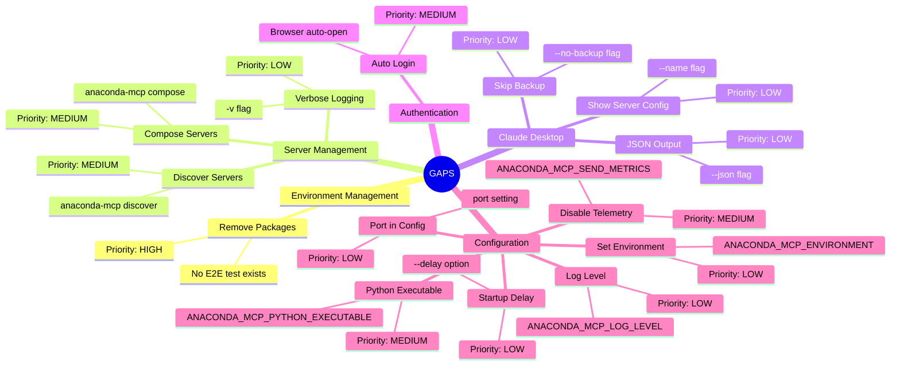

# E2E Flow to Feature Tree Mapping

## Coverage Summary

| Feature Group | Total Features | Covered | Gaps | Coverage % |
|---------------|----------------|---------|------|------------|
| Environment Management | 5 (impl) | 4 | 1 | 80% |
| Server Management | 4 | 2 | 2 | 50% |
| Claude Desktop | 9 | 6 | 3 | 67% |
| Authentication | 4 | 3 | 1 | 75% |
| Configuration | 8 | 2 | 6 | 25% |
| Transport | 2 | 2 | 0 | 100% |
| **TOTAL** | **32** | **19** | **13** | **59%** |

---

## Coverage Mapping Diagram

```mermaid
flowchart LR
    subgraph E2E["E2E Test Flows"]
        direction TB

        subgraph SETUP["Setup Flows"]
            S1[SETUP-E2E-001<br>pip Install]
            S2[SETUP-E2E-002<br>STDIO Setup]
            S3[SETUP-E2E-003<br>HTTP Setup]
        end

        subgraph TOOLS["Tool Flows"]
            T1[TOOLS-E2E-001<br>List Envs]
            T2[TOOLS-E2E-002<br>Create Env]
            T3[TOOLS-E2E-003<br>Install Pkgs]
            T4[TOOLS-E2E-004<br>Delete Env]
        end

        subgraph ERRORS["Error Flows"]
            ER1[ERROR-E2E-001<br>Dup Env]
            ER2[ERROR-E2E-002<br>Missing Env]
            ER3[ERROR-E2E-003<br>Server Down]
        end

        subgraph CONFIG["Config Flows"]
            CF1[CONFIG-E2E-001<br>Force Overwrite]
            CF2[CONFIG-E2E-002<br>Remove Config]
        end

        subgraph DEV["Dev Flows"]
            D1[DEV-E2E-001<br>From Source]
            D2[DEV-E2E-002<br>Custom Config]
        end

        subgraph AUTH["Auth Flows"]
            A1[AUTH-E2E-001<br>Authenticated]
            A2[AUTH-E2E-002<br>Anonymous]
        end

        subgraph KI["Known Issue Flows"]
            K1[KI-E2E-001<br>Name Report]
            K2[KI-E2E-002<br>Delete Works]
            K3[KI-E2E-003<br>Extra Env Vars]
            K4[KI-E2E-004<br>Install by Name]
        end

        subgraph GUARD["Guardrail Flows"]
            G1[GUARD-E2E-001<br>Channel Order]
            G2[GUARD-E2E-002<br>Missing Pkg]
            G3[GUARD-E2E-003<br>Delete Confirm]
        end
    end

    subgraph FEATURES["Features"]
        direction TB

        subgraph ENV_F["Environment Mgmt"]
            F_LIST[List Envs ✓]
            F_CREATE[Create Env ✓]
            F_DELETE[Delete Env ✓]
            F_INSTALL[Install Pkgs ✓]
            F_REMOVE[Remove Pkgs ❌]
        end

        subgraph SRV_F["Server Mgmt"]
            F_START[Start Server ✓]
            F_DISCOVER[Discover ❌]
            F_COMPOSE[Compose ❌]
            F_VERBOSE[Verbose ❌]
        end

        subgraph CD_F["Claude Desktop"]
            F_SETUP[Setup STDIO ✓]
            F_HTTP[Setup HTTP ✓]
            F_FORCE[Force ✓]
            F_NOBACK[No Backup ❌]
            F_RMCFG[Remove ✓]
            F_SHOW[Show ✓]
            F_SHOWSRV[Show Server ❌]
            F_JSON[JSON Output ❌]
            F_PATH[Path ✓]
        end

        subgraph AUTH_F["Authentication"]
            F_AUTO[Auto Login ❌]
            F_MANUAL[Manual Login ✓]
            F_ANON[Anonymous ✓]
            F_TOKEN[Token Mgmt ✓]
        end

        subgraph CFG_F["Configuration"]
            F_LOG[Log Level ❌]
            F_TELEM[Telemetry ❌]
            F_ENV[Environment ❌]
            F_PYTHON[Python Exec ❌]
            F_CFGFILE[Config File ✓]
            F_CUSTOM[Custom Config ✓]
            F_DELAY[Delay ❌]
            F_PORT[Port ❌]
        end

        subgraph TRANS_F["Transport"]
            F_STDIO[STDIO ✓]
            F_HTTPX[HTTP ✓]
        end
    end

    %% Mappings
    T1 --> F_LIST
    T2 --> F_CREATE
    T3 --> F_INSTALL
    T4 --> F_DELETE
    K1 --> F_LIST
    K2 --> F_DELETE
    K4 --> F_INSTALL
    G1 --> F_INSTALL
    G2 --> F_INSTALL
    G3 --> F_DELETE
    ER1 --> F_CREATE
    ER2 --> F_DELETE

    S2 --> F_SETUP
    S2 --> F_SHOW
    S2 --> F_PATH
    S3 --> F_HTTP
    S3 --> F_START
    CF1 --> F_FORCE
    CF1 --> F_SHOW
    CF2 --> F_RMCFG
    CF2 --> F_SHOW
    ER3 --> F_HTTPX

    D1 --> F_START
    D2 --> F_CUSTOM
    D2 --> F_CFGFILE

    A1 --> F_MANUAL
    A1 --> F_TOKEN
    A2 --> F_ANON
    K3 --> F_CFGFILE

    S2 --> F_STDIO
    S3 --> F_HTTPX

    classDef covered fill:#90EE90
    classDef gap fill:#FFB6C1

    class F_LIST,F_CREATE,F_DELETE,F_INSTALL,F_START,F_SETUP,F_HTTP,F_FORCE,F_RMCFG,F_SHOW,F_PATH,F_MANUAL,F_ANON,F_TOKEN,F_CFGFILE,F_CUSTOM,F_STDIO,F_HTTPX covered
    class F_REMOVE,F_DISCOVER,F_COMPOSE,F_VERBOSE,F_NOBACK,F_SHOWSRV,F_JSON,F_AUTO,F_LOG,F_TELEM,F_ENV,F_PYTHON,F_DELAY,F_PORT gap
```

---

## Gap Analysis

### Features NOT Covered by E2E Flows

---

## Current E2E Redundancy Analysis

Several E2E flows test the same features:

| Feature | Tested By | Redundancy |
|---------|-----------|------------|
| List Environments | TOOLS-E2E-001, TOOLS-E2E-002, KI-E2E-001 | 3x |
| Delete Environment | TOOLS-E2E-004, ERROR-E2E-002, KI-E2E-002, GUARD-E2E-003 | 4x |
| Install Packages | TOOLS-E2E-003, KI-E2E-004, GUARD-E2E-001, GUARD-E2E-002 | 4x |
| Create Environment | TOOLS-E2E-002, ERROR-E2E-001 | 2x |
| Show Config | SETUP-E2E-002, CONFIG-E2E-001, CONFIG-E2E-002 | 3x |
| Start Server | SETUP-E2E-003, DEV-E2E-001 | 2x |

---

## Optimized E2E Flow Proposal

**Goal**: Cover all 32 features with minimum flows

### Proposed Consolidated Flows (12 total, down from 22)

```mermaid
flowchart TB
    subgraph CORE["Core Flows (Must Have)"]
        C1["CORE-001: Full Setup & Tools<br>Install → STDIO Setup → List → Create → Install → Remove Pkgs → Delete"]
        C2["CORE-002: HTTP Transport Flow<br>Start Server → HTTP Setup → List Envs → Server Stop Error"]
        C3["CORE-003: Config Management<br>Show → Force Overwrite → JSON Output → Remove Config"]
    end

    subgraph CLI["CLI Feature Flows"]
        L1["CLI-001: Server Discovery<br>Discover → Compose → Verbose Logging"]
        L2["CLI-002: Advanced Options<br>Custom Config → Delay → No-Backup → Show Server"]
    end

    subgraph AUTH_FLOW["Auth Flows"]
        AF1["AUTH-001: Full Auth Cycle<br>Manual Login → Token Check → Auto Login behavior"]
        AF2["AUTH-002: Anonymous Mode<br>No login → Public channels only"]
    end

    subgraph CFG_FLOW["Config Flows"]
        CFG1["CONFIG-001: Environment Variables<br>Log Level → Telemetry → Environment → Python Exec"]
    end

    subgraph ERR["Error & Edge Cases"]
        E1["ERROR-001: Tool Errors<br>Duplicate Create → Missing Delete → Missing Package"]
    end

    subgraph GUARD_FLOW["Guardrail Flows"]
        GF1["GUARD-001: Channel & Confirmation<br>Channel ordering → Hard fail → Delete confirmation"]
    end

    subgraph REG["Regression Flows"]
        R1["REGRESS-001: Known Issues<br>Name reporting → Actual deletion → Extra env vars → Install by name"]
    end

    C1 --> |"Covers 7 features"| F1((✓))
    C2 --> |"Covers 4 features"| F2((✓))
    C3 --> |"Covers 5 features"| F3((✓))
    L1 --> |"Covers 3 features"| F4((✓))
    L2 --> |"Covers 4 features"| F5((✓))
    AF1 --> |"Covers 3 features"| F6((✓))
    AF2 --> |"Covers 1 feature"| F7((✓))
    CFG1 --> |"Covers 4 features"| F8((✓))
    E1 --> |"Covers 3 features"| F9((✓))
    GF1 --> |"Covers 3 features"| F10((✓))
    R1 --> |"Covers 4 features"| F11((✓))
```

---

## Optimized E2E Test Matrix

| Flow ID | Flow Name | Features Covered | Priority |
|---------|-----------|------------------|----------|
| **CORE-001** | Full Setup & Tools | Install, STDIO Setup, Path, List, Create, Install Pkgs, **Remove Pkgs**, Delete | P0 |
| **CORE-002** | HTTP Transport | Start Server, HTTP Setup, HTTP Transport, Error (server down) | P0 |
| **CORE-003** | Config Management | Show, Force, **JSON Output**, Remove Config, Backup | P0 |
| **CLI-001** | Server Discovery | **Discover**, **Compose**, **Verbose** | P1 |
| **CLI-002** | Advanced Options | Custom Config, **Delay**, **No-Backup**, **Show Server** | P1 |
| **AUTH-001** | Full Auth Cycle | Manual Login, Token Mgmt, **Auto Login** | P1 |
| **AUTH-002** | Anonymous Mode | Anonymous Mode | P1 |
| **CONFIG-001** | Env Variables | **Log Level**, **Telemetry**, **Environment**, **Python Exec** | P1 |
| **ERROR-001** | Tool Errors | Create (dup), Delete (missing), Install (missing pkg) | P1 |
| **GUARD-001** | Guardrails | Channel ordering, Hard fail, Delete confirmation | P0 |
| **REGRESS-001** | Known Issues | Name reporting, Deletion works, Extra env vars, Install by name | P0 |

**Bold** = Features not covered by current E2E flows (gaps filled)

---

## Feature Coverage After Optimization

| Feature Group | Before | After | Change |
|---------------|--------|-------|--------|
| Environment Management | 80% | **100%** | +20% |
| Server Management | 50% | **100%** | +50% |
| Claude Desktop | 67% | **100%** | +33% |
| Authentication | 75% | **100%** | +25% |
| Configuration | 25% | **100%** | +75% |
| Transport | 100% | 100% | - |
| **TOTAL** | **59%** | **100%** | **+41%** |

---

## Summary

### Current State
- 22 E2E flows
- 59% feature coverage
- 13 features without E2E coverage
- Significant redundancy (some features tested 4x)

### Optimized State
- 10 E2E flows for happy paths (55% reduction)
- 2 deployment-specific flows (SHARED-001, DOCKER-001)
- Error testing moved to Manual Dev Mode
- Each feature tested 1-2x max

### Testing Priority

| Priority | Type | Flows | When |
|----------|------|-------|------|
| **P1** | E2E Happy Paths | 10 flows | First |
| **P2** | Manual Dev Mode | Negative scenarios | After P1 |
| **P3** | API Automation | Error handling | When time permits |

### Key Tests Added

1. **Remove Packages** - Add to CORE-001
2. **Discover/Compose/Verbose** - New CLI-001
3. **JSON Output** - Add to CORE-003
4. **Auto Login** - Add to AUTH-001
5. **All env vars** - New CONFIG-001
6. **Delay/No-Backup/Show Server** - New CLI-002
7. **Shared Server** - New SHARED-001
8. **Docker** - New DOCKER-001
