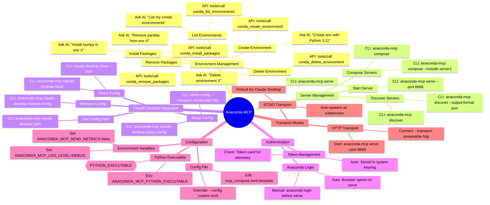
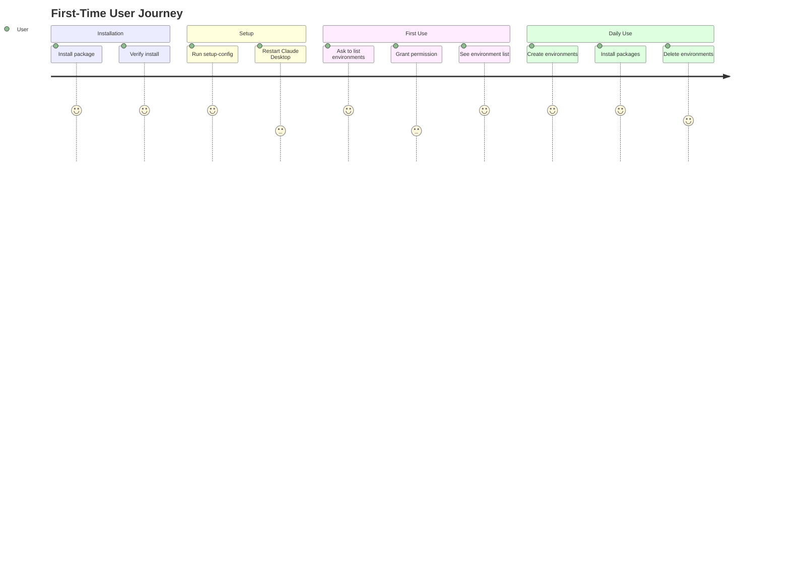

# Anaconda MCP - Feature Tree

## 3-Level Structure
- **Level 1**: Feature Group (category)
- **Level 2**: Feature (specific functionality)
- **Level 3**: User Action (how to use it)

---

## Feature Tree Diagram

---

## Detailed Feature Tree (Text Format)

### 1. Environment Management (via AI/MCP Tools)

| Feature | User Action | Method |
|---------|-------------|--------|
| **List Environments** | Ask AI: "List my conda environments" | AI Request |
| | `tools/call` with `conda_list_environments` | MCP API |
| **Create Environment** | Ask AI: "Create a conda env called X with Python 3.11" | AI Request |
| | `tools/call` with `conda_create_environment` | MCP API |
| **Delete Environment** | Ask AI: "Delete the conda environment X" | AI Request |
| | `tools/call` with `conda_delete_environment` | MCP API |
| **Install Packages** | Ask AI: "Install numpy and pandas in env X" | AI Request |
| | `tools/call` with `conda_install_packages` | MCP API |
| **Remove Packages** | Ask AI: "Remove numpy from env X" | AI Request |
| | `tools/call` with `conda_remove_packages` | MCP API |

### 2. Server Management (CLI)

| Feature | User Action | Method |
|---------|-------------|--------|
| **Start Server** | `anaconda-mcp serve` | CLI |
| | `anaconda-mcp serve --port 8888 --host 0.0.0.0` | CLI + Options |
| | `anaconda-mcp serve --config custom.toml` | CLI + Custom Config |
| | `anaconda-mcp serve --delay 5` | CLI + Startup Delay |
| **Discover Servers** | `anaconda-mcp discover` | CLI |
| | `anaconda-mcp discover --output-format json` | CLI + JSON Output |
| **Compose Servers** | `anaconda-mcp compose` | CLI |
| | `anaconda-mcp compose --include server1 --exclude server2` | CLI + Filters |
| | `anaconda-mcp compose --conflict-resolution prefix` | CLI + Strategy |
| **Verbose Logging** | `anaconda-mcp -v serve` | CLI Flag |

### 3. Claude Desktop Integration (CLI)

| Feature | User Action | Method |
|---------|-------------|--------|
| **Setup STDIO** | `anaconda-mcp claude-desktop setup-config` | CLI (default) |
| **Setup HTTP** | `anaconda-mcp claude-desktop setup-config --transport streamable-http --port 8888` | CLI + Options |
| **Force Overwrite** | `anaconda-mcp claude-desktop setup-config --force` | CLI + Flag |
| **Skip Backup** | `anaconda-mcp claude-desktop setup-config --no-backup` | CLI + Flag |
| **Remove Config** | `anaconda-mcp claude-desktop remove-config` | CLI |
| **Show Full Config** | `anaconda-mcp claude-desktop show` | CLI |
| **Show Server Config** | `anaconda-mcp claude-desktop show --name anaconda-mcp` | CLI + Filter |
| **JSON Output** | `anaconda-mcp claude-desktop show --json` | CLI + Format |
| **Get Config Path** | `anaconda-mcp claude-desktop path` | CLI |

### 4. Authentication

| Feature | User Action | Method |
|---------|-------------|--------|
| **Auto Login** | Start server, browser opens automatically | Automatic |
| **Manual Login** | `anaconda login` before starting server | CLI (anaconda-auth) |
| **Skip Auth** | Don't login, use public channels only | No action |
| **Check Token** | Token stored in system keyring | Automatic |

### 5. Configuration

| Feature | User Action | Method |
|---------|-------------|--------|
| **Set Log Level** | `export ANACONDA_MCP_LOG_LEVEL=DEBUG` | Env Var |
| **Disable Telemetry** | `export ANACONDA_MCP_SEND_METRICS=false` | Env Var |
| **Set Environment** | `export ANACONDA_MCP_ENVIRONMENT=staging` | Env Var |
| **Custom Python** | `export ANACONDA_MCP_PYTHON_EXECUTABLE=/path/to/python` | Env Var |
| **Edit Config** | Edit `mcp_compose.toml.template` | File Edit |
| **Custom Config** | `anaconda-mcp serve --config /path/to/config.toml` | CLI Option |
| **Enable HTTP** | Set `streamable_http_enabled = true` in config | Config Edit |
| **Change Port** | Set `port = 8888` in `[composer]` section | Config Edit |

### 6. Transport Modes

| Feature | User Action | Method |
|---------|-------------|--------|
| **Use STDIO** | `anaconda-mcp claude-desktop setup-config` (default) | CLI |
| | Claude Desktop spawns anaconda-mcp as subprocess | Automatic |
| **Use HTTP** | `anaconda-mcp serve --port 8888` | CLI (Terminal 1) |
| | `anaconda-mcp claude-desktop setup-config --transport streamable-http --port 8888` | CLI (Terminal 2) |

---

## Mermaid Flowchart (Alternative View)

```mermaid
flowchart TB
    subgraph ENV["Environment Management"]
        direction TB
        E1[List Environments]
        E2[Create Environment]
        E3[Delete Environment]
        E4[Install Packages]
        E5[Remove Packages]
    end

    subgraph SRV["Server Management"]
        direction TB
        S1[Start Server]
        S2[Discover Servers]
        S3[Compose Servers]
    end

    subgraph CD["Claude Desktop"]
        direction TB
        C1[Setup Config]
        C2[Remove Config]
        C3[Show Config]
        C4[Get Path]
    end

    subgraph AUTH["Authentication"]
        direction TB
        A1[Auto Login]
        A2[Manual Login]
        A3[Anonymous Mode]
    end

    subgraph CFG["Configuration"]
        direction TB
        CF1[Environment Variables]
        CF2[Config File]
        CF3[Python Executable]
    end

    subgraph TRANS["Transport"]
        direction TB
        T1[STDIO]
        T2[HTTP]
    end

    E1 --> |"AI: List environments"| AI((AI Client))
    E2 --> |"AI: Create env X"| AI
    E3 --> |"AI: Delete env X"| AI
    E4 --> |"AI: Install numpy"| AI
    E5 --> |"AI: Remove pandas"| AI

    S1 --> |"anaconda-mcp serve"| CLI((CLI))
    S2 --> |"anaconda-mcp discover"| CLI
    S3 --> |"anaconda-mcp compose"| CLI

    C1 --> |"claude-desktop setup-config"| CLI
    C2 --> |"claude-desktop remove-config"| CLI
    C3 --> |"claude-desktop show"| CLI
    C4 --> |"claude-desktop path"| CLI

    A1 --> |"Auto on serve"| AUTO((Automatic))
    A2 --> |"anaconda login"| CLI
    A3 --> |"No action"| SKIP((Skip))

    CF1 --> |"export VAR=value"| SHELL((Shell))
    CF2 --> |"Edit .toml"| FILE((File))
    CF3 --> |"PYTHON_EXECUTABLE"| SHELL

    T1 --> |"Default"| CD
    T2 --> |"--transport http"| CD
```

---

## User Journey Map

---

## Feature Priority Matrix

| Group | Feature | Priority | Status |
|-------|---------|----------|--------|
| Environment Mgmt | List Environments | P0 | Implemented |
| Environment Mgmt | Create Environment | P0 | Implemented |
| Environment Mgmt | Delete Environment | P0 | Implemented |
| Environment Mgmt | Install Packages | P0 | Implemented |
| Environment Mgmt | Remove Packages | P0 | Implemented |
| Server Mgmt | Start Server | P0 | Implemented |
| Server Mgmt | Discover Servers | P1 | Implemented |
| Server Mgmt | Compose Servers | P1 | Implemented |
| Claude Desktop | Setup Config | P0 | Implemented |
| Claude Desktop | Remove Config | P0 | Implemented |
| Claude Desktop | Show Config | P1 | Implemented |
| Authentication | Auto Login | P0 | Implemented |
| Authentication | Anonymous Mode | P1 | Implemented |
| Configuration | Env Variables | P0 | Implemented |
| Configuration | Config File | P0 | Implemented |
| Transport | STDIO | P0 | Implemented |
| Transport | HTTP | P0 | Implemented |
