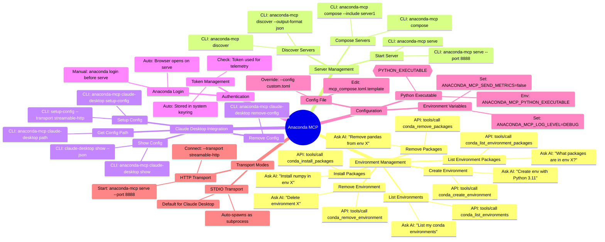
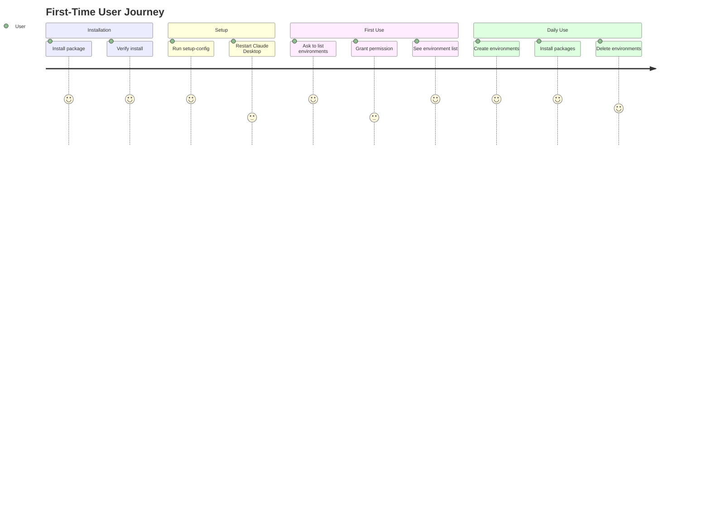

# Anaconda MCP - Feature Tree

## 3-Level Structure
- **Level 1**: Feature Group (category)
- **Level 2**: Feature (specific functionality)
- **Level 3**: User Action (how to use it)

---

## Feature Tree Diagram

---

## Feature Tree Table

| Feature Group | Feature | User Actions | Priority |
|---------------|---------|--------------|----------|
| **Environment Management** | List Environments | AI: "List my conda environments" API: `tools/call conda_list_environments` | P0 |
| | List Environment Packages | AI: "What packages are in env X?" API: `tools/call conda_list_environment_packages` | P0 |
| | Create Environment | AI: "Create env with Python 3.11" API: `tools/call conda_create_environment` | P0 |
| | Remove Environment | AI: "Delete environment X" API: `tools/call conda_remove_environment` | P0 |
| | Install Packages | AI: "Install numpy in env X" API: `tools/call conda_install_packages` | P0 |
| | Remove Packages | AI: "Remove pandas from env X" API: `tools/call conda_remove_packages` | P0 |
| **Server Management** | Start Server | `anaconda-mcp serve` `anaconda-mcp serve --port 8888` | P0 |
| | Discover Servers | `anaconda-mcp discover` `anaconda-mcp discover --output-format json` | P1 |
| | Compose Servers | `anaconda-mcp compose` `anaconda-mcp compose --include server1` | P1 |
| **Claude Desktop Integration** | Setup Config | `anaconda-mcp claude-desktop setup-config` `setup-config --transport streamable-http` | P0 |
| | Remove Config | `anaconda-mcp claude-desktop remove-config` | P0 |
| | Show Config | `anaconda-mcp claude-desktop show` `claude-desktop show --json` | P1 |
| | Get Config Path | `anaconda-mcp claude-desktop path` | P1 |
| **Authentication** | Anaconda Login | Auto: Browser opens on serve Manual: `anaconda login` before serve | P0 |
| | Token Management | Auto: Stored in system keyring Used for telemetry | P1 |
| **Configuration** | Environment Variables | `ANACONDA_MCP_LOG_LEVEL=DEBUG` `ANACONDA_MCP_SEND_METRICS=false` | P0 |
| | Config File | Edit: `mcp_compose.toml.template` Override: `--config custom.toml` | P0 |
| | Python Executable | Env: `ANACONDA_MCP_PYTHON_EXECUTABLE` Template: `{{PYTHON_EXECUTABLE}}` | P1 |
| **Transport Modes** | STDIO Transport | Default for Claude Desktop Auto-spawns as subprocess | P0 |
| | HTTP Transport | Start: `anaconda-mcp serve --port 8888` Connect: `--transport streamable-http` | P0 |

---

## User Journey Map

