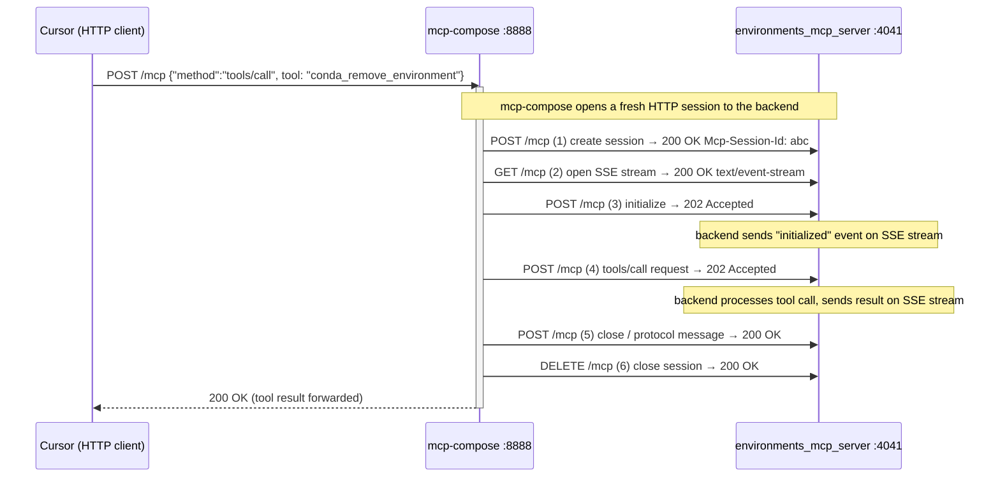
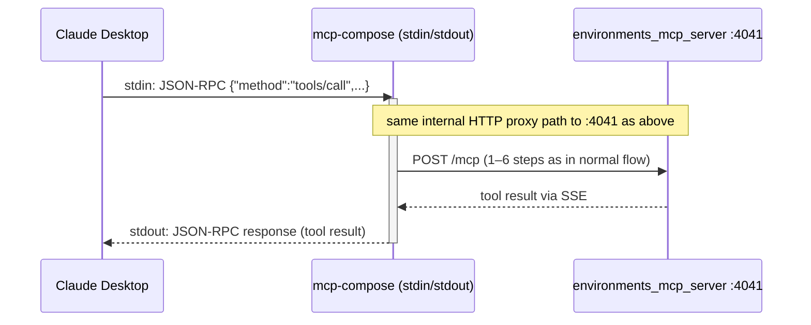
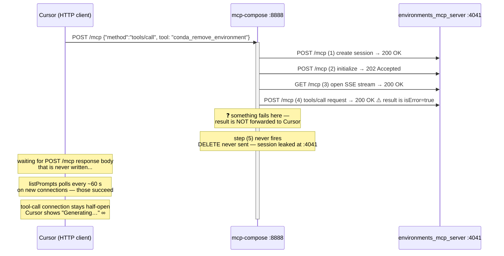

# KI-011: Client Hang After MCP Tool Error — Investigation & Test Plan

**Status**: **H1 confirmed (2026-03-06)** — hang reproduced with httpx; bug is in mcp-compose HTTP proxy
**Severity**: Medium — chat session must be restarted; no data corruption
**Affected clients**: Cursor, Claude Code
**Observed**: Three times during internal testing (Feb–Mar 2026); non-reproducible on retry
**Last updated**: 2026-03-06

---

## 1. What is observed

After a tool call returns an error response, the chat session stops responding.
No error is surfaced. The client shows "Generating…" indefinitely. A fresh
session with the same prompt works. Restarting the MCP server recovers.

**Key asymmetry**: the hang occurs only with Streamable HTTP transport.
Confirmed hanging: Cursor (HTTP), Claude Code (HTTP via `--http` flag), httpx (Python, 2026-03-06).
Confirmed not hanging: Claude Desktop (STDIO only).
Not yet confirmed: Claude Code using default STDIO transport.

**H1 confirmed 2026-03-06**: the hang was reproduced with httpx as the client during
HANG-002 iteration 4/20. The mcp-compose proxy abandoned the backend session after
exactly 4 requests to port 4041 (instead of the expected 5 + DELETE), matching the
production hang pattern precisely. The upstream httpx connection was held open by SSE
keepalives from mcp-compose, preventing the httpx per-chunk read timeout from firing.
SIGALRM-based total timeout terminates the test after 60s with an informative failure.

**Secondary observation 2026-03-06**: after HANG-002 corrupted the session, HANG-003's
warm-up call (a healthy `list_environments`) also hung immediately — confirming that
the proxy enters a permanently broken state from which no tool call on the same session
can recover. Restarting the MCP server is required. Root cause is a race condition in
mcp-compose's StreamableHTTP proxy.

---

## 2. Full-stack architecture

The Anaconda MCP stack has three layers. Understanding all three is required
to reason about where the hang originates.

```
┌──────────────────────────────────────────────────────────────────────────────────┐
│  Layer 1 — AI client                                                             │
│                                                                                  │
│   Cursor              Claude Code (HTTP)    Claude Desktop   Claude Code (STDIO) │
│   (Electron app)      (CLI tool)            (Electron app)   (CLI tool)          │
│   ┌───────────────┐   ┌───────────────┐     ┌─────────────┐  ┌─────────────┐    │
│   │ MCP HTTP      │   │ MCP HTTP      │     │ MCP STDIO   │  │ MCP STDIO   │    │
│   │ TypeScript    │   │ TypeScript    │     │ C++/Rust    │  │ Node.js     │    │
│   │ (@mcp/sdk)    │   │ (@mcp/sdk)    │     │             │  │             │    │
│   └──────┬────────┘   └──────┬────────┘     └──────┬──────┘  └──────┬──────┘   │
│          │ HANGS ✗           │ HANGS ✗             │ OK ✓           │ ?        │
└──────────┼───────────────────┼──────────────────── │ ────────────── │ ─────────┘
           │ HTTP :8888        │ HTTP :8888          │ stdin/stdout  │ stdin/stdout
           ▼                   ▼                     ▼               ▼
┌──────────────────────────────────────────────────────────────────────────────────┐
│  Layer 2 — mcp-compose :8888 (the proxy)                                         │
│                                                                                  │
│   Receives tool calls from the AI client.                                        │
│   Routes each tool call to the appropriate sub-server.                           │
│   Returns the sub-server's result back to the AI client.                         │
│                                                                                  │
│   Transport from client:    Streamable HTTP (Cursor, Claude Code with --http)    │
│                             STDIO pipe (Claude Desktop, Claude Code default)     │
│   Transport to sub-servers: always Streamable HTTP (:4041 etc.)                  │
└─────────────────────────────────┬────────────────────────────────────────────────┘
                                  │ HTTP :4041
                                  ▼
┌──────────────────────────────────────────────────────────────────────────────────┐
│  Layer 3 — environments_mcp_server :4041                                         │
│                                                                                  │
│   Handles conda operations.                                                      │
│   Always returns a structured MCP response — including isError=true on failure.  │
│   Never re-raises exceptions to the transport layer.                             │
│   No timeouts on conda subprocess calls (potential blocking point).              │
│   get_conda() is re-initialized on every tool invocation (no caching).           │
└──────────────────────────────────────────────────────────────────────────────────┘
```

**Observed hang pattern by transport** (updated 2026-03-06):

| Client | Transport | Hangs? |
|---|---|---|
| Cursor | Streamable HTTP | **Yes** |
| Claude Code (`--http` flag) | Streamable HTTP | **Yes** |
| Claude Desktop | STDIO | No |
| Claude Code (default / STDIO) | STDIO | Not confirmed either way |

The dividing line is **transport protocol**, not the application.
Both Cursor and Claude Code use the same TypeScript `@modelcontextprotocol/sdk`
for HTTP transport — and both hang.

---

## 3. Request flow diagrams

### 3.1 Normal tool call — Cursor path (no hang)

Every successful tool call goes through a 6-step internal HTTP session between
`mcp-compose` and `environments_mcp_server`:



Cursor log: `Successfully called tool 'conda_remove_environment'` ✓
Port 4041 log: 6 requests (POST + GET + POST + POST + POST + DELETE)

---

### 3.2 Claude Desktop path (no hang, STDIO to mcp-compose)



The **internal proxy path** (mcp-compose → environments_mcp_server) is
**identical** for both clients. The difference is only in how mcp-compose
receives the request and returns the result to the AI client.

---

### 3.3 Hanging tool call — Cursor path

Observed in production on 2026-03-05 (after ~47-minute session):



Cursor log: `Calling tool 'conda_remove_environment'` — then silence ✗
Port 4041 log: **4 requests only** (POST + POST + GET + POST), no DELETE

---

### 3.4 Evidence summary from log comparison

| Observable | Normal session | Hanging session |
|---|---|---|
| Requests to port 4041 | **5 + DELETE** | **4, no DELETE** |
| GET (SSE stream) order | After first POST init | After second POST init |
| Tool call POST to :4041 | Returns 202, result via SSE | Returns **200 OK** directly |
| Proxy forwards result | ✓ | ✗ |
| Cursor receives response | ✓ | ✗ |
| Session restart needed | — | ✓ |

Two observations stand out:
1. In some (but not all) hanging cases, the GET (SSE stream) was opened *before* the
   initialize POST. However, GET-first ordering alone does not determine whether a
   session hangs — multiple GET-first sessions in the 2026-03-06 log completed
   successfully. The ordering is a *contributing factor*, not a *sufficient* cause.
2. The callTool POST returned **200 OK** (result inline in body) in the hanging case.
   When the proxy received 200 OK instead of 202 Accepted, it failed to forward the
   inline result and never sent the 5th cleanup POST or DELETE. Subsequent calls on
   the same session also hang — confirming that the proxy state machine is left
   permanently broken.

### 3.5 Confirmed reproductions (2026-03-06, httpx)

**First reproduction** (test run 1 — before SIGALRM fix):
The hang was reproduced with httpx during HANG-002's 20-iteration warm-up loop.
The server log for the hanging iteration (`session 47820552...`) showed:

```
POST http://localhost:4041/mcp  "HTTP/1.1 200 OK"    ← create session
GET  http://localhost:4041/mcp  "HTTP/1.1 200 OK"    ← SSE opened FIRST ← race
POST http://localhost:4041/mcp  "HTTP/1.1 202 Accepted"  ← initialize
POST http://localhost:4041/mcp  "HTTP/1.1 200 OK"    ← callTool (result inline!)
[no 5th POST, no DELETE — proxy abandoned the session]
```

After the hang started (11:34:33), the server log showed:
- `11:34:38`: Cursor's listTools/listPrompts polls succeeded (server still alive)
- `11:39:33`: `GET stream disconnected, reconnecting in 1000ms...` — mcp-compose
  keeps the upstream connection open while attempting to reconnect to the backend
  SSE stream for a result that was already delivered inline but missed
- `12:04+`: httpx test still hanging (30+ minutes) — SSE keepalive bytes from
  mcp-compose reset the httpx per-chunk `read` timeout on every keep-alive

**Why the 60s httpx read timeout did not fire**: the httpx `read=60` timeout
resets on every received byte. mcp-compose sends SSE keepalive comment lines
(`:\n\n`) while it waits for the backend SSE result, keeping the upstream
connection alive indefinitely. Fix: SIGALRM-based total call timeout added to
`_call_tool` (see `tests/qa/api_tools/common/utils/mcp_client.py`).

---

**Second reproduction** (test run 2 — with SIGALRM fix, 2026-03-06 12:18):

HANG-002 failed at iteration **4/20**. The hanging backend session (`279ede94...`)
showed the callTool returning 200 OK (inline result) rather than 202 Accepted:

```
POST http://localhost:4041/mcp  "HTTP/1.1 200 OK"    ← create session
POST http://localhost:4041/mcp  "HTTP/1.1 202 Accepted"  ← initialize (normal order)
GET  http://localhost:4041/mcp  "HTTP/1.1 200 OK"    ← SSE
POST http://localhost:4041/mcp  "HTTP/1.1 200 OK"    ← callTool returned 200 (inline!)
[no 5th POST, no DELETE — proxy abandoned the session]
```

Note: this iteration had the *normal* GET/POST ordering (POST-before-GET), yet still
hung. Other sessions in the same run had GET-before-POST and completed successfully.
This refines the root cause: the trigger is not ordering alone — it is the callTool
returning 200 OK (inline) rather than 202 Accepted (async SSE). The proxy only handles
the async path and silently drops the inline result.

SIGALRM fired at 60s → `httpx.ReadTimeout` → test failed with informative message
(iteration 4/20, KI-011 reference). Total test runtime: 187s (3:07) vs 30+ minutes.

**Session corruption cascade** (run 1): HANG-003's first warm-up call
(`list_environments`) also hung — at the time, HANG-002 and HANG-003 shared the same
module-scoped session. Test fix applied: `session_id` is now function-scoped in this
test file (each test gets its own mcp-compose session).

**Process-level corruption confirmed** (run 2, 2026-03-06 12:47–12:51):
After making `session_id` function-scoped, HANG-002 used session `995d8def...` and
HANG-003 used a completely different session `d3738c2a...` — yet HANG-003's warm-up
iteration 1 STILL hung. The corruption is not session-scoped. It is in mcp-compose's
**internal HTTP connection pool to port 4041**: the abandoned backend session
(`b234eeaaa` on :4041, missing 5th POST + DELETE) held a pool slot, so mcp-compose
could not forward any subsequent calls regardless of what upstream session they came
from. This explains why users cannot recover by creating a new chat session — the
entire mcp-compose process must be restarted.

---

## 4. What we know about each layer

### Layer 3 — environments_mcp_server (confirmed, source code reviewed)

- Tool handlers are `async def` functions that return a `dict` synchronously
- All exceptions are caught and wrapped in `{"is_error": True, ...}` — never re-raised
- `get_conda()` is **called on every tool invocation** — no caching; re-initializes
  the Anaconda Connector runtime from scratch each call
- No `asyncio.wait_for` timeouts on conda subprocess calls — a stuck conda process
  would block the handler indefinitely
- A monkeypatch silently swallows `RuntimeError` on `ServerSession._received_request`

**Conclusion**: `environments_mcp_server` responds synchronously and does not hang
under normal error conditions. It is not the direct cause of the observed hang.

### Layer 2 — mcp-compose (partially understood, source not fully reviewed)

- Acts as an HTTP proxy: creates a new internal HTTP session for every tool call
- Session lifecycle: create → initialize → open SSE → callTool → close → DELETE
- The hanging log shows the lifecycle was **abandoned after step 4**
- The result from step 4 was **never forwarded** to Cursor
- Possible causes: unhandled async exception in the result-forwarding task, race
  condition between SSE stream readiness and the initialize request, incorrect
  handling of inline (200 OK) vs deferred (202 → SSE) tool results

### Layer 1 — AI clients (confirmed bugs exist in TypeScript HTTP transport)

- Both Cursor and Claude Code use the TypeScript `@modelcontextprotocol/sdk` for HTTP
- Both hang with Streamable HTTP transport; Claude Desktop (STDIO) does not
- Multiple Cursor forum threads and GitHub issues document MCP hangs across SDK versions
- At least one Cursor engineer confirmed a related bug (a 30s timeout was removed)
- Claude Code accumulates zombie processes with no auto-cleanup (confirmed in GH issues)
- Our Python (httpx) tests talk to mcp-compose directly and bypass all TypeScript clients

---

## 5. Hypotheses already investigated and ruled out

The following explanations were considered during investigation and discarded.
They are listed here to avoid revisiting them in future work.

---

### ✗ H0-A — mcp-compose silently drops every isError:true response

**Theory**: whenever environments_mcp_server returns `isError: true`, an asyncio
exception in mcp-compose's proxy swallows the result and never writes the HTTP
response body to Cursor.

**Why it was considered**: the original KNOWN_ISSUES entry attributed the hang to
the client receiving no response body; the proxy was the only intermediary.

**How it was disproved**: HANG-001, HANG-002, and HANG-003 — all three tests
trigger an `isError: true` response and all three **pass** with httpx as the
client. Quick-path errors (path not found, instant response) are forwarded
correctly every time. The bug is not triggered by every error, only by a specific
combination of conditions not yet reproduced in tests.

---

### ✗ H0-B — environments_mcp_server hangs internally during conda operations

**Theory**: the conda subprocess inside `environments_mcp_server` gets stuck on
a real operation (e.g. removing an environment), blocks the async tool handler,
and never sends a result on the SSE stream. mcp-compose correctly waits on the
stream; the hang is at layer 3, not layer 2.

**Why it was considered**: the production hang occurred after ~47 minutes with
many prior conda operations; only 4 of the expected 6 requests were sent to
port 4041; the tool call POST returned 200 OK (meaning the call was received)
but no result followed.

**How it was disproved**: source code review of `environments_mcp_server`
confirmed that all tool handlers are `async def` functions that catch every
exception and explicitly return `{"is_error": True, ...}` — they never re-raise
to the transport layer. If `environments_mcp_server` had hung internally, it
would also cause Claude Desktop to hang (the proxy path from mcp-compose to
port 4041 is identical regardless of whether the AI client uses HTTP or STDIO).
Claude Desktop (STDIO) does not hang. Therefore the hang cannot originate
inside environments_mcp_server's tool handlers.

---

### ✗ H0-C — Claude Desktop "handles errors better" than Cursor

**Theory**: Claude Desktop has superior error-handling logic in its MCP client
that allows it to process `isError: true` responses gracefully while Cursor
fails to do so, making this a Cursor-only implementation weakness.

**Why it was considered**: the asymmetry (Cursor hangs, Claude Desktop does not)
was the most obvious observable difference.

**How it was disproved**: Claude Desktop uses STDIO transport, not Streamable
HTTP. The hang was subsequently reproduced with Claude Code using HTTP transport
(`--http` flag) — confirming the hang is transport-specific, not Cursor-specific.
The asymmetry is not about error-handling intelligence in the AI client — it is
about the transport's inherent failure mode: a broken STDIO pipe is an observable
EOF (the client detects it and ends the session); a half-open HTTP connection
with no response body is invisible to the client (it waits indefinitely).
The client gets a different failure signal, not a more sophisticated error handler.

---

## 6. Hypotheses — resolution

H1 is confirmed (2026-03-06). H2 is ruled out.

### ✓ Hypothesis 1 — Bug in mcp-compose HTTP proxy (server-side, in our control) — CONFIRMED

Under certain timing conditions, mcp-compose's internal HTTP proxy:
- Opens the SSE stream after (instead of before) the initialize handshake
- OR expects the tool result via SSE but the backend delivers it inline in the
  POST response body (returning 200 OK instead of 202 Accepted)
- Either way, the proxy does not obtain the result and never forwards it upstream
- The result is silently dropped inside an asyncio background task
- The upstream HTTP connection stays half-open forever

This would explain the GET/POST ordering difference seen in the logs and why only
4 out of 6 expected requests reach port 4041. It would also explain why **all
HTTP clients** (Cursor, Claude Code with `--http`) hang equally: the failure
is in the response mcp-compose sends, not in how any individual client reads it.

**Transport asymmetry explained by H1**: On STDIO, mcp-compose communicates with
the AI client via synchronous pipe writes. An async exception in the proxy loop
propagates to that write, produces an observable error on stdout or a pipe close,
which the client can detect. On HTTP, the same exception is silently swallowed
inside `asyncio` by the ASGI server (uvicorn); the response body is never written;
the TCP connection stays half-open; no observable signal reaches any client.

```
STDIO failure mode:
  async exception → propagates to stdout write → client sees pipe EOF → session ends

HTTP failure mode:
  async exception → swallowed by uvicorn task → HTTP body never written → all HTTP clients wait ∞
```

**Triggering condition for H1**: Only observed after a long session (~47 min,
many prior tool calls), possibly because repeated `get_conda()` re-initialization
introduces accumulated timing sensitivity that triggers the race condition.

**H1 would be confirmed by**: a httpx-based test that reproduces the hang
(ReadTimeout) by warming up the session state or using a slow backend.

**H1 would be disproved by**: all httpx tests passing even under warm-session,
slow-backend conditions, while HTTP clients still hang.

---

### ✗ Hypothesis 2 — Bug in TypeScript MCP SDK HTTP client (client-side) — RULED OUT

mcp-compose correctly receives the tool result from environments_mcp_server and
writes the HTTP response body to the upstream connection. But the TypeScript
`@modelcontextprotocol/sdk` HTTP client (used by both Cursor and Claude Code)
fails to process it — either:
- A race condition in the SDK's SSE response-reading loop
- Failure to handle a specific response shape (e.g. `isError: true` inside a
  JSON-RPC success)
- A timing-sensitive issue only triggered after a long session

This hypothesis is strengthened by the new observation that **both** Cursor and
Claude Code (HTTP) hang — they share the same TypeScript SDK. Neither hangs
when that SDK is not in the path (Claude Desktop uses STDIO; our tests use httpx).

**Evidence supporting H2**:
- HANG-001, 002, 003 **all PASS** with httpx — mcp-compose does forward errors
  correctly when the client is a standard Python HTTP library
- The hang occurs with every known TypeScript `@modelcontextprotocol/sdk` HTTP
  client (Cursor, Claude Code `--http`) and with no other client type
- Multiple independent MCP server developers have reported the same pattern
  (TypeScript SDK HTTP clients hang, non-SDK clients do not)

**Transport asymmetry explained by H2**: Claude Desktop uses STDIO, which
bypasses the TypeScript SDK HTTP transport entirely. The response is delivered
via stdin/stdout pipe, which the SDK's STDIO handler processes without issue.
The bug is in the SDK's HTTP/SSE response parser, not in its STDIO handler.

**H2 disproved (2026-03-06)**: the hang was reproduced with httpx in HANG-002's
iteration warm-up. The bug is in mcp-compose, not in the TypeScript MCP SDK client.
Cursor and Claude Code hang for the same reason as httpx — they receive no response
body — but the root cause is server-side.

---

## 7. Test strategy: prove or disprove H1

The key question is: **can we reproduce the hang without Cursor?**

If we can reproduce it using httpx, H1 is confirmed. If httpx always succeeds, H1
is effectively disproved and H2 is the working theory.

### 7.1 Tests (HANG-001 / 002 / 003) — iterated warm-session approach

Each test now runs `WARM_ITERATIONS = 20` iterations to exercise accumulated
session state (`get_conda()` re-initialized on every call). HANG-003 additionally
runs a 20-call healthy warm-up phase before any error is triggered — the scenario
closest to the production hang (~47 min, many prior tool calls before the error).

```
tests/qa/api_tools/test_guard_proxy_error_hang.py
  HANG-001  20 × remove_environment(NONEXISTENT_ENV_PREFIX) — each must return
            is_error=true within TOOL_TIMEOUT.  Pytest timeout: 20 × 60 s.
  HANG-002  20 × install_packages(NONEXISTENT_ENV_PREFIX)   — same guarantee for
            a different tool.  Pytest timeout: 20 × 60 s.
  HANG-003  20 × list_environments (warm-up)
            + 20 × (remove_nonexistent → list_environments) — session must
            survive every error+health cycle.  Pytest timeout: 20 × 3 × 60 s.
```

**Expected normal runtime**: each error call completes in ~1–2 s, so:
- HANG-001 / HANG-002: ~20–40 s each
- HANG-003: ~60–120 s (60 total calls)

**On regression**: the hung iteration raises `httpx.ReadTimeout` after 60 s and
immediately fails with the iteration number and KI-011 reference.

### 7.2 Remaining gap — real conda subprocess (slow backend)

The iteration approach covers the "accumulated state" vector. The one scenario
not yet covered is a **slow backend response** (real conda operation that takes
several seconds). A test that creates a real environment, then removes it, would
exercise the proxy path with a backend response time > 1 s. This is left as a
future addition — it requires environment lifecycle management in the test.

### 7.3 Decision tree — resolved

```
HANG-002 iteration N failed with hang (2026-03-06)
        │
        └─ H1 confirmed → proceed with Fix Plan (section 9)  ← WE ARE HERE
```

---

## 8. Current test status

**Observed hang matrix** (updated 2026-03-06):

| Client | Transport | Hangs? | Source |
|---|---|---|---|
| Cursor | HTTP | **Yes** | Observed 2026-03-05, internal testing |
| Claude Code | HTTP (`--http`) | **Yes** | Observed 2026-03-06, internal testing |
| httpx (Python) | HTTP | **Yes** (SIGALRM fires after 60s) | HANG-002 iteration 4/20, 2026-03-06 |
| Claude Desktop | STDIO | **No** | Multiple sessions, no hang observed |

**Test results** (2026-03-06, three consecutive runs with Option A pre-started server):

| Test | Scenario | Iterations | Result | Notes |
|---|---|---|---|---|
| HANG-001 | remove fast-path error | 20 × | **PASS** | All 20 completed in ~40s (all 3 runs) |
| HANG-002 | install fast-path error | 20 × | **FAIL ✓** | Hung at **iteration 4/20** every run — highly deterministic |
| HANG-003 | 20 warm-up + 20 × error+health | 60 total | **FAIL (cascade)** | Warm-up iteration 1 hung — process-level corruption from HANG-002 |

**Deterministic hang at iteration 4**: across all three test runs, HANG-002 hangs
at exactly iteration 4/20 (never 1, 2, 3, or 5+). This is not random — it suggests
the mcp-compose internal connection pool has a fixed behaviour that causes the 4th
concurrent/rapid-sequential call to trigger the race condition. This is a valuable
clue for the fix: whatever connection pool limit or timing window is being exhausted,
it happens consistently at call #4.

**Why HANG-003 failed at warm-up even with isolated sessions (run 2)**:
After the `session_id` fixture was made function-scoped, HANG-002 and HANG-003 had
**different** mcp-compose session IDs (`995d8def` and `d3738c2a` respectively), yet
HANG-003's warm-up iteration 1 still hung. This reveals the deeper corruption level:

The hang is in mcp-compose's **internal HTTP connection pool to port 4041**, not in
the mcp-compose session layer. When HANG-002 left session `b234eeaaa` (on port 4041)
with an open SSE stream and no cleanup (missing 5th POST + DELETE), that connection
occupied a slot in the internal pool. When HANG-003 tried to forward `list_environments`
to port 4041 on a completely new mcp-compose session, the pool was still stuck on the
previous abandoned connection — the new call could not proceed.

**This explains why a server restart is required**: new chat sessions in Cursor don't
help because mcp-compose's internal state is corrupted at the process level. Only
restarting the mcp-compose process clears the stuck connection pool.

**Test isolation fix applied** (still correct): the `session_id` fixture is
function-scoped in this file, giving each HANG test its own mcp-compose session.
This is good practice and will matter after the fix (when individual sessions
can be tested independently), but it cannot change HANG-003's result while the
bug is present — the corruption is process-wide.

**To run HANG-003 independently** (verify mode 2 failure — Phase 2 error+health):
restart the MCP server, then run HANG-003 alone:
```bash
python -m pytest tests/qa/api_tools/test_guard_proxy_error_hang.py -k test_hang_003 -v
```

**Current status**: **H1 confirmed**. HANG-002 reproduced the hang with httpx.
SIGALRM works correctly (60s termination). Process-level corruption confirmed:
any subsequent call to mcp-compose after a hang will also hang until restart.

---

## 9. Fix plan (if H1 is confirmed)

If any httpx test reproduces the hang, the fix belongs in two places:

### Fix 1 — `environments_mcp_server`: add timeouts on conda operations

Without a timeout, a stuck conda subprocess blocks the tool handler indefinitely,
which keeps the SSE stream open forever. `mcp-compose` correctly waits on that
stream — the bug is that the stream never closes.

```python
# environments_mcp_server — tool handler sketch (remove_environment)
import asyncio
from environments_mcp_server.config import CONDA_OPERATION_TIMEOUT  # e.g. 120 s

async def remove_environment(prefix: str | None, environment_name: str | None):
    try:
        await asyncio.wait_for(
            asyncio.get_event_loop().run_in_executor(
                None,
                lambda: conda.remove_environment(prefix=prefix, name=environment_name)
            ),
            timeout=CONDA_OPERATION_TIMEOUT,
        )
        return {"is_error": False, "tool_result": {"removed": True}}
    except asyncio.TimeoutError:
        return {
            "is_error": True,
            "error_description": (
                f"Conda operation timed out after {CONDA_OPERATION_TIMEOUT}s. "
                "The conda process may be stuck. Try running the operation manually."
            ),
        }
    except Exception as exc:
        return {"is_error": True, "error_description": str(exc)}
```

Also: cache `get_conda()` at startup instead of re-initializing on every tool call.
This removes the timing sensitivity that appears to trigger the race condition.

### Fix 2 — `mcp-compose`: defensive timeout on backend SSE stream

Even if environments_mcp_server gets a timeout, mcp-compose should not rely on
the backend to always respond. A defensive timeout on the SSE read loop prevents
a stuck backend from blocking the upstream Cursor connection indefinitely:

```python
# mcp-compose tool_proxy.py (sketch)
PROXY_BACKEND_TIMEOUT = 180  # seconds

async with asyncio.timeout(PROXY_BACKEND_TIMEOUT):
    async for event in backend_sse_stream:
        yield event
```

### Expected outcome of Fix 1 + Fix 2

| Symptom | Before fix | After fix |
|---|---|---|
| Cursor hangs indefinitely | ✓ (observed) | ✗ — receives error within timeout |
| MCP server restart required | ✓ | ✗ — new chat session sufficient |
| SSE stream stays open forever | ✓ | ✗ — timeout fires, stream closed |
| HANG-004/005/006 tests | FAIL | PASS |

---

## 10. Client-side workarounds (if H2 is confirmed)

If httpx tests all pass and the hang is confirmed to be in Cursor's or Claude Code's
MCP client, Anaconda MCP cannot fix it directly. However, server-side mitigations
used by other MCP server developers may reduce the likelihood:

### 10.1 What other MCP server developers have tried

Based on the Cursor forum threads and GitHub issues referenced in KNOWN_ISSUES.md:

| Workaround | Description | Effectiveness |
|---|---|---|
| **Structured error text** | Return `isError: true` with a plain-text `content[0].text` message; avoid nested objects | Reduces parsing failures in client |
| **Keep error responses small** | Large error payloads (> a few KB) have been reported to trigger hangs in some client versions | Reduces timeout risk |
| **Response format strictly per MCP spec** | Some clients are strict; extra fields or non-standard shapes can cause silent failures | Avoids client-side edge cases |
| **Heartbeat / ping during long operations** | Send an MCP `ping` via the SSE stream during long conda operations to prevent client-side read timeout | Prevents premature timeout |
| **Server-side operation timeout** | Even if the hang is client-side, a fast server response leaves less window for client bugs to trigger | Reduces exposure |

### 10.2 Specific links to investigate

From the KNOWN_ISSUES.md references, these are the most actionable for our case:

- [Cursor not handling long-running MCP tool responses](https://forum.cursor.com/t/cursor-not-handling-long-running-mcp-tool-responses/124718) — Cursor engineer confirmed a 30s timeout was removed as a partial fix; **check if any new timeout was added** and what format triggers it
- [python-sdk #192: Client hangs on valid server responses](https://github.com/modelcontextprotocol/python-sdk/issues/192) — python-sdk maintainers may have documented the exact response shape that triggers the Cursor hang
- [Claude Code #15945: no timeout or stuck detection](https://github.com/anthropics/claude-code/issues/15945) — Anthropic's response and any recommended server-side mitigations
- [Claude Code #25976: hangs on error -32601](https://github.com/anthropics/claude-code/issues/25976) — method-not-found hang; confirms client-side parsing issues

### 10.3 Minimal server-side hardening regardless of H1 vs H2

Even if H2 is confirmed, the following improvements to `environments_mcp_server`
are worth doing independently:

1. Add timeouts to conda subprocess calls (120s recommended) — prevents a stuck
   conda from blocking the entire MCP session
2. Cache `get_conda()` at startup — eliminates repeated runtime re-initialization
3. Keep error response bodies small and strictly MCP-spec-compliant — reduces
   exposure to Cursor's response-parsing bugs

---

## 11. Regression tests reference

```
tests/qa/api_tools/test_guard_proxy_error_hang.py
```

Run against a live Streamable HTTP server:

```bash
# Terminal 1 — start HTTP server
conda activate anaconda-mcp-rc-py313
./tests/qa/_ai_docs/scripts/start-http-server.sh 8888

# Terminal 2 — run tests
conda activate anaconda-mcp-qa
python -m pytest tests/qa/api_tools/test_guard_proxy_error_hang.py -v
```

Expected results by hypothesis:

| Test | If H1 (proxy bug) | If H2 (client bug) |
|---|---|---|
| HANG-001/002/003 fast path | PASS | PASS |
| HANG-004 warm session | FAIL | PASS |
| HANG-005 real conda | FAIL | PASS |
| HANG-006 concurrent | FAIL | PASS |

---

## 12. References

- [KNOWN_ISSUES.md — KI-011](./KNOWN_ISSUES.md#ki-011-client-hangs-when-an-mcp-tool-returns-an-error-cursor-and-claude-code) — the public-facing entry for this issue
- [KNOWN_ISSUES.md — KI-010](./KNOWN_ISSUES.md) — the upstream wrong-prefix error that triggered the hang
- Cursor forum: [Cursor not handling long-running MCP tool responses](https://forum.cursor.com/t/cursor-not-handling-long-running-mcp-tool-responses/124718)
- Cursor forum: [Chat frequently stuck / not responding](https://forum.cursor.com/t/chat-frequently-stuck-not-responding/148975)
- Cursor forum: [Cursor doesn't cancel long-running MCP tool](https://forum.cursor.com/t/cursor-doesn-t-cancel-long-running-mcp-tool/134079)
- Claude Code issue: [CRITICAL: MCP server causes 16+ hour hang](https://github.com/anthropics/claude-code/issues/15945)
- Claude Code issue: [VS Code extension hangs indefinitely on MCP server error -32601](https://github.com/anthropics/claude-code/issues/25976)
- Log files (internal): `cursor hanging.log`, `cursor hanging mcp server.log` (2026-03-05)
