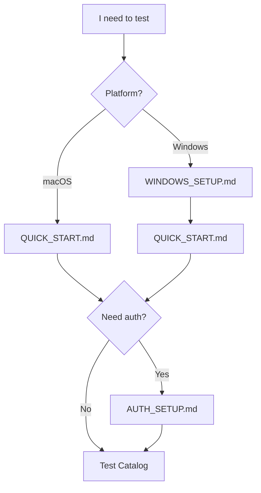

# QA Testing Guide

## Quick Navigation

## 1. Setup

| Platform | Guide |
|----------|-------|
| macOS | [QUICK_START.md](./tests/e2e/setup/QUICK_START.md) |
| Windows | [WINDOWS_SETUP.md](./tests/e2e/setup/WINDOWS_SETUP.md) → [QUICK_START.md](./tests/e2e/setup/QUICK_START.md) |
| Windows + Claude Desktop | [WINDOWS_CLAUDE_DESKTOP.md](./tests/e2e/setup/WINDOWS_CLAUDE_DESKTOP.md) |

## 2. Prerequisites (if test requires auth)

| State | Guide | Used by |
|-------|-------|---------|
| Backup .condarc | [AUTH_SETUP.md#backup](./tests/e2e/setup/AUTH_SETUP.md#before-you-begin--backup-recommended) | All auth tests |
| Logged In | [AUTH_SETUP.md#logged-in](./tests/e2e/setup/AUTH_SETUP.md#prerequisites-logged-in-core-001-auth-002) | CORE-001, AUTH-002 |
| Logged Out + Public | [AUTH_SETUP.md#logged-out-public](./tests/e2e/setup/AUTH_SETUP.md#prerequisites-logged-out--public-channels-core-001a) | CORE-001a |
| Logged Out + Private | [AUTH_SETUP.md#logged-out-private](./tests/e2e/setup/AUTH_SETUP.md#prerequisites-logged-out--private-channels-auth-001a) | AUTH-001a |
| Cleanup | [AUTH_SETUP.md#cleanup](./tests/e2e/setup/AUTH_SETUP.md#post-conditions--cleanup) | After auth tests |

## 3. Test Catalog

| Test | Description | RC1 | RC2 |
|------|-------------|:---:|:---:|
| [SETUP-001](./tests/e2e/SETUP-001.md) | Installation disclaimer verification | | + |
| [CORE-001](./tests/e2e/CORE-001.md) | Full tools flow — logged in | + | + |
| [CORE-001a](./tests/e2e/CORE-001a.md) | Full tools flow — logged out (public channels) | + | + |
| [AUTH-001](./tests/e2e/AUTH-001.md) | Anonymous mode (public channels) | + | + |
| [AUTH-001a](./tests/e2e/AUTH-001a.md) | Anonymous + private channels → 403 | | + |
| [AUTH-002](./tests/e2e/AUTH-002.md) | Authenticated mode | + | + |
| [GUARD-001](./tests/e2e/GUARD-001.md) | Guardrails (no pip fallback, deletion confirm) | + | + |
| [CHAN-001](./tests/e2e/CHAN-001.md) | Override channels behavior | | + |
| [REGRESS-001](./tests/e2e/REGRESS-001.md) | Known issues regression (KI-001, KI-002, KI-003) | + | + |
| [REGRESS-002](./tests/e2e/REGRESS-002.md) | Remove environment by name (DESK-1342) | + | + |

**Legend**: `+` = in scope for release

## 4. Tracking & Reference

| Document | Purpose |
|----------|---------|
| [TEST_MATRIX_rc2.md](./_planning/TEST_MATRIX_rc2.md) | Test assignments per QA/config |
| [TEST_PROGRESS.md](./_tracking/TEST_PROGRESS.md) | Results tracking |
| [KNOWN_ISSUES.md](./_tracking/KNOWN_ISSUES.md) | Bugs and workarounds |

## 5. Workflow

1. **Setup**: Follow platform guide to install and configure
2. **Backup**: Run backup command from AUTH_SETUP.md (once, before any auth tests)
3. **Prerequisites**: Set auth state per test requirements
4. **Execute**: Run test steps, record results
5. **Cleanup**: Restore original state after auth tests
6. **Report**: Update TEST_PROGRESS.md with results

---

## Additional Documentation

### Product Documentation
| Document | Description |
|----------|-------------|
| [PRODUCT_OVERVIEW.md](./_product/PRODUCT_OVERVIEW.md) | Product features, architecture, constraints |
| [FEATURE_TREE.md](./_product/FEATURE_TREE.md) | 3-level feature tree with diagrams |
| [CONFIGURATION.md](./tech_details/CONFIGURATION.md) | Configuration options reference |

### Automation Test Docs
| Document | Description |
|----------|-------------|
| [TESTS_CLI.md](./tests/automation/TESTS_CLI.md) | CLI-only flows (automatable) |
| [TESTS_CONFIG.md](./tests/automation/TESTS_CONFIG.md) | Configuration tests (automatable) |
| [TESTS_API_TOOLS.md](./tests/automation/TESTS_API_TOOLS.md) | Direct API tool tests (automatable) |

### Test Projects (automation)
| Folder | Purpose |
|--------|---------|
| [`tests/qa/http_tools/`](../http_tools/README.md) | HTTP API regression suite |
| [`tests/qa/stdio_tools/`](../stdio_tools/README.md) | STDIO regression suite |
