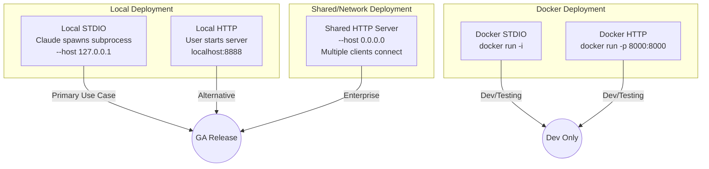
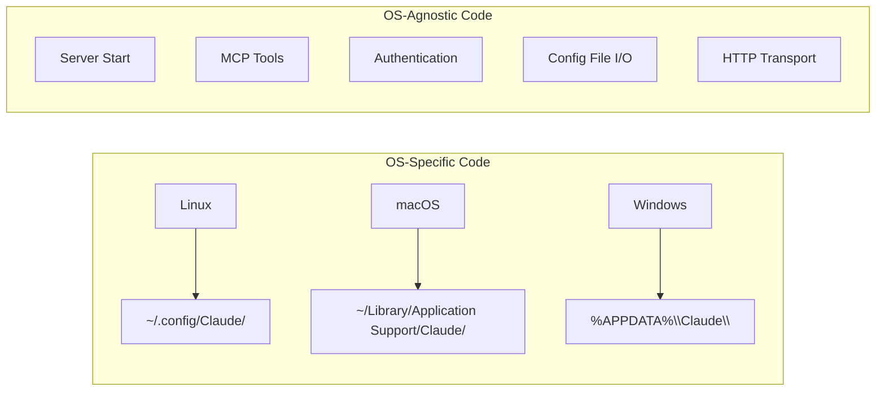
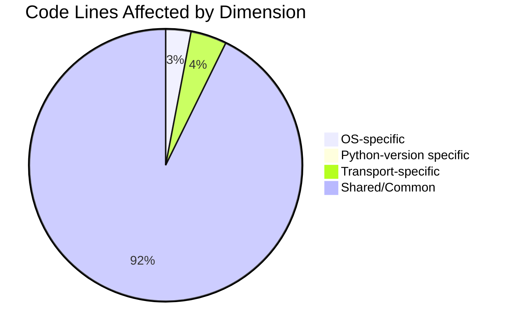
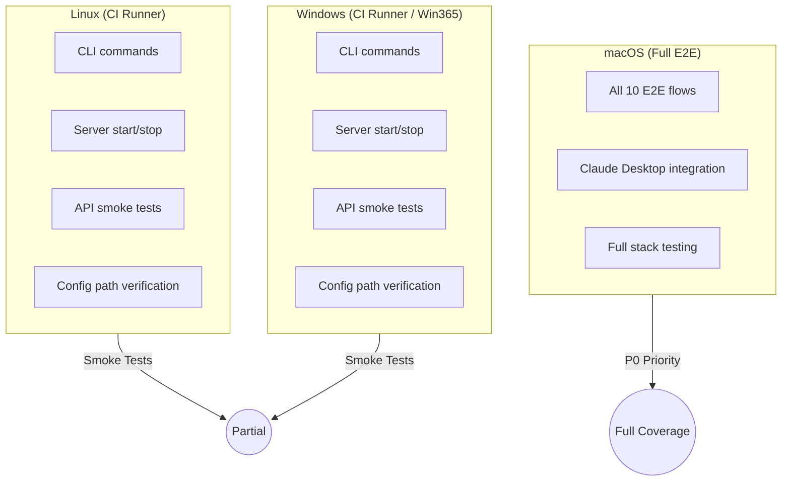
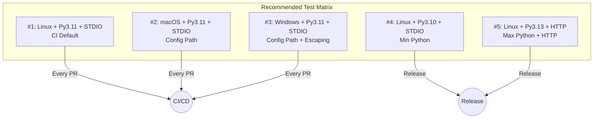
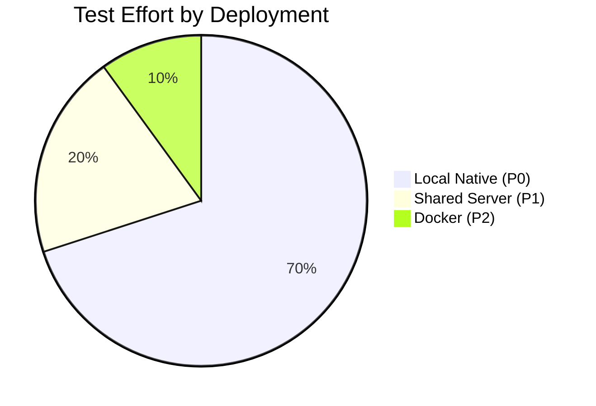

# Anaconda MCP - Test Matrix & Pairwise Analysis

## Scope Analysis

### Dimensions Identified

| Dimension | Values | Source |
|-----------|--------|--------|
| **Operating System** | Linux, macOS, Windows | `consts.py`, `claude_desktop.py` |
| **Python Version** | 3.10, 3.11, 3.12, 3.13 | `pyproject.toml`: `>=3.10,<3.14` |
| **MCP Client** | Claude Desktop | Only client supported |
| **Transport** | STDIO, HTTP | `claude_desktop.py` |
| **Deployment** | Local Native, Shared Server, Docker | `USER_GUIDE.md`, `DOCKER.md` |

### Deployment Scenarios



### Deployment Characteristics

| Deployment | Persistence | Multi-Client | Network | Priority |
|------------|-------------|--------------|---------|----------|
| **Local STDIO** | Yes | No | No | **P0** |
| **Local HTTP** | Yes | No | No | **P0** |
| **Shared Server** | Yes | Yes | Yes | **P1** |
| **Docker STDIO** | No (ephemeral) | No | No | **P2** |
| **Docker HTTP** | No (ephemeral) | Yes | Yes | **P2** |

### Full Cartesian Product

```
3 OS × 4 Python × 1 Client × 2 Transport × 3 Deployment = 72 combinations
```

This is too many for practical E2E testing. Let's analyze what actually differs.

---

## Code Path Analysis

### OS-Specific Code (3 distinct paths)

Only **Claude Desktop config path** differs by OS:



**Conclusion**: OS testing needed only for `claude-desktop` commands.

### Python Version Analysis

| Version | Support Status | CI Tested | Risk |
|---------|---------------|-----------|------|
| 3.10 | Minimum supported | No | **HIGH** - boundary |
| 3.11 | Supported | Yes | Low |
| 3.12 | Supported | No | Medium |
| 3.13 | Maximum supported | No | **HIGH** - boundary |

**Conclusion**: Test boundaries (3.10, 3.13) plus one middle version (3.11).

### Transport Analysis

| Transport | OS-Specific | Code Path |
|-----------|-------------|-----------|
| STDIO | No (subprocess is cross-platform) | `build_stdio_config()` |
| HTTP | No | `build_streamable_http_config()` |

**Conclusion**: Transport testing is OS-agnostic.

### Deployment Analysis

| Deployment | Unique Concerns | Test Priority |
|------------|-----------------|---------------|
| **Local Native** | Config paths, subprocess | P0 - Primary |
| **Shared Server** | Network binding, firewall, multi-client | P1 - Enterprise |
| **Docker** | Ephemeral storage, container networking | P2 - Dev/Test only |

**Key Differences by Deployment:**

| Concern | Local | Shared | Docker |
|---------|-------|--------|--------|
| Conda envs persist | ✓ | ✓ | ✗ |
| Network exposure | ✗ | ✓ | ✓ |
| Firewall issues | ✗ | ✓ | ✓ |
| Multi-client | ✗ | ✓ | ✓ |
| Host OS matters | ✓ | ✓ | ✗ (Linux container) |

**Conclusion**:
- Local Native = primary test focus
- Shared Server = additional network tests
- Docker = separate test track (Linux only)

### Client Analysis

| Client | Status | Notes |
|--------|--------|-------|
| Claude Desktop | Fully supported | Only client with dedicated code |
| Claude Code | Works (via STDIO) | No specific integration |

**Conclusion**: Only Claude Desktop needs testing now.

---

## Risk-Based Prioritization

### What Can Go Wrong?

| Risk | Dimension | Impact | Likelihood |
|------|-----------|--------|------------|
| Config path wrong | OS | High | Medium |
| Python syntax incompatibility | Python version | High | Low |
| Dependency version conflict | Python version | Medium | Medium |
| STDIO subprocess failure | OS | High | Low |
| HTTP transport failure | Transport | Medium | Low |

### Code Coverage by Dimension



**97% of code is shared** - dimensional testing has diminishing returns.

---

## Pairwise Test Matrix

### Pairwise Principle

Instead of testing all 24 combinations, pairwise ensures every pair of values appears at least once.

### Generated Pairwise Matrix

Using pairwise algorithm for: 3 OS × 3 Python × 2 Transport = 18 full → **6 pairwise**

| # | OS | Python | Transport | Rationale |
|---|-----|--------|-----------|-----------|
| 1 | **Linux** | **3.10** | STDIO | Boundary Python + common OS |
| 2 | **macOS** | **3.11** | STDIO | CI-tested Python + macOS |
| 3 | **Windows** | **3.13** | STDIO | Boundary Python + Windows paths |
| 4 | **Linux** | **3.13** | HTTP | HTTP + high Python |
| 5 | **macOS** | **3.10** | HTTP | HTTP + low Python |
| 6 | **Windows** | **3.11** | HTTP | HTTP + Windows |

### Pairwise Coverage Verification

| Pair | Combinations | Covered |
|------|--------------|---------|
| Linux + 3.10 | ✓ | #1 |
| Linux + 3.11 | - | (skip) |
| Linux + 3.13 | ✓ | #4 |
| macOS + 3.10 | ✓ | #5 |
| macOS + 3.11 | ✓ | #2 |
| macOS + 3.13 | - | (skip) |
| Windows + 3.10 | - | (skip) |
| Windows + 3.11 | ✓ | #6 |
| Windows + 3.13 | ✓ | #3 |
| Linux + STDIO | ✓ | #1 |
| Linux + HTTP | ✓ | #4 |
| macOS + STDIO | ✓ | #2 |
| macOS + HTTP | ✓ | #5 |
| Windows + STDIO | ✓ | #3 |
| Windows + HTTP | ✓ | #6 |
| 3.10 + STDIO | ✓ | #1 |
| 3.10 + HTTP | ✓ | #5 |
| 3.11 + STDIO | ✓ | #2 |
| 3.11 + HTTP | ✓ | #6 |
| 3.13 + STDIO | ✓ | #3 |
| 3.13 + HTTP | ✓ | #4 |

**All pairs covered with 6 combinations** (vs 18 full matrix).

---

## Recommended Test Strategy

### Available Test Environments

| Environment | OS | Claude Desktop | Use For |
|-------------|-----|----------------|---------|
| QA macOS | macOS | ✅ Yes | Full E2E testing |
| GitHub Runner | Linux | ❌ No | CLI + API smoke tests |
| GitHub Runner | Windows | ❌ No | CLI + API smoke tests |
| Win365 Instance | Windows | ❌ No | CLI + API smoke tests |

### Test Strategy by Platform



### Tier 1: macOS Full E2E (Manual QA)

**Environment**: QA macOS with Claude Desktop

| # | Flow | Priority | Description |
|---|------|----------|-------------|
| 1 | CORE-001 | P0 | Full setup & all 5 tools |
| 2 | CORE-002 | P0 | HTTP transport |
| 3 | CORE-003 | P0 | Config management |
| 4 | GUARD-001 | P0 | Guardrails (full stack) |
| 5 | REGRESS-001 | P0 | Known issues regression |
| 6 | CLI-001 | P1 | Server discovery |
| 7 | CLI-002 | P1 | Advanced options |
| 8 | AUTH-001 | P1 | Authentication |
| 9 | AUTH-002 | P1 | Anonymous mode |
| 10 | CONFIG-001 | P1 | Environment variables |

### Tier 2: Linux/Windows Smoke Tests (CI/Manual)

**Environment**: GitHub Runners or Win365 (no Claude Desktop)

**What we CAN test without Claude Desktop:**

```bash
# 1. CLI Help & Version
anaconda-mcp --help
anaconda-mcp --version  # if available

# 2. Server Start/Stop
anaconda-mcp serve --port 8888 &
sleep 5
curl -s http://localhost:8888/mcp -X POST \
  -H "Content-Type: application/json" \
  -d '{"jsonrpc":"2.0","id":1,"method":"initialize","params":{"protocolVersion":"2024-11-05","capabilities":{},"clientInfo":{"name":"test","version":"1.0"}}}'
curl -s http://localhost:8888/mcp -X POST \
  -H "Content-Type: application/json" \
  -d '{"jsonrpc":"2.0","id":2,"method":"tools/list","params":{}}'
kill %1

# 3. Config Path Verification (OS-specific)
anaconda-mcp claude-desktop path
# Linux: ~/.config/Claude/claude_desktop_config.json
# Windows: %APPDATA%\Claude\claude_desktop_config.json

# 4. Discover & Compose
anaconda-mcp discover
anaconda-mcp compose --output-format json

# 5. Verbose Logging
anaconda-mcp -v serve --delay 1 &
sleep 3
kill %1
```

### Linux/Windows Smoke Test Checklist

| Test | Command | Expected |
|------|---------|----------|
| CLI loads | `anaconda-mcp --help` | Shows help |
| Server starts | `anaconda-mcp serve` | Listening on port |
| API responds | `curl .../initialize` | JSON-RPC response |
| Tools available | `curl .../tools/list` | 5 conda tools |
| Correct config path | `claude-desktop path` | OS-specific path |
| Discover works | `anaconda-mcp discover` | Lists servers |
| Compose works | `anaconda-mcp compose` | No errors |
| Env vars work | `ANACONDA_MCP_LOG_LEVEL=DEBUG` | Debug logs |

### Platform Test Coverage

| Test Area | macOS | Linux | Windows |
|-----------|-------|-------|---------|
| Claude Desktop E2E | ✅ Full | ❌ N/A | ❌ N/A |
| CLI commands | ✅ | ✅ | ✅ |
| Server start/stop | ✅ | ✅ | ✅ |
| API smoke test | ✅ | ✅ | ✅ |
| Config path | ✅ | ✅ | ✅ |
| Tool execution | ✅ via Claude | ✅ via API | ✅ via API |
| Environment tools | ✅ Full | ⚠️ API only | ⚠️ API only |

### Simplified CI Workflow

```yaml
# GitHub Actions
jobs:
  smoke-test:
    strategy:
      matrix:
        os: [ubuntu-latest, windows-latest]
    steps:
      - uses: actions/checkout@v4
      - uses: conda-incubator/setup-miniconda@v3
      - run: conda install anaconda-mcp environments-mcp-server
      - run: |
          anaconda-mcp --help
          anaconda-mcp claude-desktop path
          anaconda-mcp discover
          # Start server and test API
          anaconda-mcp serve --port 8888 &
          sleep 10
          curl -f http://localhost:8888/mcp -X POST ...
```

---

## Scope Elimination

### What We Can Skip

| Dimension | Skip | Rationale |
|-----------|------|-----------|
| Python 3.12 | Yes | Between boundaries, low risk |
| Cursor client | Yes | No code exists yet |
| VS Code client | Yes | No code exists yet |
| SSE transport | Yes | Not supported by anaconda-mcp CLI |
| Claude Code specific | Yes | Uses same STDIO as Claude Desktop |

### What We Must Test

| Dimension | Must Test | Rationale |
|-----------|-----------|-----------|
| All 3 OS | Yes | Different config paths |
| Python 3.10, 3.13 | Yes | Boundaries |
| Python 3.11 | Yes | CI baseline |
| STDIO transport | Yes | Default mode |
| HTTP transport | Yes | Alternative mode |

---

## Final Test Matrix

### Minimum Viable Matrix (5 combinations)



### Matrix Summary

| Tier | Combinations | When | Coverage |
|------|--------------|------|----------|
| CI/CD | 3 | Every PR | OS paths |
| Release | 5 | Before release | OS + Python boundaries + HTTP |
| Full | 6 | Major release | Complete pairwise |

---

## Implementation Recommendation

### Update CI/CD Workflow

```yaml
# .github/workflows/test-claude-desktop.yml
strategy:
  matrix:
    include:
      # Tier 1: Every PR (OS coverage)
      - os: ubuntu-latest
        python-version: '3.11'
        transport: stdio
      - os: macos-latest
        python-version: '3.11'
        transport: stdio
      - os: windows-latest
        python-version: '3.11'
        transport: stdio

      # Tier 2: Release only (Python boundaries)
      - os: ubuntu-latest
        python-version: '3.10'
        transport: stdio
        release-only: true
      - os: ubuntu-latest
        python-version: '3.13'
        transport: http
        release-only: true
```

### E2E Flow Assignment

| Flow | Tier 1 (CI) | Tier 2 (Release) |
|------|-------------|------------------|
| CORE-001 | All 3 OS | All 5 combinations |
| CORE-002 | - | HTTP combinations only |
| CORE-003 | Linux only | All |
| REGRESS-001 | All 3 OS | All |
| Others | - | All |

---

## Summary

| Metric | Full Matrix | Pairwise | Recommended |
|--------|-------------|----------|-------------|
| Combinations | 72 | 12 | **7** |
| Reduction | - | 83% | **90%** |
| Coverage | 100% | 100% pairs | 100% critical paths |

**Key decisions**:
1. Skip Python 3.12 (between boundaries)
2. Skip future clients (Cursor, VS Code) until code exists
3. Test OS paths on every PR (Local Native only)
4. Test Python boundaries on release only
5. Test HTTP transport on release only
6. Test Shared Server deployment on release only
7. Test Docker only on major releases (dev/test purpose)

---

## Deployment Decision Matrix

| Question | Answer | Test Impact |
|----------|--------|-------------|
| **Primary use case?** | Local Native (developer machine) | Focus 80% of testing here |
| **Enterprise use case?** | Shared HTTP Server | Test network scenarios on release |
| **Docker purpose?** | Dev/Testing only (ephemeral) | Lower priority, Linux-only |
| **Multi-client needed?** | Only for Shared Server | Test concurrency on release |
| **Persistence matters?** | Yes for Local/Shared, No for Docker | Document Docker limitations |

---

## Test Effort Distribution



| Deployment | E2E Flows | Priority | When to Run |
|------------|-----------|----------|-------------|
| Local Native | 11 flows | P0 | Every PR |
| Shared Server | 1-2 flows | P1 | Release |
| Docker | 1 flow | P2 | Major Release |
