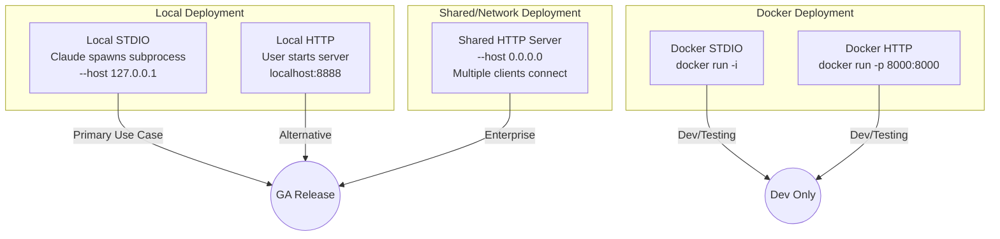
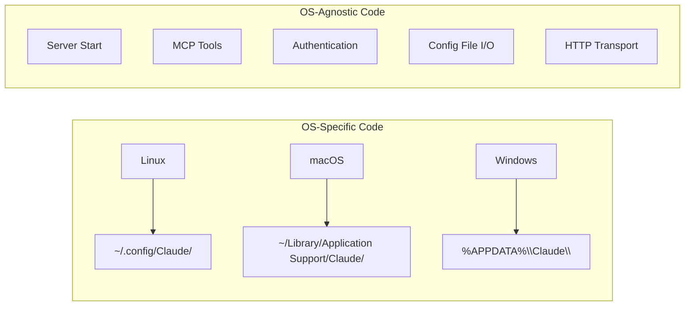
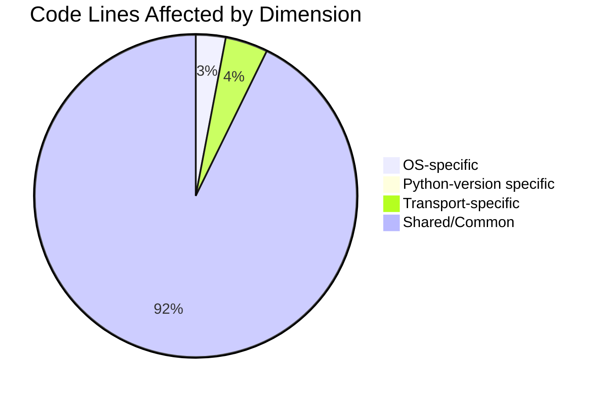
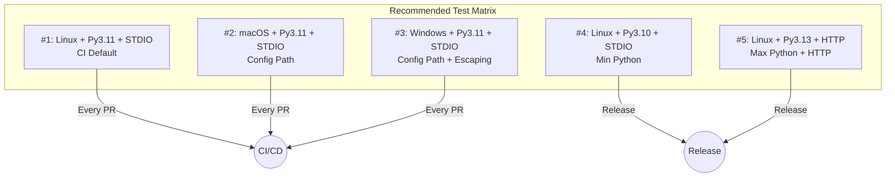
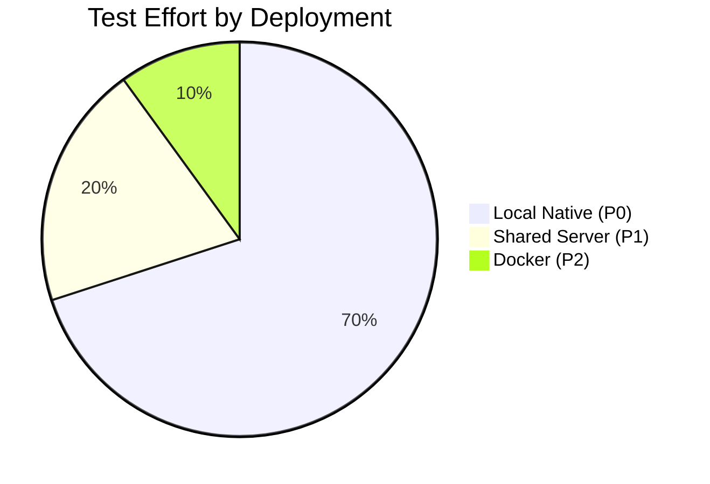

# Anaconda MCP - Test Matrix & Pairwise Analysis

## Scope Analysis

### Dimensions Identified

| Dimension | Values | Source |
|-----------|--------|--------|
| **Operating System** | Linux, macOS, Windows | `consts.py`, `claude_desktop.py` |
| **Python Version** | 3.10, 3.11, 3.12, 3.13 | `pyproject.toml`: `>=3.10,<3.14` |
| **MCP Client** | Claude Desktop | Only client supported |
| **Transport** | STDIO, HTTP | `claude_desktop.py` |
| **Deployment** | Local Native, Shared Server, Docker | `USER_GUIDE.md`, `DOCKER.md` |

### Deployment Scenarios



### Deployment Characteristics

| Deployment | Persistence | Multi-Client | Network | Priority |
|------------|-------------|--------------|---------|----------|
| **Local STDIO** | Yes | No | No | **P0** |
| **Local HTTP** | Yes | No | No | **P0** |
| **Shared Server** | Yes | Yes | Yes | **P1** |
| **Docker STDIO** | No (ephemeral) | No | No | **P2** |
| **Docker HTTP** | No (ephemeral) | Yes | Yes | **P2** |

### Full Cartesian Product

```
3 OS × 4 Python × 1 Client × 2 Transport × 3 Deployment = 72 combinations
```

This is too many for practical E2E testing. Let's analyze what actually differs.

---

## Code Path Analysis

### OS-Specific Code (3 distinct paths)

Only **Claude Desktop config path** differs by OS:



**Conclusion**: OS testing needed only for `claude-desktop` commands.

### Python Version Analysis

| Version | Support Status | CI Tested | Risk |
|---------|---------------|-----------|------|
| 3.10 | Minimum supported | No | **HIGH** - boundary |
| 3.11 | Supported | Yes | Low |
| 3.12 | Supported | No | Medium |
| 3.13 | Maximum supported | No | **HIGH** - boundary |

**Conclusion**: Test boundaries (3.10, 3.13) plus one middle version (3.11).

### Transport Analysis

| Transport | OS-Specific | Code Path |
|-----------|-------------|-----------|
| STDIO | No (subprocess is cross-platform) | `build_stdio_config()` |
| HTTP | No | `build_streamable_http_config()` |

**Conclusion**: Transport testing is OS-agnostic.

### Deployment Analysis

| Deployment | Unique Concerns | Test Priority |
|------------|-----------------|---------------|
| **Local Native** | Config paths, subprocess | P0 - Primary |
| **Shared Server** | Network binding, firewall, multi-client | P1 - Enterprise |
| **Docker** | Ephemeral storage, container networking | P2 - Dev/Test only |

**Key Differences by Deployment:**

| Concern | Local | Shared | Docker |
|---------|-------|--------|--------|
| Conda envs persist | ✓ | ✓ | ✗ |
| Network exposure | ✗ | ✓ | ✓ |
| Firewall issues | ✗ | ✓ | ✓ |
| Multi-client | ✗ | ✓ | ✓ |
| Host OS matters | ✓ | ✓ | ✗ (Linux container) |

**Conclusion**:
- Local Native = primary test focus
- Shared Server = additional network tests
- Docker = separate test track (Linux only)

### Client Analysis

| Client | Status | Notes |
|--------|--------|-------|
| Claude Desktop | Fully supported | Only client with dedicated code |
| Claude Code | Works (via STDIO) | No specific integration |
| Cursor | Planned (P1) | No code yet |
| VS Code + Copilot | Planned (P1) | No code yet |

**Conclusion**: Only Claude Desktop needs testing now.

---

## Risk-Based Prioritization

### What Can Go Wrong?

| Risk | Dimension | Impact | Likelihood |
|------|-----------|--------|------------|
| Config path wrong | OS | High | Medium |
| Python syntax incompatibility | Python version | High | Low |
| Dependency version conflict | Python version | Medium | Medium |
| STDIO subprocess failure | OS | High | Low |
| HTTP transport failure | Transport | Medium | Low |

### Code Coverage by Dimension



**97% of code is shared** - dimensional testing has diminishing returns.

---

## Pairwise Test Matrix

### Pairwise Principle

Instead of testing all 24 combinations, pairwise ensures every pair of values appears at least once.

### Generated Pairwise Matrix

Using pairwise algorithm for: 3 OS × 3 Python × 2 Transport = 18 full → **6 pairwise**

| # | OS | Python | Transport | Rationale |
|---|-----|--------|-----------|-----------|
| 1 | **Linux** | **3.10** | STDIO | Boundary Python + common OS |
| 2 | **macOS** | **3.11** | STDIO | CI-tested Python + macOS |
| 3 | **Windows** | **3.13** | STDIO | Boundary Python + Windows paths |
| 4 | **Linux** | **3.13** | HTTP | HTTP + high Python |
| 5 | **macOS** | **3.10** | HTTP | HTTP + low Python |
| 6 | **Windows** | **3.11** | HTTP | HTTP + Windows |

### Pairwise Coverage Verification

| Pair | Combinations | Covered |
|------|--------------|---------|
| Linux + 3.10 | ✓ | #1 |
| Linux + 3.11 | - | (skip) |
| Linux + 3.13 | ✓ | #4 |
| macOS + 3.10 | ✓ | #5 |
| macOS + 3.11 | ✓ | #2 |
| macOS + 3.13 | - | (skip) |
| Windows + 3.10 | - | (skip) |
| Windows + 3.11 | ✓ | #6 |
| Windows + 3.13 | ✓ | #3 |
| Linux + STDIO | ✓ | #1 |
| Linux + HTTP | ✓ | #4 |
| macOS + STDIO | ✓ | #2 |
| macOS + HTTP | ✓ | #5 |
| Windows + STDIO | ✓ | #3 |
| Windows + HTTP | ✓ | #6 |
| 3.10 + STDIO | ✓ | #1 |
| 3.10 + HTTP | ✓ | #5 |
| 3.11 + STDIO | ✓ | #2 |
| 3.11 + HTTP | ✓ | #6 |
| 3.13 + STDIO | ✓ | #3 |
| 3.13 + HTTP | ✓ | #4 |

**All pairs covered with 6 combinations** (vs 18 full matrix).

---

## Recommended Test Strategy

### Tier 1: CI/CD Automated (Every PR) - Local Native

Run on every pull request:

| # | OS | Python | Transport | Deployment | E2E Flows |
|---|-----|--------|-----------|------------|-----------|
| 1 | ubuntu-latest | 3.11 | STDIO | Local | CORE-001, REGRESS-001 |
| 2 | macos-latest | 3.11 | STDIO | Local | CORE-001 (config path) |
| 3 | windows-latest | 3.11 | STDIO | Local | CORE-001 (config path) |

**Rationale**: Matches current CI, catches OS-specific path issues.

### Tier 2: Release Testing (Before Release) - Local + Shared

Run before each release:

| # | OS | Python | Transport | Deployment | E2E Flows |
|---|-----|--------|-----------|------------|-----------|
| 1 | Linux | 3.10 | STDIO | Local | All P0 flows |
| 2 | Linux | 3.13 | HTTP | Local | CORE-002, CONFIG-001 |
| 3 | macOS | 3.11 | STDIO | Local | All P0 flows |
| 4 | Windows | 3.13 | STDIO | Local | All P0 flows |
| 5 | Linux | 3.11 | HTTP | **Shared** | SHARED-001 (new) |

**Rationale**: Covers Python boundaries, both transports, and shared server.

### Tier 3: Full Regression (Major Release) - All Deployments

| # | OS | Python | Transport | Deployment | E2E Flows |
|---|-----|--------|-----------|------------|-----------|
| 1-5 | (Tier 2) | | | | |
| 6 | Linux | 3.11 | HTTP | **Docker** | DOCKER-001 (new) |
| 7 | Linux | 3.11 | HTTP | **Shared** | Multi-client test |

### Deployment-Specific Test Flows (New)

**SHARED-001: Shared Server Scenario**
```
1. Start server: anaconda-mcp serve --host 0.0.0.0 --port 8888
2. From another machine/container, connect via HTTP
3. Verify tool execution works remotely
4. Test concurrent client connections (if applicable)
```

**DOCKER-001: Docker Deployment Scenario**
```
1. Build image: make docker-build
2. Run container: docker run -it -p 8000:8000 anaconda-mcp
3. Connect Claude Desktop to container
4. Create environment (verify it's ephemeral)
5. Stop container, verify environment lost
```

---

## Scope Elimination

### What We Can Skip

| Dimension | Skip | Rationale |
|-----------|------|-----------|
| Python 3.12 | Yes | Between boundaries, low risk |
| Cursor client | Yes | No code exists yet |
| VS Code client | Yes | No code exists yet |
| SSE transport | Yes | Deprecated |
| Claude Code specific | Yes | Uses same STDIO as Claude Desktop |

### What We Must Test

| Dimension | Must Test | Rationale |
|-----------|-----------|-----------|
| All 3 OS | Yes | Different config paths |
| Python 3.10, 3.13 | Yes | Boundaries |
| Python 3.11 | Yes | CI baseline |
| STDIO transport | Yes | Default mode |
| HTTP transport | Yes | Alternative mode |

---

## Final Test Matrix

### Minimum Viable Matrix (5 combinations)



### Matrix Summary

| Tier | Combinations | When | Coverage |
|------|--------------|------|----------|
| CI/CD | 3 | Every PR | OS paths |
| Release | 5 | Before release | OS + Python boundaries + HTTP |
| Full | 6 | Major release | Complete pairwise |

---

## Implementation Recommendation

### Update CI/CD Workflow

```yaml
# .github/workflows/test-claude-desktop.yml
strategy:
  matrix:
    include:
      # Tier 1: Every PR (OS coverage)
      - os: ubuntu-latest
        python-version: '3.11'
        transport: stdio
      - os: macos-latest
        python-version: '3.11'
        transport: stdio
      - os: windows-latest
        python-version: '3.11'
        transport: stdio

      # Tier 2: Release only (Python boundaries)
      - os: ubuntu-latest
        python-version: '3.10'
        transport: stdio
        release-only: true
      - os: ubuntu-latest
        python-version: '3.13'
        transport: http
        release-only: true
```

### E2E Flow Assignment

| Flow | Tier 1 (CI) | Tier 2 (Release) |
|------|-------------|------------------|
| CORE-001 | All 3 OS | All 5 combinations |
| CORE-002 | - | HTTP combinations only |
| CORE-003 | Linux only | All |
| GUARD-001 | Linux only | All |
| REGRESS-001 | All 3 OS | All |
| Others | - | All |

---

## Summary

| Metric | Full Matrix | Pairwise | Recommended |
|--------|-------------|----------|-------------|
| Combinations | 72 | 12 | **7** |
| Reduction | - | 83% | **90%** |
| Coverage | 100% | 100% pairs | 100% critical paths |

**Key decisions**:
1. Skip Python 3.12 (between boundaries)
2. Skip future clients (Cursor, VS Code) until code exists
3. Test OS paths on every PR (Local Native only)
4. Test Python boundaries on release only
5. Test HTTP transport on release only
6. Test Shared Server deployment on release only
7. Test Docker only on major releases (dev/test purpose)

---

## Deployment Decision Matrix

| Question | Answer | Test Impact |
|----------|--------|-------------|
| **Primary use case?** | Local Native (developer machine) | Focus 80% of testing here |
| **Enterprise use case?** | Shared HTTP Server | Test network scenarios on release |
| **Docker purpose?** | Dev/Testing only (ephemeral) | Lower priority, Linux-only |
| **Multi-client needed?** | Only for Shared Server | Test concurrency on release |
| **Persistence matters?** | Yes for Local/Shared, No for Docker | Document Docker limitations |

---

## Test Effort Distribution



| Deployment | E2E Flows | Priority | When to Run |
|------------|-----------|----------|-------------|
| Local Native | 11 flows | P0 | Every PR |
| Shared Server | 1-2 flows | P1 | Release |
| Docker | 1 flow | P2 | Major Release |
