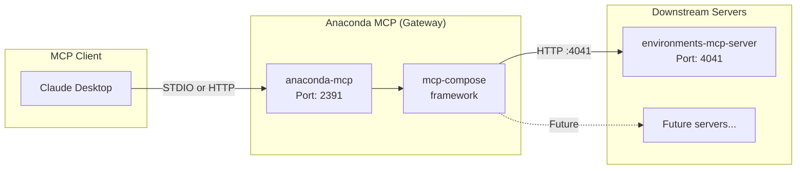
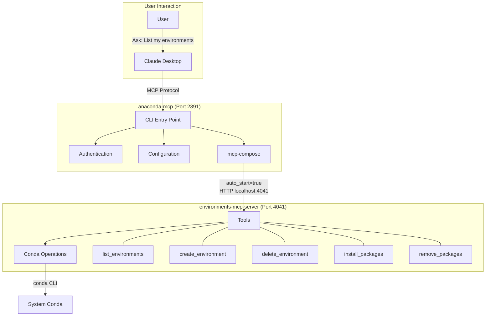
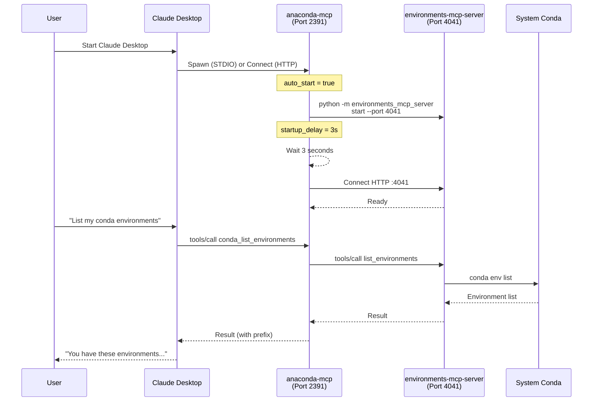

# Anaconda MCP - Product Overview

## What is Anaconda MCP?

Anaconda MCP is a **unified gateway** that composes multiple Model Context Protocol (MCP) servers into a single endpoint. It enables AI assistants (Claude Desktop, other MCP clients) to interact with Anaconda environments and tools through a consistent interface.

## Problem Being Solved

Data scientists and developers managing conda environments lack integration with AI coding assistants. Current pain points:
- AI assistants suggest `pip install` commands that conflict with conda-managed environments
- No programmatic way for LLMs to respect `.condarc` channel configurations
- Users manually copy-paste environment specs between AI chat and terminal
- AI tools cannot verify package availability on licensed/private channels

## Core Value Proposition

- **Single Entry Point**: One MCP server URL instead of configuring multiple servers
- **Tool Composition**: Automatically combines tools from downstream MCP servers
- **Conflict Resolution**: Handles naming conflicts when tools have same names
- **Claude Desktop Integration**: One-command setup for Claude Desktop users
- **Channel-Aware**: Respects `.condarc` channel ordering and enterprise policies

## Architecture

### High-Level Overview



### Component Relationship



### Startup Sequence



## Transport Modes

| Mode | Description | Use Case |
|------|-------------|----------|
| **STDIO** | Claude Desktop spawns anaconda-mcp as subprocess | Default for Claude Desktop (recommended) |
| **Streamable HTTP** | HTTP server mode, client connects via URL | Shared servers, Docker |

**Note**: Only STDIO and Streamable HTTP are supported by anaconda-mcp CLI.

## Supported Clients

| Client | Status | Notes |
|--------|--------|-------|
| **Claude Desktop** | Supported | Dedicated CLI integration (`claude-desktop` commands); STDIO transport only |
| **Cursor** | Supported for HTTP testing | Required for HTTP transport E2E validation (Claude Desktop does not support HTTP — [KI-009](../_tracking/KNOWN_ISSUES.md#ki-009)) |

**Other MCP clients** (Claude Code, VS Code) may work via standard MCP protocol but are not in scope for current release testing.

## Exposed Tools

Currently, anaconda-mcp exposes tools from the **Environments MCP Server** with `conda_` prefix:

### Implemented (P0)

| Tool | Description | Parameters |
|------|-------------|------------|
| `conda_list_environments` | List all conda environments | None |
| `conda_list_environment_packages` | List packages in an environment | environment |
| `conda_create_environment` | Create new conda environment | environment_name, packages |
| `conda_remove_environment` | Delete conda environment (requires confirmation) | environment_name |
| `conda_install_packages` | Install packages | environment, packages |
| `conda_remove_packages` | Remove packages | environment, packages |


## Key Features

### 1. Authentication (Optional)
- Browser-based Anaconda login (`anaconda login`)
- API key authentication via `ANACONDA_AUTH_API_KEY` env var or `~/.anaconda/config.toml`
- Token stored in system keyring
- Required for some downstream features (private channels)

### 2. Telemetry (Optional)
- Sends metrics to Anaconda SnakeEyes service
- Can be disabled via `ANACONDA_MCP_SEND_METRICS=false`

### 3. Claude Desktop CLI Commands
- `claude-desktop setup-config` - Auto-configure Claude Desktop
- `claude-desktop remove-config` - Remove configuration
- `claude-desktop show` - Display current config
- `claude-desktop path` - Show config file location

### 4. Configuration Template System
- Uses `{{PYTHON_EXECUTABLE}}` placeholder
- Supports environment variable override
- Auto-detects Python interpreter path

## Constraints and Limitations

### Technical Constraints
- Python version: 3.10 - 3.13
- Requires `mcp-compose>=0.1.8,<2.0.0`
- Default ports: 2391 (anaconda-mcp), 4041 (environments-mcp-server)

### Platform Constraints
- Supported: Windows, macOS, Linux
- Claude Desktop paths vary by OS
- Windows requires escaped backslashes in config

### Runtime Constraints
- Downstream servers must be reachable (auto-started or manual)
- 3-second default startup delay for downstream servers
- SIGTERM handled for graceful shutdown

## Not In Scope (This Release)

Per epic, these are explicitly excluded:

| Category | Examples | Reason |
|----------|----------|--------|
| GitHub integration | Repository cloning, PR creation | Separate auth scope |
| Filesystem operations | Project scaffolding, file creation | Security review needed |
| Documentation context | Anaconda docs RAG, package lookup | Infrastructure needed |
| Cloud/Remote environments | Anaconda Cloud workspace management | Requires Remote Runtimes |

## Installation Methods

1. **pip**: `pip install anaconda-mcp`
2. **conda**: `conda install anaconda-mcp`
3. **MCPB bundle**: Double-click `.mcpb` file
4. **Docker**: `docker run anaconda-mcp`
5. **Source**: `make install-dev`

## Default Configuration

```toml
[composer]
name = "anaconda-mcp"
conflict_resolution = "prefix"
log_level = "INFO"
port = 2391

[transport]
stdio_enabled = true
streamable_http_enabled = false
```

## Dependencies

### Required at Runtime
- `mcp-compose` - MCP composition framework
- `anaconda-auth` - Authentication & keyring
- `click` - CLI framework
- `pydantic-settings` - Configuration
- `httpx` - HTTP client

### Downstream Servers
- `environments-mcp-server` - Conda environment management (auto-started)
