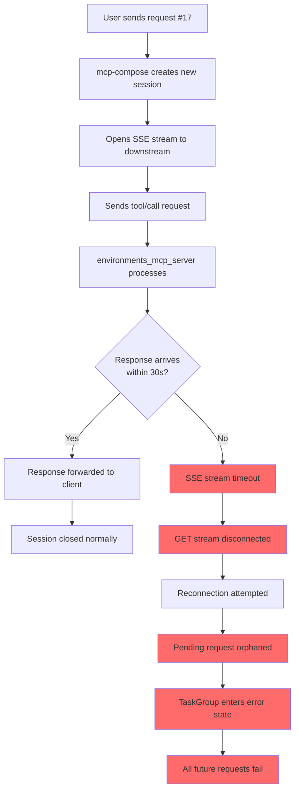
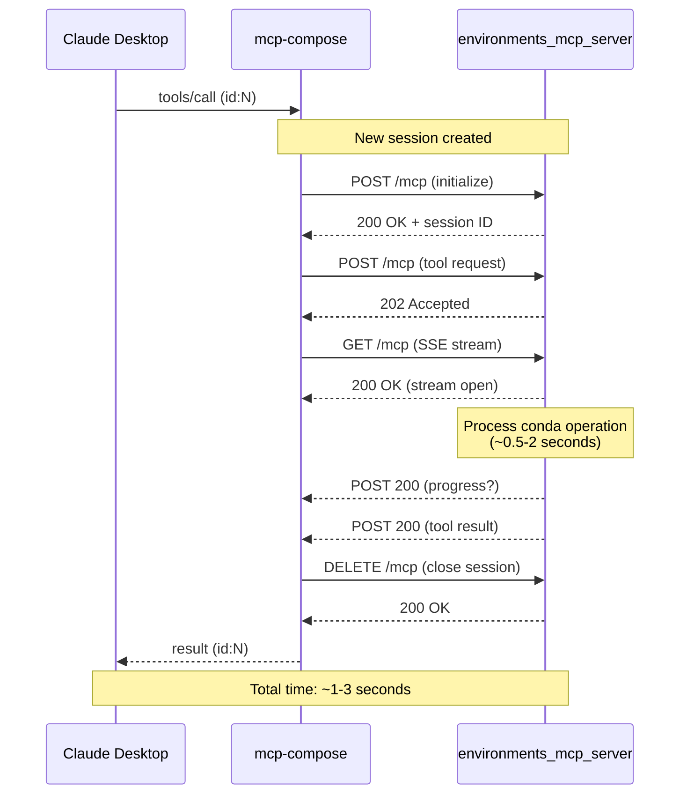
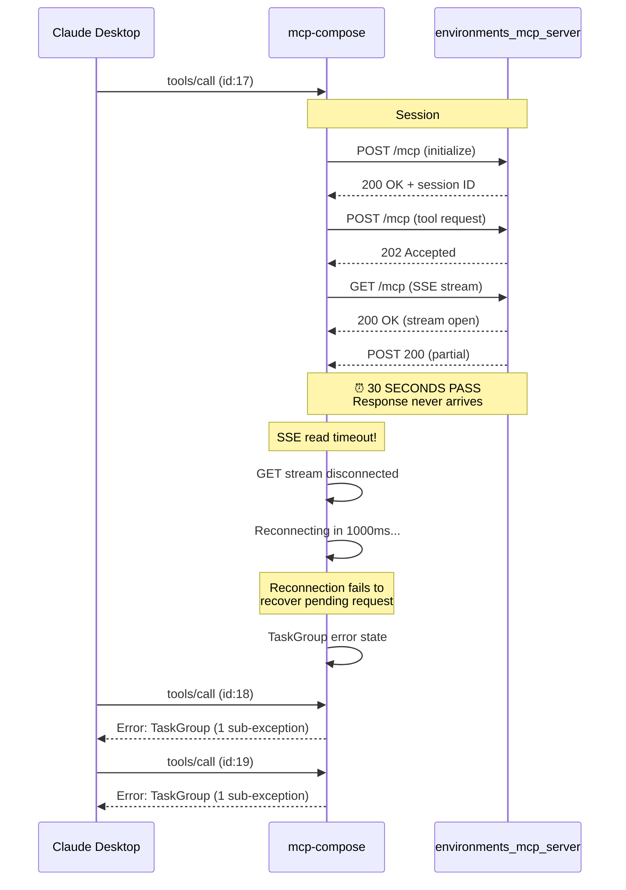
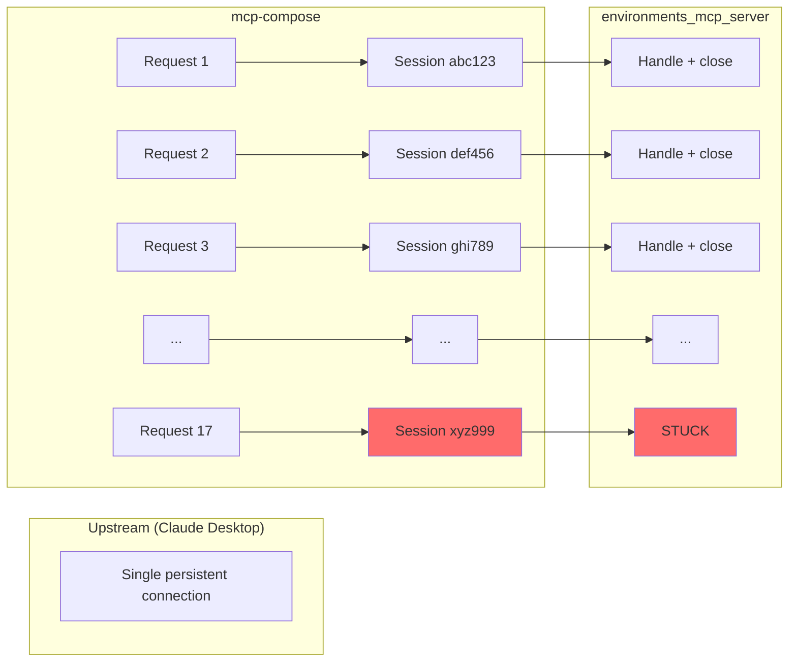

# Technical Analysis: MCP Proxy Hang

Deep dive into root cause, protocol flow, and suggested fixes.

## Event Chain Overview



## Successful Request Flow



## Failed Request Flow (Hang)



## Connection State Timeline

```mermaid
timeline
    title Connection States During Hang

    section Normal Operation (requests 1-16)
        Request starts : ESTABLISHED connections
        Operation runs : Data flowing
        Response sent : DELETE closes session
        Cleanup : TIME_WAIT then closed

    section Hang (request 17)
        17:39:55 : Session init (ESTABLISHED)
        17:39:55 : SSE stream opened
        17:39:55 : Partial response
        17:39:56 to 17:40:24 : Waiting... (still ESTABLISHED)
        17:40:25 : SSE timeout fires
        17:40:25 : Stream disconnected
        17:40:26 : Connections close

    section Post-Hang (requests 18+)
        Any request : TaskGroup error
        No recovery : Must restart
```

## Why It Happens at ~17 Requests

```mermaid
graph LR
    subgraph "Request 1-10"
        A1[Fresh state] --> A2[Quick operations]
        A2 --> A3[Clean completion]
    end

    subgraph "Request 11-16"
        B1[Accumulated sessions] --> B2[More memory pressure]
        B2 --> B3[Slightly slower]
        B3 --> B4[Still completes < 30s]
    end

    subgraph "Request 17"
        C1[Resource pressure peaks] --> C2[Internal delay]
        C2 --> C3[Response delivery stalls]
        C3 --> C4[30s timeout fires]
        C4 --> C5[HANG]
    end

    A3 --> B1
    B4 --> C1

    style C4 fill:#ff6b6b
    style C5 fill:#ff6b6b
```



## Session-Per-Call Pattern

Each tool call creates a **new downstream session**:



**Problem**: After ~17 session create/destroy cycles, internal state degrades.

## Root Cause Analysis

### What We Know For Certain

1. **SSE stream disconnects after 30 seconds** (observed in logs)
2. **Connections are ESTABLISHED during hang** (observed in lsof)
3. **Response stops being forwarded** after ~17 requests
4. **TaskGroup corruption** blocks all subsequent requests
5. **Downstream server remains healthy** (LISTEN state preserved)

### What We Don't Know

1. **Where is the 30-second timeout configured?**
   - mcp.client.streamable_http?
   - httpx client?
   - Server-side SSE?

2. **Why does the response stop arriving?**
   - Internal buffer issue?
   - Async task deadlock?
   - Connection pool exhaustion?

3. **Why doesn't reconnection work?**
   - Pending request not tracked?
   - Session state lost?

## Code Investigation Areas

### mcp.client.streamable_http (MCP SDK)

```
Look for:
- SSE stream timeout configuration
- "GET stream disconnected" log message
- Reconnection logic
- Request tracking during reconnect
```

### mcp_compose/tool_proxy.py

```
Look for:
- TaskGroup usage
- Error handling for stream failures
- How pending requests are tracked
- What happens when SSE stream dies mid-request
```

### httpx/httpcore

```
Look for:
- Connection pool configuration
- Read timeout settings
- Keepalive behavior
```

## Potential Fixes

### 1. Increase SSE Timeout

```python
# Current (assumed):
timeout = 30  # seconds

# Proposed:
timeout = 300  # 5 minutes for long operations
# Or make configurable via environment variable
```

### 2. Add Keepalive Heartbeats

```python
# environments_mcp_server should send periodic heartbeats
async def process_tool_call():
    task = asyncio.create_task(actual_operation())
    while not task.done():
        await send_heartbeat()  # Keeps SSE stream alive
        await asyncio.sleep(10)
    return await task
```

### 3. Improve TaskGroup Error Isolation

```python
# Current: one failure kills all
async with TaskGroup() as tg:
    tg.create_task(handle_request())  # If this fails, all fail

# Proposed: isolate failures
try:
    async with TaskGroup() as tg:
        tg.create_task(handle_request())
except ExceptionGroup as eg:
    log_error(eg)
    # Don't propagate - allow next request to proceed
```

### 4. Fix Reconnection Logic

```python
# Track pending requests
pending_requests = {}

async def handle_disconnect():
    # On reconnect, retry pending requests
    for req_id, req in pending_requests.items():
        await retry_request(req)
```

## Connection State Reference

| State | Meaning |
|-------|---------|
| LISTEN | Server socket waiting for connections |
| ESTABLISHED | Active connection, data can flow |
| TIME_WAIT | Recently closed, waiting for cleanup |
| CLOSE_WAIT | Remote closed, local hasn't acknowledged |
| CLOSED | Connection fully terminated |

**During hang:**
- mcp-compose → env_server: ESTABLISHED (then closes after 30s)
- env_server: LISTEN (always healthy)

**After hang:**
- Only LISTEN remains
- All client connections closed

## Test Results Summary

| Test | Complexity | Duration | Result |
|------|------------|----------|--------|
| Echo server + 0.8s delay | Simple | <1s | PASS |
| list_environments | Shallow | ~0.06s | 40/40 PASS |
| install_packages | Deep | ~0.8s | 19/40 FAIL |
| install + list mixed | Mixed | varies | 15/40 FAIL |
| Claude Desktop real use | Real | varies | FAIL at ~17 |

**Conclusion**: Bug is triggered by accumulated state over ~17 requests with real operations, not by simple timing.
