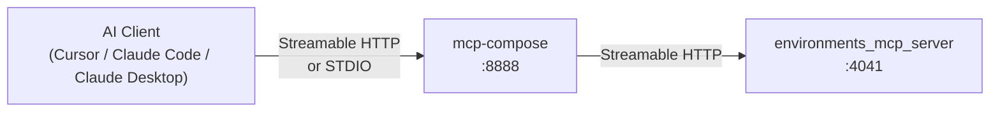
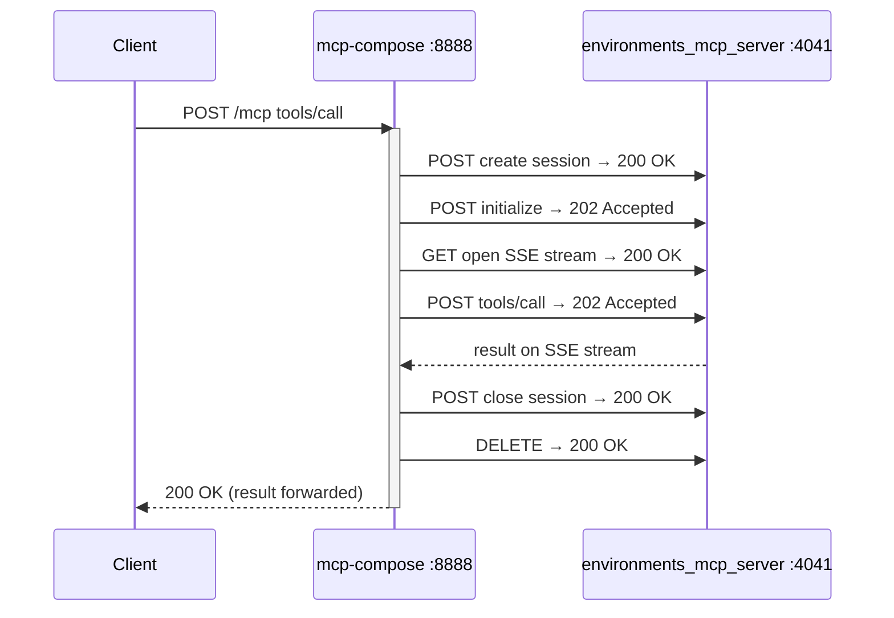
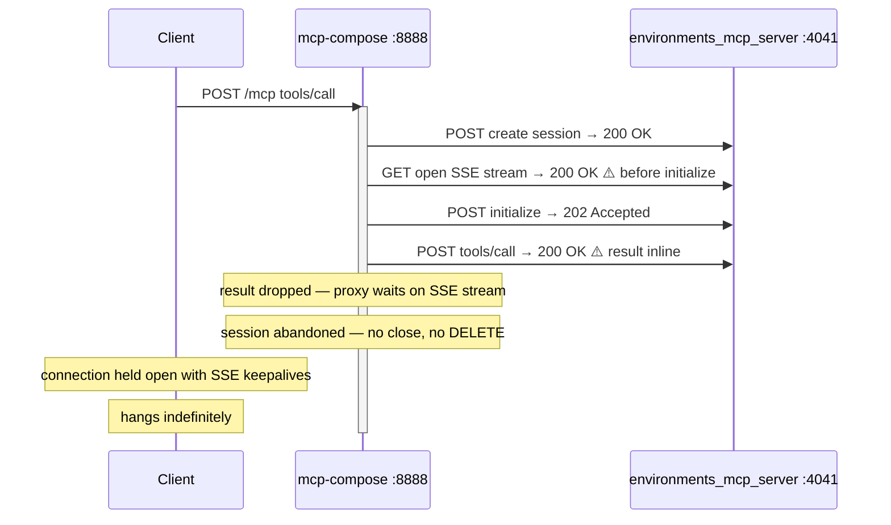
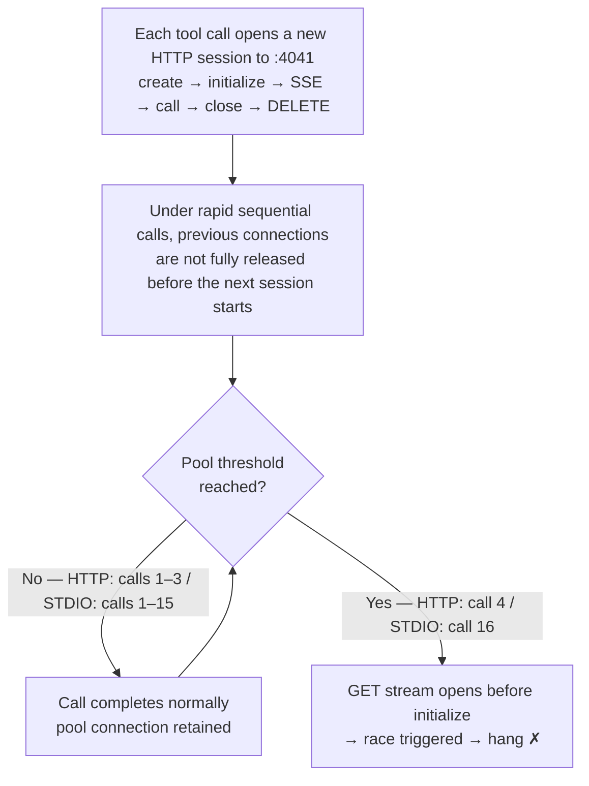
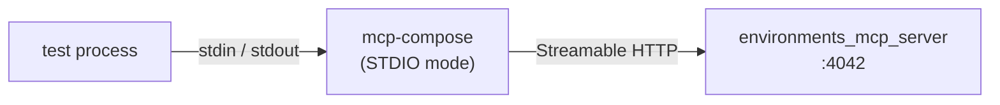
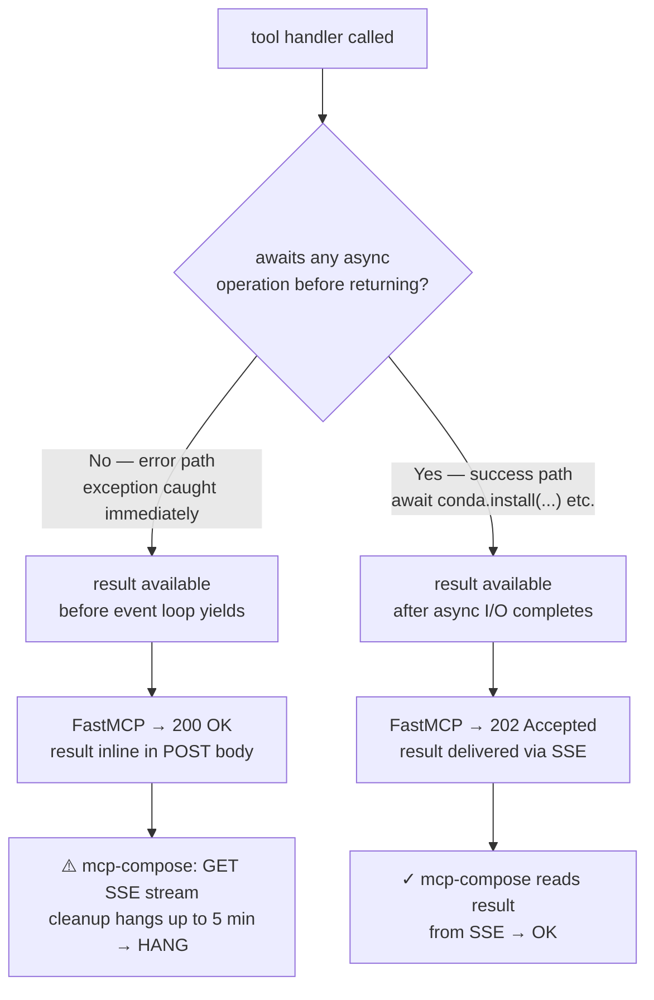

# KI-011: Technical Investigation — mcp-compose Proxy Hang

**Status**: Fix Proposed — [mcp-compose #27](https://github.com/datalayer/mcp-compose/issues/27), [PR #28](https://github.com/datalayer/mcp-compose/pull/28)
**Component**: `mcp-compose` 0.1.10

---

## Stack



The external transport (client → mcp-compose) can be HTTP or STDIO.
The internal transport (mcp-compose → environments_mcp_server) is always
Streamable HTTP, regardless of how the external client connects.

---

## Log Analysis

Server logs at port 4041 revealed two distinct request patterns:

**Normal call** — 6 requests:

```
POST /mcp  200 OK       create session
POST /mcp  202 Accepted initialize
GET  /mcp  200 OK       open SSE stream
POST /mcp  202 Accepted tools/call  ← result arrives via SSE
POST /mcp  200 OK       close session
DELETE /mcp 200 OK      delete session
```

**Hanging call** — 4 requests, no DELETE:

```
POST /mcp  200 OK       create session
GET  /mcp  200 OK       open SSE stream  ⚠️ before initialize
POST /mcp  202 Accepted initialize
POST /mcp  200 OK       tools/call       ⚠️ result inline in body, not via SSE
[no close, no DELETE — session abandoned]
```

Two differences from the normal pattern:

1. The SSE GET stream was opened **before** the initialize POST completed
2. `tools/call` returned **HTTP 200 OK** with the result inline instead of 202 Accepted
   with the result delivered asynchronously via SSE

`environments_mcp_server` responded correctly in both cases. The result was present in
the `tools/call` POST body. The proxy did not forward it.

---

## Protocol Flow

### Normal



### Hanging



---

## Automated Testing

### Why a single execution was not enough

Running a single error-triggering call consistently returned `is_error: true` in under
1 second. The race requires the internal HTTP connection pool to reach a specific state.



STDIO adds serialization latency through the stdin/stdout pipe, slowing the rate at
which pool state accumulates — pushing the threshold from call 4 to call 16.

### Warmup approach

Two test suites cover the two upstream transports — see their READMEs for execution
instructions:

| Suite | Transport | README |
|---|---|---|
| `tests/qa/http_tools/test_guard_proxy_error_hang.py` | Streamable HTTP | [http_tools/README.md](../../http_tools/README.md) |
| `tests/qa/stdio_tools/test_guard_proxy_error_hang_stdio.py` | STDIO | [stdio_tools/README.md](../../stdio_tools/README.md) |

Each test calls the same error-triggering tool 20 times in rapid succession. This
accumulates session state and consistently triggers the race condition:

| Test | Tool | Iterations | Result | Hangs at |
|---|---|---|---|---|
| HANG-001 | `conda_remove_environment` error path | 20 | **PASS** | — |
| HANG-002 | `conda_install_packages` error path | 20 | **FAIL** | iteration **4** |
| HANG-003 | 20 × warm-up + 20 × (error + health check) | 60 | **FAIL** | health step **20** |

HANG-002 triggers at exactly iteration 4 across all runs — the internal connection pool
reaches a state that triggers the race at a fixed call count.

HANG-003 exposes a second failure mode: the proxy can corrupt its state while forwarding
an error response, causing the immediately following healthy call to hang — even when
the error call itself returned normally. This matches the production scenario where a
long session eventually stops responding after an error.

---

## STDIO Transport Test

To determine whether the hang is gated on the HTTP upstream path or lives in
`mcp-compose`'s internal proxy logic, a STDIO test suite was created with the
following architecture:



The internal proxy path (mcp-compose → environments_mcp_server) is identical to the
HTTP tests. Only the upstream transport differs.

| Test | Tool | Iterations | Result | Hangs at |
|---|---|---|---|---|
| STDIO-HANG-001 | `conda_remove_environment` error path | 20 | **PASS** | — |
| STDIO-HANG-002 | `conda_install_packages` error path | 20 | **FAIL** | iteration **16** |
| STDIO-HANG-003 | 20 × warm-up + 20 × (error + health check) | 60 | **FAIL** | health step **20** |

The same hang was reproduced over STDIO. The upstream transport shifts the iteration
at which the race triggers (4 over HTTP, 16 over STDIO) but does not prevent it.
The bug is in `mcp-compose`'s internal HTTP connection pool, not in the upstream
transport handler.

**Additional finding**: over STDIO, `mcp-compose` encodes a tool error with
`isError: false` at the outer JSON-RPC level (the error payload is inside
`content[0].text`). Over HTTP the same error has `isError: true`. This is a separate,
lower-severity serialization issue unrelated to KI-011.

---

## Root Cause

`mcp-compose` creates a new Streamable HTTP session to `environments_mcp_server` for
each tool call. The expected session lifecycle is:
**create → initialize → open SSE stream → call tool → close → DELETE**

Under race conditions the SSE GET stream is opened before initialize completes. When
`tools/call` is then sent, `environments_mcp_server` returns the result **inline in
the POST response body** (HTTP 200 OK) rather than via the SSE stream. `mcp-compose`
is only listening on the SSE stream and does not read the inline body — the result is
silently dropped.

**Why errors specifically trigger the inline path**:



The session is abandoned without close or DELETE. The connection pool slot it occupies
is never released. All subsequent calls to port 4041 — regardless of upstream session
— block on this stuck slot, making the corruption process-wide.

---

## Ecosystem Context

The same class of bug — Streamable HTTP client locks up, corrupts the connection pool,
and makes all subsequent calls hang process-wide — is widely reported across the MCP
Python ecosystem. None of the issues below describes exactly KI-011, but they confirm
that the GET stream lifecycle race is a systemic weakness in the MCP SDK.

### Related issues

| Issue | Project | Root cause stated | Relationship to KI-011 |
|---|---|---|---|
| [python-sdk #1941](https://github.com/modelcontextprotocol/python-sdk/issues/1941) | MCP Python SDK | GET stream task fails silently → POST SSE response waits for dead task indefinitely | Closest analogue — identical race around GET stream timing |
| [python-sdk #1811](https://github.com/modelcontextprotocol/python-sdk/issues/1811) | MCP Python SDK | `read_stream_writer` left open after SSE disconnect → `receive()` hangs | Same stuck-stream consequence |
| [python-sdk #680](https://github.com/modelcontextprotocol/python-sdk/issues/680) | MCP Python SDK | Server callback response never reaches server → call hangs forever | Same hang pattern, different trigger (fixed in 2025) |
| [openai-agents #1288](https://github.com/openai/openai-agents-python/issues/1288) | OpenAI Agents | Failed connection corrupts anyio cancel scope → all subsequent `await` calls cancelled process-wide | **Identical consequence** — process-wide corruption after one bad call |

### Timing observation confirms the race

The author of python-sdk #1941 noted:

> *"I tried with and without a debugger, and noticed that with a debugger attached,
> the timing overhead masks the race condition and operations complete successfully."*

This is the same character as KI-011: the hang is deterministic under load (fixed call
count: 4 over HTTP, 16 over STDIO) but disappears when execution slows down. Both are
pool-state races, not logic errors.

### What makes KI-011 distinct

All found issues diagnose the problem at the **MCP SDK client** level
(`streamablehttp_client`, `handle_get_stream` task). None identifies the specific
combination that drives KI-011:

1. `mcp-compose` using the **deprecated `streamablehttp_client`** — which silently
   injects a 5-minute SSE read timeout regardless of the configured `timeout` value.
2. The server-side trigger: tool handlers that return **synchronously** cause FastMCP
   to serve the result inline (200 OK), which is the event that activates the broken
   cleanup path in the deprecated client.

The `asyncio.sleep(0)` workaround (server-side, one line per handler) has not been
published by any other project in this context. It is a canonical Python asyncio
technique and is safe, but it is novel as an MCP tool handler mitigation and must be
reverted once the upstream fix ships.

---

## Fix

**Issue**: [mcp-compose #27](https://github.com/datalayer/mcp-compose/issues/27)
**PR**: [mcp-compose #28](https://github.com/datalayer/mcp-compose/pull/28)

### Solution — Replace deprecated `streamablehttp_client` with `streamable_http_client`

The deprecated `streamablehttp_client` has a hidden 5-minute SSE read timeout. The fix
creates a compatibility wrapper using the non-deprecated `streamable_http_client` with
explicit `httpx.AsyncClient`:

```python
# mcp_compose/http_client.py
def streamable_http_client_compat(url, headers=None, timeout=30):
    import httpx
    from contextlib import asynccontextmanager
    from mcp.client.streamable_http import streamable_http_client

    @asynccontextmanager
    async def _context():
        async with httpx.AsyncClient(
            headers=headers,
            timeout=httpx.Timeout(float(timeout)),
        ) as http_client:
            async with streamable_http_client(url=url, http_client=http_client) as streams:
                yield streams

    return _context()
```

All usages of `streamablehttp_client` in `cli.py` are replaced with this helper.

### Test Results (verified 2026-03-07)

| Test | Before Fix | After Fix |
|------|------------|-----------|
| 20 iterations | Hangs at iteration 4 | ✅ All pass |
| 50 iterations | N/A | ✅ All pass |
| Cursor e2e | Hangs after ~4 tool calls | ✅ Works normally |

**No workaround required in `environments-mcp-server`** — the `asyncio.sleep()` hack
is not needed when using the fixed mcp-compose.

### Optional — Defensive timeouts in `environments_mcp_server`

Independent of this fix, `environments_mcp_server` could add timeouts on conda operations
as defensive hardening:

```python
result = await asyncio.wait_for(conda.install(...), timeout=120)
```

This is not required to fix KI-011 but prevents other potential hang scenarios.

---

## Regression Tests

```
tests/qa/http_tools/test_guard_proxy_error_hang.py      # HTTP transport
tests/qa/stdio_tools/test_guard_proxy_error_hang_stdio.py  # STDIO transport
```

After the fix, all six tests (HANG-001/002/003 and STDIO-HANG-001/002/003) should pass.
