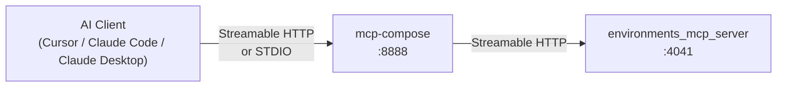
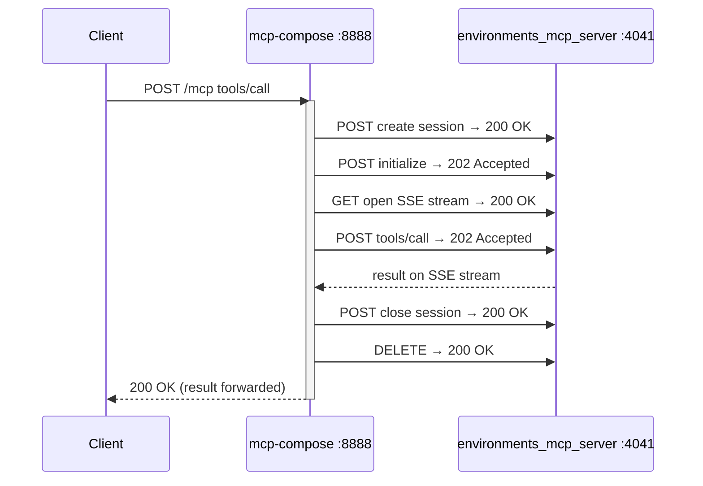
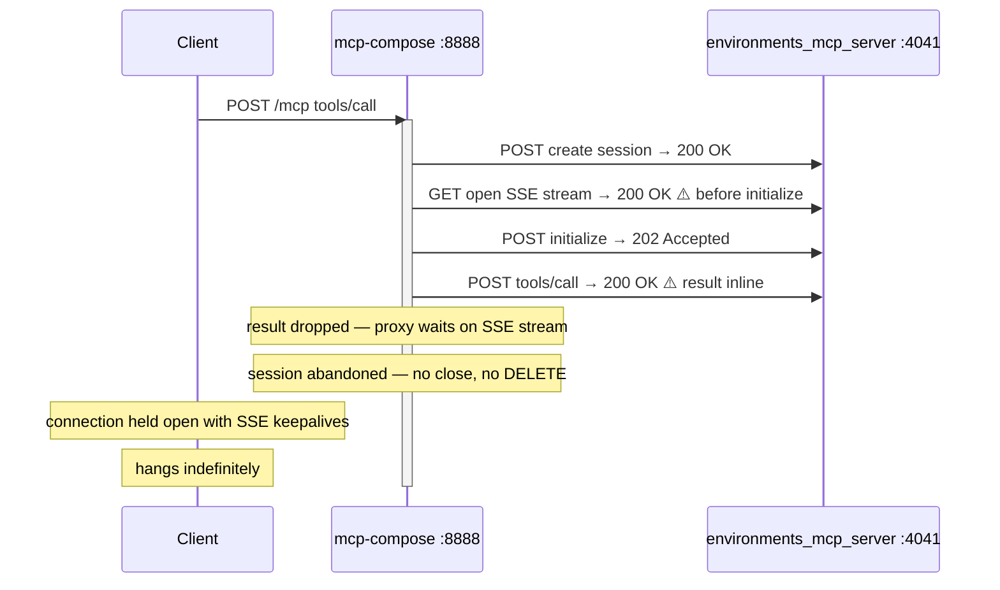
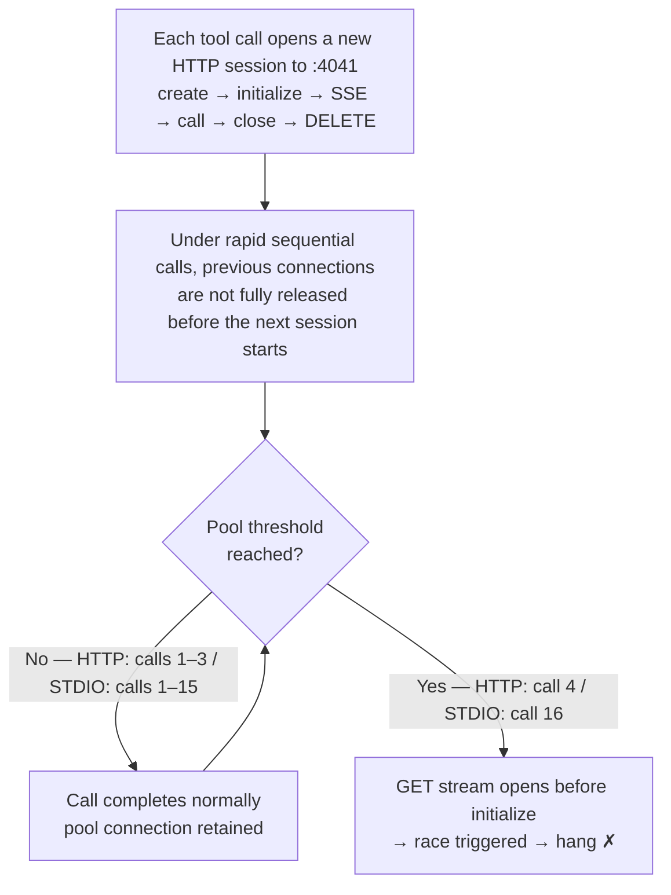

# KI-011: Technical Investigation — mcp-compose Proxy Hang

**Status**: Root cause confirmed, fix plan ready
**Component**: `mcp-compose` 0.1.10

---

## Stack



The external transport (client → mcp-compose) can be HTTP or STDIO.
The internal transport (mcp-compose → environments_mcp_server) is always
Streamable HTTP, regardless of how the external client connects.

---

## Log Analysis

Server logs at port 4041 revealed two distinct request patterns:

**Normal call** — 6 requests:

```
POST /mcp  200 OK       create session
POST /mcp  202 Accepted initialize
GET  /mcp  200 OK       open SSE stream
POST /mcp  202 Accepted tools/call  ← result arrives via SSE
POST /mcp  200 OK       close session
DELETE /mcp 200 OK      delete session
```

**Hanging call** — 4 requests, no DELETE:

```
POST /mcp  200 OK       create session
GET  /mcp  200 OK       open SSE stream  ⚠️ before initialize
POST /mcp  202 Accepted initialize
POST /mcp  200 OK       tools/call       ⚠️ result inline in body, not via SSE
[no close, no DELETE — session abandoned]
```

Two differences from the normal pattern:

1. The SSE GET stream was opened **before** the initialize POST completed
2. `tools/call` returned **HTTP 200 OK** with the result inline instead of 202 Accepted
   with the result delivered asynchronously via SSE

`environments_mcp_server` responded correctly in both cases. The result was present in
the `tools/call` POST body. The proxy did not forward it.

---

## Protocol Flow

### Normal



### Hanging



---

## Automated Testing

### Why a single execution was not enough

Running a single error-triggering call consistently returned `is_error: true` in under
1 second. The race requires the internal HTTP connection pool to reach a specific state.



STDIO adds serialization latency through the stdin/stdout pipe, slowing the rate at
which pool state accumulates — pushing the threshold from call 4 to call 16.

### Warmup approach

Two test suites cover the two upstream transports — see their READMEs for execution
instructions:

| Suite | Transport | README |
|---|---|---|
| `tests/qa/http_tools/test_guard_proxy_error_hang.py` | Streamable HTTP | [http_tools/README.md](../../http_tools/README.md) |
| `tests/qa/stdio_tools/test_guard_proxy_error_hang_stdio.py` | STDIO | [stdio_tools/README.md](../../stdio_tools/README.md) |

Each test calls the same error-triggering tool 20 times in rapid succession. This
accumulates session state and consistently triggers the race condition:

| Test | Tool | Iterations | Result | Hangs at |
|---|---|---|---|---|
| HANG-001 | `conda_remove_environment` error path | 20 | **PASS** | — |
| HANG-002 | `conda_install_packages` error path | 20 | **FAIL** | iteration **4** |
| HANG-003 | 20 × warm-up + 20 × (error + health check) | 60 | **FAIL** | health step **20** |

HANG-002 triggers at exactly iteration 4 across all runs — the internal connection pool
reaches a state that triggers the race at a fixed call count.

HANG-003 exposes a second failure mode: the proxy can corrupt its state while forwarding
an error response, causing the immediately following healthy call to hang — even when
the error call itself returned normally. This matches the production scenario where a
long session eventually stops responding after an error.

---

## STDIO Transport Test

To determine whether the hang is gated on the HTTP upstream path or lives in
`mcp-compose`'s internal proxy logic, a STDIO test suite was created with the
following architecture:

```
test process ──stdin/stdout──▶ mcp-compose (STDIO mode)
                                       │
                               Streamable HTTP :4042
                                       │
                               environments_mcp_server
```

The internal proxy path (mcp-compose → environments_mcp_server) is identical to the
HTTP tests. Only the upstream transport differs.

| Test | Tool | Iterations | Result | Hangs at |
|---|---|---|---|---|
| STDIO-HANG-001 | `conda_remove_environment` error path | 20 | **PASS** | — |
| STDIO-HANG-002 | `conda_install_packages` error path | 20 | **FAIL** | iteration **16** |
| STDIO-HANG-003 | 20 × warm-up + 20 × (error + health check) | 60 | **FAIL** | health step **20** |

The same hang was reproduced over STDIO. The upstream transport shifts the iteration
at which the race triggers (4 over HTTP, 16 over STDIO) but does not prevent it.
The bug is in `mcp-compose`'s internal HTTP connection pool, not in the upstream
transport handler.

**Additional finding**: over STDIO, `mcp-compose` encodes a tool error with
`isError: false` at the outer JSON-RPC level (the error payload is inside
`content[0].text`). Over HTTP the same error has `isError: true`. This is a separate,
lower-severity serialization issue unrelated to KI-011.

---

## Root Cause

`mcp-compose` creates a new Streamable HTTP session to `environments_mcp_server` for
each tool call. The expected session lifecycle is:
**create → initialize → open SSE stream → call tool → close → DELETE**

Under race conditions the SSE GET stream is opened before initialize completes. When
`tools/call` is then sent, `environments_mcp_server` returns the result **inline in
the POST response body** (HTTP 200 OK) rather than via the SSE stream. `mcp-compose`
is only listening on the SSE stream and does not read the inline body — the result is
silently dropped.

The session is abandoned without close or DELETE. The connection pool slot it occupies
is never released. All subsequent calls to port 4041 — regardless of upstream session
— block on this stuck slot, making the corruption process-wide.

---

## Fix Plan

### Fix 1 — Handle inline tool results in `mcp-compose`

When `tools/call` returns HTTP 200 OK, read and forward the inline response body
instead of waiting on the SSE stream. The proxy must handle both paths:

- **202 Accepted** → result arrives asynchronously on SSE stream (current path)
- **200 OK** → result is inline in the POST response body (unhandled path)

### Fix 2 — Defensive timeout on the SSE read loop

Prevents a stuck backend from holding the upstream connection open indefinitely if an
inline result is missed:

```python
# mcp-compose — sketch
async with asyncio.timeout(180):
    async for event in backend_sse_stream:
        yield event
```

### Fix 3 — Timeouts on conda operations in `environments_mcp_server`

Without a timeout, a stuck conda subprocess blocks the tool handler indefinitely,
keeping the SSE stream open forever:

```python
await asyncio.wait_for(
    asyncio.get_event_loop().run_in_executor(None, conda_op),
    timeout=120,
)
```

### Expected outcome

| Symptom | Before fix | After fix |
|---|---|---|
| Hang on error-path tool call | ✓ | ✗ |
| Process-wide pool corruption | ✓ | ✗ |
| New chat session recovers | ✗ | ✓ |
| HANG-002 / STDIO-HANG-002 tests | FAIL | PASS |

---

## Regression Tests

```
tests/qa/http_tools/test_guard_proxy_error_hang.py      # HTTP transport
tests/qa/stdio_tools/test_guard_proxy_error_hang_stdio.py  # STDIO transport
```

After the fix, all six tests (HANG-001/002/003 and STDIO-HANG-001/002/003) should pass.
