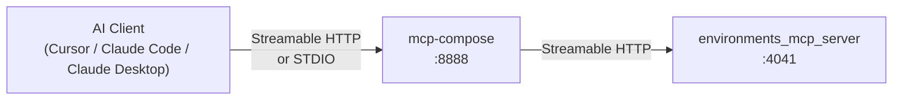
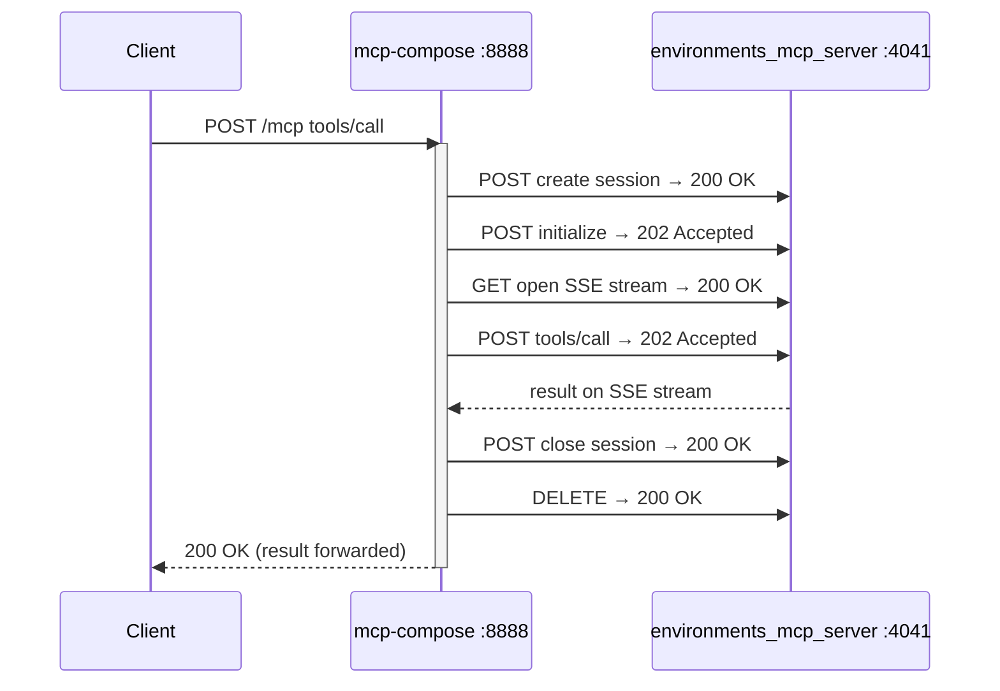
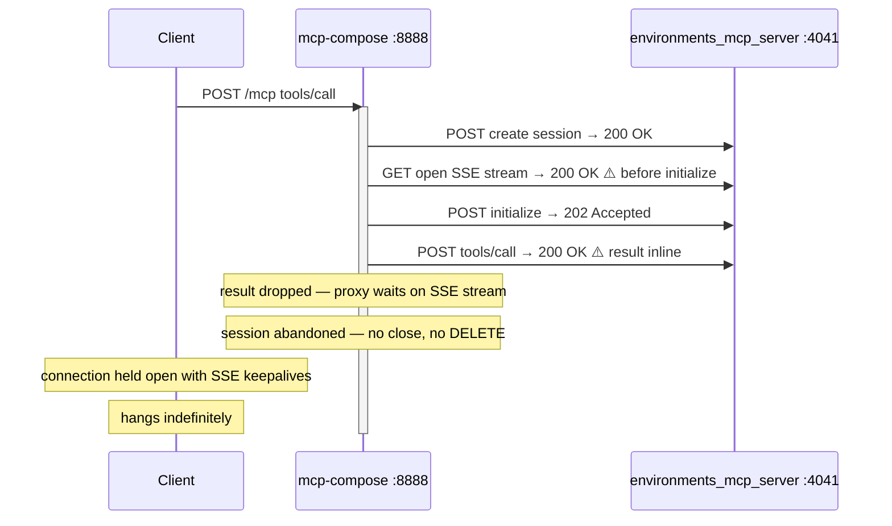
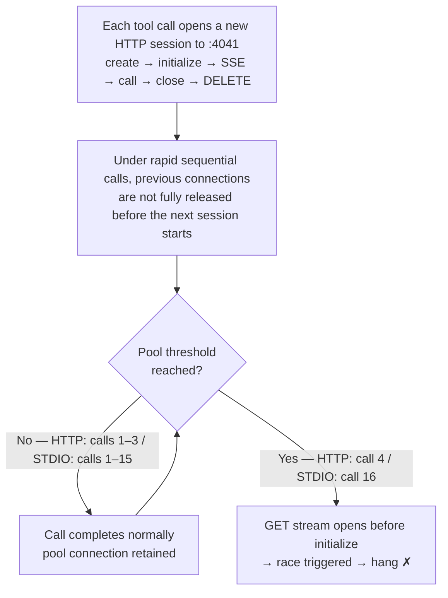

# KI-011: Technical Investigation — mcp-compose Proxy Hang

**Status**: Root cause confirmed, fix plan ready
**Component**: `mcp-compose` 0.1.10

---

## Stack



The external transport (client → mcp-compose) can be HTTP or STDIO.
The internal transport (mcp-compose → environments_mcp_server) is always
Streamable HTTP, regardless of how the external client connects.

---

## Log Analysis

Server logs at port 4041 revealed two distinct request patterns:

**Normal call** — 6 requests:

```
POST /mcp  200 OK       create session
POST /mcp  202 Accepted initialize
GET  /mcp  200 OK       open SSE stream
POST /mcp  202 Accepted tools/call  ← result arrives via SSE
POST /mcp  200 OK       close session
DELETE /mcp 200 OK      delete session
```

**Hanging call** — 4 requests, no DELETE:

```
POST /mcp  200 OK       create session
GET  /mcp  200 OK       open SSE stream  ⚠️ before initialize
POST /mcp  202 Accepted initialize
POST /mcp  200 OK       tools/call       ⚠️ result inline in body, not via SSE
[no close, no DELETE — session abandoned]
```

Two differences from the normal pattern:

1. The SSE GET stream was opened **before** the initialize POST completed
2. `tools/call` returned **HTTP 200 OK** with the result inline instead of 202 Accepted
   with the result delivered asynchronously via SSE

`environments_mcp_server` responded correctly in both cases. The result was present in
the `tools/call` POST body. The proxy did not forward it.

---

## Protocol Flow

### Normal



### Hanging



---

## Automated Testing

### Why a single execution was not enough

Running a single error-triggering call consistently returned `is_error: true` in under
1 second. The race requires the internal HTTP connection pool to reach a specific state.



STDIO adds serialization latency through the stdin/stdout pipe, slowing the rate at
which pool state accumulates — pushing the threshold from call 4 to call 16.

### Warmup approach

Two test suites cover the two upstream transports — see their READMEs for execution
instructions:

| Suite | Transport | README |
|---|---|---|
| `tests/qa/http_tools/test_guard_proxy_error_hang.py` | Streamable HTTP | [http_tools/README.md](../../http_tools/README.md) |
| `tests/qa/stdio_tools/test_guard_proxy_error_hang_stdio.py` | STDIO | [stdio_tools/README.md](../../stdio_tools/README.md) |

Each test calls the same error-triggering tool 20 times in rapid succession. This
accumulates session state and consistently triggers the race condition:

| Test | Tool | Iterations | Result | Hangs at |
|---|---|---|---|---|
| HANG-001 | `conda_remove_environment` error path | 20 | **PASS** | — |
| HANG-002 | `conda_install_packages` error path | 20 | **FAIL** | iteration **4** |
| HANG-003 | 20 × warm-up + 20 × (error + health check) | 60 | **FAIL** | health step **20** |

HANG-002 triggers at exactly iteration 4 across all runs — the internal connection pool
reaches a state that triggers the race at a fixed call count.

HANG-003 exposes a second failure mode: the proxy can corrupt its state while forwarding
an error response, causing the immediately following healthy call to hang — even when
the error call itself returned normally. This matches the production scenario where a
long session eventually stops responding after an error.

---

## STDIO Transport Test

To determine whether the hang is gated on the HTTP upstream path or lives in
`mcp-compose`'s internal proxy logic, a STDIO test suite was created with the
following architecture:

```
test process ──stdin/stdout──▶ mcp-compose (STDIO mode)
                                       │
                               Streamable HTTP :4042
                                       │
                               environments_mcp_server
```

The internal proxy path (mcp-compose → environments_mcp_server) is identical to the
HTTP tests. Only the upstream transport differs.

| Test | Tool | Iterations | Result | Hangs at |
|---|---|---|---|---|
| STDIO-HANG-001 | `conda_remove_environment` error path | 20 | **PASS** | — |
| STDIO-HANG-002 | `conda_install_packages` error path | 20 | **FAIL** | iteration **16** |
| STDIO-HANG-003 | 20 × warm-up + 20 × (error + health check) | 60 | **FAIL** | health step **20** |

The same hang was reproduced over STDIO. The upstream transport shifts the iteration
at which the race triggers (4 over HTTP, 16 over STDIO) but does not prevent it.
The bug is in `mcp-compose`'s internal HTTP connection pool, not in the upstream
transport handler.

**Additional finding**: over STDIO, `mcp-compose` encodes a tool error with
`isError: false` at the outer JSON-RPC level (the error payload is inside
`content[0].text`). Over HTTP the same error has `isError: true`. This is a separate,
lower-severity serialization issue unrelated to KI-011.

---

## Root Cause

`mcp-compose` creates a new Streamable HTTP session to `environments_mcp_server` for
each tool call. The expected session lifecycle is:
**create → initialize → open SSE stream → call tool → close → DELETE**

Under race conditions the SSE GET stream is opened before initialize completes. When
`tools/call` is then sent, `environments_mcp_server` returns the result **inline in
the POST response body** (HTTP 200 OK) rather than via the SSE stream. `mcp-compose`
is only listening on the SSE stream and does not read the inline body — the result is
silently dropped.

**Why errors specifically trigger the inline path**: `environments_mcp_server` tool
handlers catch all exceptions synchronously and return a result dict immediately —
they do not await any long-running operation before returning. FastMCP observes that
the result is already available and serves it inline in the 200 OK POST body. On the
success path the handler awaits `conda.install(...)` / `conda.remove_environment(...)`
etc., which takes seconds; FastMCP issues 202 Accepted and delivers the result via SSE
when the awaited call completes. This is why the hang is exclusive to error-path calls.

The session is abandoned without close or DELETE. The connection pool slot it occupies
is never released. All subsequent calls to port 4041 — regardless of upstream session
— block on this stuck slot, making the corruption process-wide.

---

## Fix Plan

**All three fixes are required for a complete resolution.** 
- Fix 1 and Fix 2 address the root cause in `mcp-compose` (upstream, not owned by this team). 
- Fix 3 is independent defensive hardening in `environments_mcp_server` (this team's repo). 
- While Fix 1 + Fix 2 are pending upstream, the **Workaround** below can be shipped immediately.

### Fix 1 — Switch from deprecated `streamablehttp_client` to `streamable_http_client` in `mcp-compose`

**Repo**: `mcp-compose` (upstream — file at https://github.com/datalayer/mcp-compose/issues)

`cli.py` uses the deprecated `streamablehttp_client` for every proxied tool call.
The deprecated function silently adds a **5-minute SSE read timeout** (`sse_read_timeout=300s`),
independent of the 30-second `timeout` argument passed by `mcp-compose`. This is why
hangs last minutes, not seconds. The replacement non-deprecated API does not carry this
default:

```python
# mcp_compose/cli.py — proposed change
# Before:
from mcp.client.streamable_http import streamablehttp_client   # deprecated, adds sse_read_timeout=300s
# After:
from mcp.client.streamable_http import streamable_http_client  # current API, no hidden timeout
```

The proxy must also handle both response paths for `tools/call`:

- **202 Accepted** → result arrives asynchronously on SSE stream (currently handled)
- **200 OK** → result is inline in the POST response body (currently causes the hang)

### Fix 2 — Bound each proxied call with `asyncio.timeout` in `mcp-compose`

**Repo**: `mcp-compose` (upstream)

Switching the API (Fix 1) removes the hidden 5-minute default, but a defensive per-call
timeout prevents any future regression regardless of SDK internals or downstream
misbehaviour:

```python
# mcp_compose/cli.py — proposed change
async def streamable_http_tool_proxy(**kwargs):
    async with asyncio.timeout(float(http_config.timeout)):   # hard deadline per call
        async with streamable_http_client(url=http_config.url, ...) as (r, w, _):
            async with ClientSession(r, w) as session:
                await session.initialize()
                result = await session.call_tool(original_tool_name, kwargs)
                ...
```

### Fix 3 — Timeouts on conda operations in `environments_mcp_server`

**Repo**: `environments-mcp-server` (owned by this team).

`environments_mcp_server` delegates all real conda work to the `anaconda_connector_conda`
async library (`await conda.install(...)`, `await conda.remove_environment(...)`, etc.).
There are no timeouts on these awaited calls, so a hung conda operation keeps the tool
handler suspended indefinitely, holding the FastMCP SSE stream open forever. Wrap each
call with `asyncio.wait_for`:

```python
try:
    result = await asyncio.wait_for(
        conda.install(...),
        timeout=120,
    )
except asyncio.TimeoutError:
    return ServerToolResult(
        is_error=True,
        error_description="conda operation timed out after 120 seconds.",
    ).model_dump()
```

Apply the same pattern to `conda.remove_environment(...)`, `conda.create(...)`, and
`conda.remove(...)` in the corresponding tool files.

A secondary concern: `utils/conda.py` calls `subprocess.check_output(["conda", "info",
"--json"])` synchronously without a `timeout=` argument. This runs only at startup
(conda discovery), but should also be hardened:

```python
subprocess.check_output(["conda", "info", "--json"], text=True, timeout=30)
```

---

## Workaround — Ship now while Fix 1 + Fix 2 are pending upstream

**Repo**: `environments-mcp-server` (owned by this team).

The hang is triggered exclusively because error-path handlers return *synchronously*
(no `await` before returning), causing FastMCP to serve the result inline via 200 OK.
`mcp-compose` then fails to clean up the GET SSE stream within the 5-minute window.

Adding `await asyncio.sleep(0)` as the **first line** of every tool handler forces a
yield to the event loop before any work begins. FastMCP observes that the result is not
yet available and always uses the 202 Accepted + SSE path — the path `mcp-compose`
handles correctly. The race condition still fires internally but stops mattering.

```python
# environments_mcp_server/tools/environments/install_packages.py
@register_tool
async def install_packages(prefix: str, packages: list[str]) -> dict:
    await asyncio.sleep(0)  # workaround: force FastMCP onto 202+SSE path (KI-011)
    try:
        ...
```

Apply to every tool handler (`install_packages`, `remove_packages`,
`remove_environment`, `create_environment`, `list_environments`,
`list_environment_packages`).

This workaround couples `environments_mcp_server` to `mcp-compose`'s broken
assumption and must be reverted once Fix 1 + Fix 2 ship in a `mcp-compose` release.
Mark each added line with a `# workaround KI-011` comment to make the revert obvious.

### Expected outcome

| Symptom | Before | After Fix 1+2 | After Workaround |
|---|---|---|---|
| Hang on error-path tool call | ✓ | ✗ | ✗ |
| Process-wide pool corruption | ✓ | ✗ | ✗ |
| New chat session recovers | ✗ | ✓ | ✓ |
| HANG-002 / STDIO-HANG-002 tests | FAIL | PASS | PASS |

---

## Regression Tests

```
tests/qa/http_tools/test_guard_proxy_error_hang.py      # HTTP transport
tests/qa/stdio_tools/test_guard_proxy_error_hang_stdio.py  # STDIO transport
```

After the fix, all six tests (HANG-001/002/003 and STDIO-HANG-001/002/003) should pass.
