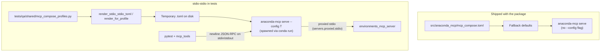
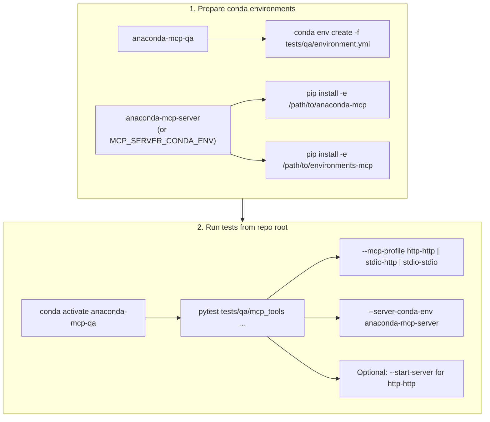

# API Tool Tests — Design Document

## Purpose

**Why this test layer exists:**

API Tool tests verify that MCP tools behave correctly when called directly via the MCP protocol (JSON-RPC over HTTP or STDIO). This layer tests the **server's contract with MCP clients** — the same interface used by Claude Desktop, Cursor, and other MCP-compatible tools.

**What this layer catches:**
- Tool input validation and error handling
- Correct JSON-RPC response structure (success vs error)
- Timeout and hang regressions (server must respond within reasonable time)
- Session state corruption across multiple tool calls
- Transport-specific edge cases (SSE streaming, connection pooling)

**What this layer does NOT test:**
- LLM behavior or prompt engineering
- End-to-end user workflows through Claude Desktop UI
- Installation and packaging

---

## Design Rationale

### Why Test at the MCP Protocol Level?

1. **Deterministic**: No LLM variability — same input always produces same output
2. **Fast feedback**: Seconds per test vs minutes for E2E flows
3. **CI-friendly**: Can run in GitHub Actions without GUI or LLM API calls
4. **Regression-focused**: Catches known issues (KI-002, KI-003, KI-010, KI-011) reliably
5. **Transport-agnostic logic**: Same tool behavior expected over HTTP and STDIO

### Test Categories

| Category | Purpose | Example |
|----------|---------|---------|
| **Happy path** | Tools return expected results for valid inputs | `conda_list_environments` returns env list |
| **Error handling** | Tools return proper errors for invalid inputs | Install nonexistent package → `is_error: true` |
| **Regression guards** | Prevent recurrence of known bugs | KI-011: error response must not hang |
| **Protocol compliance** | JSON-RPC structure, error codes, session handling | Invalid tool → error code -32601 |

---

## Architecture

### Two-Axis Transport Model (Client × Upstream)

MCP-compose sits **between** the test harness and the conda MCP server. Those two hops can use different transports:

| Hop | Meaning | Typical `[transport]` / server section |
|-----|---------|----------------------------------------|
| **Client edge** | Test process ↔ mcp-compose | Streamable HTTP (`POST …/mcp`) or STDIO (newline JSON-RPC) |
| **Upstream edge** | mcp-compose ↔ `environments_mcp_server` | `[[servers.proxied.streamable-http]]` or `[[servers.proxied.stdio]]` |

**Named QA profiles** (same strings for CI labels and `--mcp-profile` style options):

| Profile | Client edge | Upstream edge | Notes |
|---------|-------------|----------------|-------|
| **http-http** | HTTP | Streamable HTTP | Matches `tests/qa/_ai_docs/scripts/start-http-server.sh` |
| **stdio-http** | STDIO | Streamable HTTP | Exercises STDIO MCP client path with HTTP-backed conda server |
| **stdio-stdio** | STDIO | STDIO | Matches historical `stdio_tools/` regressions; avoids upstream HTTP pool issues (DESK-1409) |

Optional fourth combination **http-stdio** (HTTP client, STDIO upstream) is valid for mcp-compose but not a default matrix cell unless product asks for it.

Canonical TOML for each profile is generated in code so tests stay **deterministic**: `tests/qa/shared/mcp_compose_profiles.py` (`render_http_http_toml`, `render_stdio_http_toml`, `render_stdio_stdio_toml`, `render_for_profile`).

### Packaged `mcp_compose.toml` vs generated config (stdio-stdio)

The file **`src/anaconda_mcp/mcp_compose.toml`** is the **default** when users run `anaconda-mcp serve` **without** `--config`. **QA does not rely on that file** to pick transports for `pytest`: profiles build TOML from **`mcp_compose_profiles.py`**, write a temp file, and pass **`--config`** to `anaconda-mcp serve`.



**Takeaway:** editing `src/anaconda_mcp/mcp_compose.toml` does **not** change how **`--mcp-profile=stdio-stdio`** behaves; that profile is entirely driven by **generated** TOML + **`--config`**.

### Transport Abstraction (Single Test Suite)

Tests should be **transport-agnostic** at the **tool-contract** layer: the same assertions run for every profile that targets the same tool surface.

Per profile, only the **adapter** changes:

- **Client HTTP**: `POST` to `/mcp`, SSE-aware parsing (`common/utils/mcp_client.py` in `http_tools`).
- **Client STDIO**: newline-delimited JSON-RPC over a subprocess (`stdio_client.py` in `stdio_tools`).

```
┌─────────────────────────────────────────────────────────┐
│              Test specification (deterministic)           │
│  assert tool X with args A returns structured result Y   │
└─────────────────────────────────────────────────────────┘
                            │
                            ▼
┌─────────────────────────────────────────────────────────┐
│         MCPClient protocol (call_tool, session)         │
│   HttpMcpClient(profile=http-http | …)                  │
│   StdioMcpClient(profile=stdio-http | stdio-stdio)      │
└─────────────────────────────────────────────────────────┘
                            │
                            ▼
┌─────────────────────────────────────────────────────────┐
│                  mcp-compose (anaconda-mcp)              │
│  [transport] + [[servers.proxied.*]] from profile       │
└─────────────────────────────────────────────────────────┘
                            │
                            ▼
┌─────────────────────────────────────────────────────────┐
│            environments_mcp_server (conda tools)         │
└─────────────────────────────────────────────────────────┘
```

### CI Matrix Support

Tests support GitHub Actions with **profile** as a dimension (not just “http vs stdio” on a single hop):

```yaml
strategy:
  matrix:
    os: [ubuntu-latest, macos-latest, windows-latest]
    python-version: ["3.10", "3.11", "3.12", "3.13"]
    mcp-profile: [http-http, stdio-http, stdio-stdio]
```

**Execution model**: Each matrix cell runs on a separate runner. Within each cell:

1. Fixture starts **one** mcp-compose process using the TOML for `mcp-profile` (see `tests/qa/shared/mcp_compose_profiles.py`).
2. Run **the same** tool tests via the adapter that matches the profile’s **client edge** (HTTP vs STDIO).
3. Tear down after the session (or per test for STDIO-heavy hang regressions that require a fresh process).

**CLI options (target end state):**

| Option | Purpose |
|--------|---------|
| `--mcp-profile` | `http-http` \| `stdio-http` \| `stdio-stdio` — selects both edges |
| `--server-url` | MCP endpoint when client edge is HTTP (e.g. `http://localhost:9888/mcp`) |
| `--compose-port` / `--downstream-port` | Ports for HTTP-http profile and streamable-http upstream |

**Requirements:**

- **Deterministic config**: Generated TOML from `mcp_compose_profiles`, not hand-edited copies in each test file.
- **Isolated conda env per cell**: Each Python version uses its own env with `anaconda-mcp` installed.
- **Fixture scope**: Session-scoped server for HTTP client edge; function-scoped `stdio_server` where a fresh process is required (KI-011 regressions).

### Server Lifecycle via Fixture

The `mcp_server` fixture manages the full server lifecycle. The **profile** selects how the config is built and whether readiness is probed over HTTP or STDIO:

```python
@pytest.fixture(scope="session")
def mcp_server(request, tmp_path_factory):
    """Start anaconda-mcp with TOML from mcp_compose_profiles, wait for ready, teardown."""
    slug = request.config.getoption("--mcp-profile")  # http-http | stdio-http | stdio-stdio
    profile = mcp_compose_profiles.PROFILES_BY_SLUG[slug]
    compose_port = request.config.getoption("--compose-port")
    downstream_port = request.config.getoption("--downstream-port")
    cfg = tmp_path_factory.mktemp("mcp") / "compose.toml"
    cfg.write_text(
        mcp_compose_profiles.render_for_profile(
            profile, compose_port=compose_port, downstream_port=downstream_port,
            python_executable=sys.executable,
        ),
        encoding="utf-8",
    )
    proc = subprocess.Popen(
        ["anaconda-mcp", "serve", "--config", str(cfg)],
        stdin=subprocess.PIPE if profile.client == mcp_compose_profiles.ClientEdge.STDIO else None,
        stdout=subprocess.PIPE if profile.client == mcp_compose_profiles.ClientEdge.STDIO else subprocess.DEVNULL,
    )
    if profile.client == mcp_compose_profiles.ClientEdge.HTTP:
        _wait_for_ready(f"http://localhost:{compose_port}/mcp")
    else:
        _stdio_initialize_handshake(proc)
    yield proc
    proc.terminate()
    proc.wait(timeout=10)
```

(Exact argument names and handshake helpers match the unified suite as it lands; today, `http_tools` may still use `start-http-server.sh` until this fixture replaces it.)

**Benefits of fixture-only approach:**
- **Platform-independent**: Python `subprocess` works on Linux, macOS, Windows
- **Automatic cleanup**: pytest guarantees teardown even on test failure
- **No script maintenance**: single source of truth for server startup
- **Closer to reality**: starts server the same way a user would

### Fixture Scopes

| Fixture | Scope | Reason |
|---------|-------|--------|
| `mcp_server` | session | Server startup is expensive (~10s); one per test run |
| `mcp_client` | session | Transport adapter (HTTP or STDIO); matches server |
| `session_id` | module | Each test file gets isolated MCP session |
| `conda_env` | module | Env creation is expensive (~30s) |
| `fresh_session_id` | function | For tests that corrupt session state |

---

## Platform Considerations

### OS-Specific Behavior

| Aspect | Linux/macOS | Windows |
|--------|-------------|---------|
| Process signals | `SIGTERM` for cleanup | `taskkill` or process handle |
| Path separators | `/` | `\` (use `pathlib`) |
| Conda activation | `conda run -n env` | Same, but shell differences |
| STDIO line endings | `\n` | `\r\n` possible |

### Python Version Differences

- **3.10**: Baseline — must work
- **3.11-3.13**: May have asyncio/typing changes
- Tests should not rely on version-specific features

---

## Example Scenarios (Illustrative)

These examples show the **type** of tests, not an exhaustive list:

### Happy Path Example
```python
def test_list_environments_returns_base(session_id):
    """conda_list_environments must include 'base' environment."""
    response = call_tool("conda_list_environments", {}, session_id)
    envs = parse_result(response)["environments"]
    assert any(e["name"] == "base" for e in envs)
```

### Error Handling Example
```python
def test_install_nonexistent_package_returns_error(conda_env, session_id):
    """Installing a fake package must return is_error=true, not hang."""
    response = call_tool(
        "conda_install_packages",
        {"environment": conda_env["name"], "packages": ["nonexistent-xyz"]},
        session_id,
    )
    assert parse_result(response)["is_error"] is True
```

### Regression Guard Example
```python
@pytest.mark.timeout(60)
def test_error_response_does_not_hang(fresh_session_id):
    """KI-011: server must respond within timeout after error."""
    for _ in range(10):
        response = call_tool(
            "conda_remove_environment",
            {"prefix": "/nonexistent/path"},
            fresh_session_id,
        )
        assert parse_result(response)["is_error"] is True
```

---

## Current Implementation Status

### What Exists
- `tests/qa/mcp_tools/`: **Unified** MCP tool suite; `--mcp-profile` selects **http-http**, **stdio-http**, or **stdio-stdio** (see `README.md` there)
- Legacy directories `tests/qa/http_tools/` and `tests/qa/stdio_tools/` contain only redirect READMEs; tests live under `mcp_tools/`
- `tests/qa/shared/mcp_compose_profiles.py`: canonical TOML for all three profiles
- Regression tests for KI-002, KI-003, KI-010, KI-011

### Known Issues in Test Design
1. **Resolved (suite merge)**: Single `mcp_tools/` tree with shared `common/` and profile-aware fixtures (`call_tool`, `call_no_hang_unified`).
2. **Optional follow-ups**: Register `pytest.mark.timeout` in `pytest.ini` when using pytest-timeout; add CI matrix on `--mcp-profile`.

### Recommended Structure (Unified)

```
tests/qa/
├── shared/
│   └── mcp_compose_profiles.py   # Deterministic TOML for http-http, stdio-http, stdio-stdio
├── conftest.py                 # --mcp-profile, server lifecycle, mcp_client fixture
├── common/
│   ├── clients/
│   │   ├── base.py             # Protocol: initialize, call_tool, parse_tool_result
│   │   ├── http_client.py      # Client edge: HTTP
│   │   └── stdio_client.py     # Client edge: STDIO (upstream driven by profile TOML)
│   ├── constants/              # Shared test data, tool names, timeouts
│   └── validators/             # Response validation (works across client edges)
├── test_tools.py               # Tool tests — only use MCPClient + validators
└── test_regressions.py         # KI-xxx regression tests
```

**Key changes:**

- **One** logical suite; **profile** selects both edges (`http-http`, `stdio-http`, `stdio-stdio`).
- `mcp_client` fixture yields an implementation of `MCPClient` — tests call `call_tool(name, args)` and shared validators inspect results.
- **Upstream** behavior is defined entirely by the generated compose file, not by duplicate suites (`http_tools/` vs `stdio_tools/` merge over time).

**Current step (incremental):** `tests/qa/shared/mcp_compose_profiles.py` exists; `stdio_tools` stdio-stdio config is generated from `render_stdio_stdio_toml`. Next steps: add `stdio-http` spawn path in conftest, merge duplicate guard tests behind parametrized profile, and fold `http_tools` + `stdio_tools` into `tests/qa/mcp_tools/` when ready.

CLI and Config tests stay in separate directories (`tests/qa/cli/`, `tests/qa/config/`) — see their respective design docs.

---

## Running Tests

### What operators do (end-to-end)

Two conda environments are required: one for **pytest** (`anaconda-mcp-qa` from `tests/qa/environment.yml`) and one for the **server under test** (`anaconda-mcp-server` by convention — any name, passed via `--server-conda-env`). See [`tests/qa/mcp_tools/README.md`](../../../mcp_tools/README.md) for exact `conda create` / `pip install -e` commands.



### Local Development
```bash
# http-http (Streamable HTTP client → compose → HTTP upstream)
pytest tests/qa/mcp_tools -q --mcp-profile=http-http \
  --server-url http://localhost:9888/mcp --start-server \
  --server-conda-env anaconda-mcp-server

# stdio-stdio (STDIO client → compose → STDIO upstream)
pytest tests/qa/mcp_tools -q --mcp-profile=stdio-stdio \
  --server-conda-env anaconda-mcp-server

# stdio-http
pytest tests/qa/mcp_tools -q --mcp-profile=stdio-http \
  --server-conda-env anaconda-mcp-server
```

### CI Invocation
```bash
export MCP_PROFILE=stdio-stdio   # or http-http, stdio-http
pytest tests/qa/mcp_tools \
  --mcp-profile "${MCP_PROFILE}" \
  --server-url "http://localhost:${PORT}/mcp" \
  -v
```

The fixture handles server startup, readiness check, and teardown automatically.

### Server log collection (mcp-compose + downstream)

**What gets captured**

For **`http-http`** with **`--start-server`** only, `tests/qa/mcp_tools/conftest.py` redirects **all stdout and stderr** of the auto-started process to a **single temp file** (suffix `*-anaconda-mcp.log`). The command is:

`conda run -n <server-env> bash tests/qa/_ai_docs/scripts/start-http-server.sh <port>`

That script runs **`python -m anaconda_mcp serve`** with a generated HTTP config. One process stream therefore includes:

- **anaconda-mcp** (mcp-compose): transport, proxy, tool registration, compose-level errors
- **Child processes** started by compose (e.g. **`environments_mcp_server`** for the conda MCP upstream), insofar as they write to the same stdout/stderr tree the parent inherits

There are **not** separate pytest-managed log files per subprocess; for deep downstream-only issues you may still need to run the stack manually or add extra logging in those packages.

**When it is attached to the HTML report**

If **`pytest-html`** is installed:

- On **failed** **setup** or **call** (not teardown-only failures in the same way—hook filters `rep.when` to `setup` and `call`), the hook **`pytest_runtest_makereport`** appends an extra named **`mcp-server.log (tail)`**.
- Content: a short header plus the **last ~48,000 characters** of that temp file (see `_MCP_SERVER_LOG_TAIL_CHARS` in `conftest.py`).

**When there is no attachment**

- **`--start-server` not used** (you point at an already-running server): no temp server log path is registered; failures have no **`mcp-server.log (tail)`** extra. Use your own terminal / service logs for the running server.
- **Client edge is not HTTP** (`stdio-http`, `stdio-stdio`): the session autostart path above does not run; there is **no** automatic compose log file attachment from this hook today.

**Where to look**

| Artifact | Where |
|----------|--------|
| **pytest-html extra** | Open **`tests/qa/mcp_tools/reports/report.html`** (default; overridable with `pytest --html=…`). Expand a **failed** row; look for **`mcp-server.log (tail)`** under extras. |
| **Python `logging` from tests** | In the terminal report: **Captured log setup** / **Captured log call** (pytest’s logging capture). This is **not** the server process log; it is test harness loggers (`conftest`, `mcp_client`, etc.). |
| **Temp file** | Exists only until session teardown after **`--start-server`**; it is **deleted** when the server fixture finishes. Do not rely on the path after the run ends—use the HTML extra on failure. |

Operator-oriented summary: [`tests/qa/mcp_tools/README.md`](../../../mcp_tools/README.md) (HTML report + `--start-server`).

---

## Related Documents

- [TESTS_CLI.md](./TESTS_CLI.md) — CLI command tests (no server required)
- [TESTS_CONFIG.md](./TESTS_CONFIG.md) — Configuration and environment variable tests
- [KNOWN_ISSUES.md](../../_tracking/KNOWN_ISSUES.md) — Bug references for regression tests
