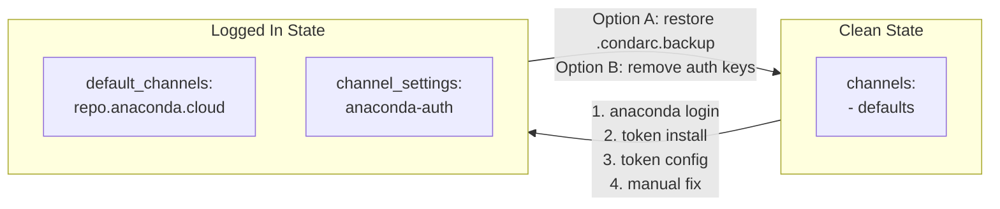

# Authentication Setup & Cleanup

This document defines prerequisites and post-conditions for authentication-related tests. Referenced from [QA_WALKTHROUGH.md](../../../QA_WALKTHROUGH.md) and individual test files in [e2e/](../).

---

## Before You Begin — Backup Recommended

**Run this once before any auth-related testing:**

```bash
# Save original .condarc before any changes
cp ~/.condarc ~/.condarc.backup 2>/dev/null || true
echo "Backup created: ~/.condarc.backup"
```

This backup is used by the cleanup procedure to restore your exact original state.

**No backup?** Cleanup will still work — it removes auth-related keys manually. See [Cleanup without backup](#cleanup-without-backup).

---

## Overview

| State | Tests | Channel Source |
|-------|-------|----------------|
| Logged in | CORE-001, AUTH-002 | `repo.anaconda.cloud` (private) |
| Logged out + private channels | AUTH-001a | `repo.anaconda.cloud` (expect 403) |
| Logged out + public channels | CORE-001a | `repo.anaconda.com` (public) |

---

## Configuration Flow



---

## Why Each Step Is Needed

### Login Steps

| Step | Command | Why |
|------|---------|-----|
| 1 | `anaconda login` | Authenticates user with Anaconda servers |
| 2 | `anaconda token install` | Installs conda token for channel access |
| 3 | `anaconda token config` | Configures `default_channels` to point to `repo.anaconda.cloud` |
| 4 | Manual `channel_settings` | **Bug**: `anaconda token config` often doesn't set this; required for `anaconda-auth` plugin to handle credentials |
| 5 | Restart Claude Desktop | MCP server reads `.condarc` at startup; changes not picked up dynamically |

### Cleanup Steps

| Step | Command | Why |
|------|---------|-----|
| 1 | `anaconda logout` | Clears authentication session |
| 2 | `anaconda token remove` | **May fail** with `CondaKeyError` — skip if fails |
| 3 | `conda config --remove-key channel_settings` | Removes auth handler config |
| 4 | `conda config --remove-key default_channels` | Restores default channel routing |
| 5 | Restore `.condarc.backup` | Ensures exact original state |
| 6 | Restart Claude Desktop | MCP server picks up restored config |

---

## Prerequisites: Logged In (CORE-001, AUTH-002)

> **Reminder**: Ensure you have created a backup first. See [Before You Begin](#before-you-begin--backup-recommended).

### Setup

```bash
# Step 1: Login
anaconda login

# Step 2: Verify logged in
anaconda whoami
# [EXPECTED] Shows your username and subscription info

# Step 3: Install and configure token
anaconda token install
anaconda token config

# Step 4: Verify default_channels
conda config --show default_channels
# [EXPECTED]
#   - https://repo.anaconda.cloud/repo/main
#   - https://repo.anaconda.cloud/repo/r
#   - https://repo.anaconda.cloud/repo/msys2

# Step 5: Verify channel_settings
conda config --show channel_settings
# [EXPECTED] Entry for 'https://repo.anaconda.cloud/*' → 'anaconda-auth'
# [IF EMPTY] Proceed to Step 5a

# Step 5a: Manual fix if channel_settings is empty
# (anaconda token config does not always set this correctly)
cat >> ~/.condarc << 'EOF'

channel_settings:
  - channel: https://repo.anaconda.cloud/*
    auth: anaconda-auth
EOF

# Verify channel_settings is now set
conda config --show channel_settings

# Step 6: Restart Claude Desktop to pick up .condarc changes
```

### Gate Check

Do NOT proceed if:
- `default_channels` still points to `repo.anaconda.com`
- `channel_settings` is empty

---

## Prerequisites: Logged Out + Private Channels (AUTH-001a)

Used to test anonymous user denial on private channels.

```bash
# Step 1: Logout (but keep channel config)
anaconda logout

# Step 2: Verify logged out
anaconda whoami
# [EXPECTED] "AuthenticationMissingError" or "You are not logged in"

# Step 3: Verify default_channels STILL points to repo.anaconda.cloud
conda config --show default_channels
# [EXPECTED]
#   - https://repo.anaconda.cloud/repo/main
#   - https://repo.anaconda.cloud/repo/r
#   - https://repo.anaconda.cloud/repo/msys2

# Step 4: Verify channel_settings STILL has anaconda-auth handler
conda config --show channel_settings
# [EXPECTED] Entry for 'https://repo.anaconda.cloud/*' → 'anaconda-auth'

# Step 5: Restart Claude Desktop
```

### Expected Behavior

Anonymous user attempting to access private channels should get:
- HTTP 403 Forbidden
- Clear error message about authentication required
- NOT 404 (wrong URL)
- NOT silent fallback to public channels

---

## Prerequisites: Logged Out + Public Channels (CORE-001a)

Used to test normal anonymous user flow with public channels.

```bash
# Step 1: Logout
anaconda logout

# Step 2: Remove token configuration
# NOTE: May fail with "CondaKeyError: 'signing_metadata_url_base'" — skip if fails
anaconda token remove 2>/dev/null || true

# Step 3: Remove channel_settings
conda config --remove-key channel_settings 2>/dev/null || true

# Step 4: Remove default_channels (restores to public defaults)
conda config --remove-key default_channels 2>/dev/null || true

# Step 5: Verify logged out
anaconda whoami
# [EXPECTED] "AuthenticationMissingError" or "You are not logged in"

# Step 6: Verify default_channels restored to public
conda config --show default_channels
# [EXPECTED]
#   - https://repo.anaconda.com/pkgs/main
#   - https://repo.anaconda.com/pkgs/r

# Step 7: Verify channel_settings removed
conda config --show channel_settings
# [EXPECTED] channel_settings: []

# Step 8: Restart Claude Desktop
```

---

## Post-Conditions / Cleanup

Run after completing all auth-related tests to restore original state.

### Cleanup with Backup (recommended)

If you created `~/.condarc.backup` in [Before You Begin](#before-you-begin--backup-recommended):

```bash
# Step 1: Remove any test environments
conda remove -n e2e-test --all -y 2>/dev/null || true
conda remove -n auth-test --all -y 2>/dev/null || true
conda remove -n anon-test --all -y 2>/dev/null || true

# Step 2: Logout
anaconda logout 2>/dev/null || true

# Step 3: Remove token configuration
anaconda token remove 2>/dev/null || true

# Step 4: Restore original .condarc from backup
cp ~/.condarc.backup ~/.condarc
rm ~/.condarc.backup
echo "Restored original .condarc"

# Step 5: Verify cleanup
anaconda whoami
# [EXPECTED] "AuthenticationMissingError" or "You are not logged in"

conda config --show default_channels
# [EXPECTED] Original state (matches your backup)

# Step 6: Restart Claude Desktop to pick up restored config
```

### Cleanup without Backup

If you don't have a backup, manually remove auth-related configuration:

```bash
# Step 1: Remove any test environments
conda remove -n e2e-test --all -y 2>/dev/null || true
conda remove -n auth-test --all -y 2>/dev/null || true
conda remove -n anon-test --all -y 2>/dev/null || true

# Step 2: Logout
anaconda logout 2>/dev/null || true

# Step 3: Remove token configuration
anaconda token remove 2>/dev/null || true

# Step 4: Remove auth-related keys from .condarc
conda config --remove-key channel_settings 2>/dev/null || true
conda config --remove-key default_channels 2>/dev/null || true

# Step 5: Verify cleanup
anaconda whoami
# [EXPECTED] "AuthenticationMissingError" or "You are not logged in"

conda config --show default_channels
# [EXPECTED] repo.anaconda.com URLs or empty (conda defaults)

conda config --show channel_settings
# [EXPECTED] channel_settings: []

# Step 6: Restart Claude Desktop to pick up restored config
```

> **Note**: Without backup, any custom `.condarc` settings unrelated to auth (e.g., custom channels, proxy settings) will be preserved. Only `channel_settings` and `default_channels` are removed.

---

## Known Issues

| Issue | Description | Workaround |
|-------|-------------|------------|
| `anaconda token config` doesn't set `channel_settings` | Bug in anaconda-auth CLI | Manual Step 5a in login prerequisites |
| `anaconda token remove` fails with `CondaKeyError` | Bug in anaconda-auth CLI | Skip and use `conda config --remove-key` instead |
| DESK-1401 | MCP subprocess doesn't pass credentials | Blocks AUTH-002; AUTH-001a passes (403 expected) |

---

## State Verification Checklist

### Logged In State
```
[ ] anaconda whoami → shows username
[ ] default_channels → repo.anaconda.cloud URLs
[ ] channel_settings → anaconda-auth entry
[ ] Terminal: conda create -n test python=3.11 → succeeds
```

### Logged Out + Private Channels State
```
[ ] anaconda whoami → AuthenticationMissingError
[ ] default_channels → repo.anaconda.cloud URLs (still)
[ ] channel_settings → anaconda-auth entry (still)
```

### Logged Out + Public Channels State
```
[ ] anaconda whoami → AuthenticationMissingError
[ ] default_channels → repo.anaconda.com URLs
[ ] channel_settings → empty
[ ] Terminal: conda create -n test python=3.11 → succeeds (public channels)
```

### Clean State (after cleanup)
```
[ ] anaconda whoami → AuthenticationMissingError
[ ] .condarc → matches original backup
```
