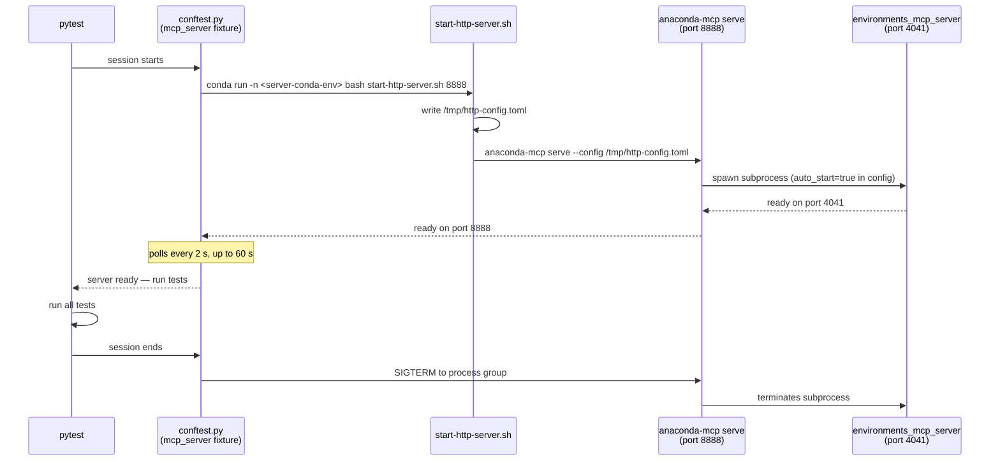

# API Tools Tests

Direct MCP API tests — validate tool behavior by calling the server over HTTP,
without an LLM client in the loop. Deterministic and repeatable.

---

## What these tests cover

| Test | Bug | Checks |
|------|-----|--------|
| `test_err_003a_by_name_error_description` | ERR-003a | `conda_install_packages(environment=<name>)` must report "could not resolve the packages", not "environment not found", when the environment exists |
| `test_err_003a_by_name_returns_error` | ERR-003a | must return `is_error=true` for a nonexistent package (no silent pip fallback) |
| `test_err_003b_by_prefix_error_description` | ERR-003b (2a) | `conda_install_packages(prefix=<path>)` must report "could not resolve the packages" — not the connector-level CondaError message |
| `test_err_003b_by_prefix_does_not_hang` | ERR-003b (2b) | must respond within 60 s — a timeout means the synchronous solve blocked the event loop on a cold cache |
| `test_err_003b_solve_blocks_concurrent_requests` | ERR-003b (2b) | a concurrent `tools/list` must respond in < 1 s while a prefix-based install is running — a delay means the solve is blocking the event loop |

All bugs were reproduced on 2026-03-05 (macOS, Streamable HTTP, Python 3.13,
Cursor client). See [Root Cause Analysis](#root-cause-analysis) below.

---

## Root Cause Analysis

Component: `environments_mcp_server 1.0.0rc1`
File: `tools/environments/install_packages.py`

### ERR-003a — False "environment not found" when called by name

**Symptom:** `conda_install_packages(environment="<name>", ...)` returns
`"The environment was not found"` even though the environment exists and the
real problem is that the requested package is not available.

**Root cause:** `anaconda_connector_conda` creates a fresh
`Context(search_path=())` (empty search path) for every call via
`local_context.py`. With an empty search path conda's context does not populate
`envs_dirs`, so `context.target_prefix` raises
`conda.exceptions.EnvironmentLocationNotFound` when trying to resolve the
environment name — **before the solver is ever invoked**. The handler at
`install_packages.py:93` catches this and returns the wrong error.

The handler at line 100 (`except conda_exceptions.ResolvePackageNotFound`) is
not implicated in ERR-003a. The env resolution fails earlier; the solver path
is never reached.

### ERR-003b — Two independent sub-defects when called by prefix

Calling by prefix bypasses the name-resolution step, so the context issue does
not apply. The solver is invoked directly — which exposes two further defects.

#### 2a — Dead code / wrong error path

**Symptom:** the returned `error_description` does not say
"Could not resolve the packages" — it contains a connector-level message.

**Root cause:** the connector (`transactions/env/base.py:202`) catches
`conda.exceptions.ResolvePackageNotFound` internally and re-raises it as
`PackageNotFoundError` (a `CondaError` subclass). By the time this exception
reaches `install_packages.py`, it is already a `CondaError`, so it bypasses:

```python
except conda_exceptions.ResolvePackageNotFound:   # line 100 — DEAD CODE
    return "Could not resolve the packages"        # never reached
```

and is caught by the generic handler at line 112 instead:

```python
except CondaError as ex:
    error_msg = str(ex)   # connector-level message, not "Could not resolve…"
```

The handler at line 100 is **unreachable dead code for any call path** — name
or prefix — because the connector always wraps the exception before it arrives
at `install_packages.py`.

#### 2b — Synchronous solve blocks the event loop

**Symptom:** on a cold repodata cache the server becomes unresponsive to all
concurrent requests for the duration of the conda solve, manifesting as an
apparent hang from the client's perspective.

**Root cause:** `InstallTransaction.prepare()` accesses `self._status`
synchronously (before any `await`). `_status` is a `cached_property` that
accesses `self.unlink_link_transaction`, which calls
`solver.solve_for_transaction()` directly **on the async event loop thread** —
not inside `asyncio.to_thread`. The `asyncio.to_thread(execute)` call at
`base.py:151` only wraps the transaction execution phase, which is never reached
for a nonexistent package. On a cold repodata cache the solver blocks on
network I/O, starving the event loop of the ability to process any other
request until the solve completes or the SSE session times out.

### Why both defects appear together in GUARD-001

ERR-003a's misleading "environment not found" causes the LLM to retry the
installation using the prefix (interpreting the error as a misconfiguration).
The retry triggers ERR-003b. Without ERR-003a the prefix call would not normally
occur.

---

## Setup (once)

### 1. Create the QA conda environment

```bash
conda env create -f tests/qa/api_tools/environment.yml
```

This creates `anaconda-mcp-qa` with `pytest`, `pytest-html`, and `httpx`.
It does **not** need `anaconda-mcp` installed — the server runs separately.

If the environment already exists and needs updating:

```bash
conda env update -f tests/qa/api_tools/environment.yml --prune
```

---

## Running tests

Always use `python -m pytest` (not bare `pytest`) to avoid picking up a
Homebrew/system pytest that shadows the conda env's installation.

### Option A — pre-started server (default)

```bash
# Terminal 1: start the server
conda activate anaconda-mcp-rc-py313
./tests/qa/_ai_docs/scripts/start-http-server.sh 8888

# Terminal 2: run the tests
conda activate anaconda-mcp-qa
python -m pytest tests/qa/api_tools/ -v
```

### Option B — auto-start server

The test session starts and stops the server automatically using
`tests/qa/_ai_docs/scripts/start-http-server.sh`. The script runs
`anaconda-mcp serve` and auto-starts `environments_mcp_server` as a
subprocess, so the target conda env must have both installed.

**One-time setup** — the server env needs the `anaconda-mcp` CLI and its
runtime dependencies. The CLI entry point (`anaconda-mcp serve`) is defined in
this project's `pyproject.toml`, so the project itself must be installed into
the env. The runtime dependencies are listed in the root `environment.yml`.

```bash
# Step 1: create the env with runtime dependencies
#   Option A — fresh env from environment.yml (name comes from the file)
conda env create -f environment.yml --name anaconda-mcp-rc-py313

#   Option B — update an already-created env
#   (use conda env update, NOT conda install --file)
conda env update -n anaconda-mcp-rc-py313 -f environment.yml

# Step 2: install the anaconda-mcp project itself into the env
#   This registers the 'anaconda-mcp' CLI entry point used by start-http-server.sh
conda run -n anaconda-mcp-rc-py313 pip install -e .
```

**Run with auto-start:**

```bash
# Minimal — uses MCP_SERVER_CONDA_ENV env var or the default 'anaconda-mcp-rc-py313'
conda activate anaconda-mcp-qa
python -m pytest tests/qa/api_tools/ -v --start-server

# Explicit env name via flag
python -m pytest tests/qa/api_tools/ -v \
  --start-server \
  --server-conda-env anaconda-mcp-rc-py313

# Explicit env name via environment variable (set once in your shell profile)
export MCP_SERVER_CONDA_ENV=anaconda-mcp-rc-py313
python -m pytest tests/qa/api_tools/ -v --start-server

# Full example with report metadata
python -m pytest tests/qa/api_tools/ -v \
  --start-server \
  --server-conda-env anaconda-mcp-rc-py313 \
  --transport http \
  --python-version 3.13
```

**What happens automatically** when `--start-server` is set:



---

## CLI options

| Option | Default | Description |
|--------|---------|-------------|
| `--server-url` | `http://localhost:8888/mcp` | MCP server endpoint. Also reads `MCP_SERVER_URL` env var. |
| `--transport` | `http` | Transport label for the HTML report (only `http` supported). |
| `--python-version` | — | Server Python version label for the report (e.g. `3.13`). |
| `--start-server` | off | Auto-start the server before the session; stop it after. |
| `--server-conda-env` | `anaconda-mcp-rc-py313` | Conda env with `anaconda-mcp` (used with `--start-server`). Also reads `MCP_SERVER_CONDA_ENV` env var. |

### Other examples

```bash
# Different port
python -m pytest tests/qa/api_tools/ -v --server-url http://localhost:9999/mcp

# Remote server
python -m pytest tests/qa/api_tools/ -v --server-url http://myserver:8888/mcp
```

---

## HTML report

Generated after every run at:

```
tests/qa/api_tools/reports/report.html
```

Open in any browser. The report includes:
- Pass/fail status per test with full assertion diffs
- Server URL, transport, and Python version in the metadata header
- Captured stdout (conda env creation logs) in the setup section

---

## Expected results

| Test | Bug present | Bug fixed |
|------|-------------|-----------|
| `test_err_003a_by_name_error_description` | **FAIL** | PASS |
| `test_err_003a_by_name_returns_error` | PASS | PASS |
| `test_err_003b_by_prefix_error_description` | **FAIL** | PASS |
| `test_err_003b_by_prefix_does_not_hang` | **FAIL** (timeout, cold cache) / PASS (warm cache) | PASS |
| `test_err_003b_solve_blocks_concurrent_requests` | **FAIL** (cold cache only) / PASS (warm cache) | PASS |

> **Cache note:** tests tagged "cold cache only" require the repodata cache to
> be cleared (`conda clean --all`) before the run to reliably fail. With warm
> cache the solve completes in < 100 ms and the timing-based assertions cannot
> detect the block.

---

## File structure

```
tests/qa/api_tools/
├── README.md                              ← this file
├── environment.yml                        ← QA conda env (pytest + httpx + pytest-html + pytest-timeout)
├── pytest.ini                             ← local config (HTML report, markers)
├── .gitignore                             ← ignores reports/*.html and caches
├── conftest.py                            ← CLI options, server fixture, HTML metadata, shared fixtures
├── test_guard_install_nonexistent_pkg.py  ← GUARD-001 regression tests
├── common/
│   ├── constants/
│   │   ├── config.py                      ← BASE_URL, TOOL_TIMEOUT
│   │   ├── test_data.py                   ← ENV_NAME, NONEXISTENT_PKG
│   │   └── mcp_tools.py                   ← Tools, InstallPackagesArgs, ToolResultFields enums
│   └── utils/
│       ├── mcp_client.py                  ← _call_tool, _parse_mcp_response, _tool_result
│       ├── conda_utils.py                 ← _conda_env_prefix
│       └── response_validators.py         ← _validate_package_resolution_error
└── reports/
    └── report.html                        ← generated, gitignored
```
