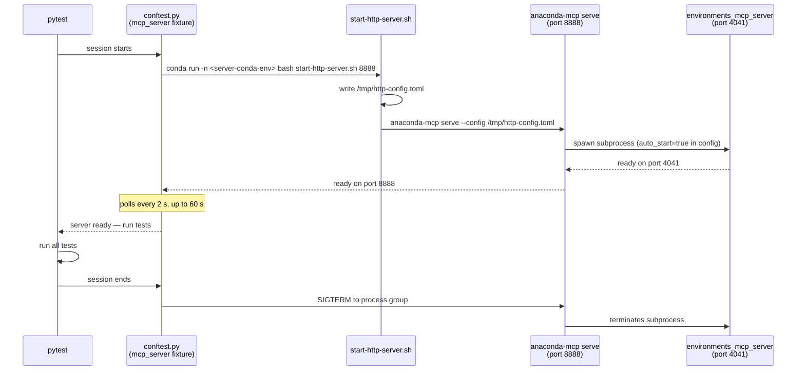

# API Tools Tests

Direct MCP API tests — validate tool behavior by calling the server over HTTP,
without an LLM client in the loop. Deterministic and repeatable.

---

## What these tests cover

| Test | Issue | Checks |
|------|-------|--------|
| `test_err_003a_by_name_error_description` | KI-010 | `conda_install_packages(environment=<name>)` must NOT return "environment not found" when the environment exists |
| `test_err_003a_by_name_returns_error` | KI-010 | must return `is_error=true` for a nonexistent package (no silent pip fallback) |
| `test_err_003b_by_prefix_does_not_hang` | KI-010 | `conda_install_packages(prefix=<path>)` must respond within 60 s |
| `test_ki002_list_environments_reports_correct_name` | KI-002 | `conda_list_environments` must return the correct name for each env — not "base" for a non-base environment |
| `test_ki003_remove_environment_by_name` | KI-003 | `conda_remove_environment(environment_name=<name>)` must resolve the correct prefix and remove the env |
| `test_hang_001_remove_nonexistent_env_does_not_hang` | KI-011 | `conda_remove_environment(prefix=<nonexistent>)` must return an error within 60 s — the mcp-compose proxy must not hang when the backend returns `isError=true` |
| `test_hang_002_install_into_nonexistent_env_does_not_hang` | KI-011 | `conda_install_packages(prefix=<nonexistent>)` must return an error within 60 s — same proxy hang guard for the install code path |
| `test_hang_003_session_survives_error_response` | KI-011 | after receiving an error response, subsequent tool calls on the same HTTP session must also complete — the proxy must not corrupt session state |

Reproduced on 2026-03-05, macOS, `environments-mcp-server 1.0.0rc1`.
See [KI-002, KI-003, KI-010, KI-011](../_ai_docs/KNOWN_ISSUES.md) in KNOWN_ISSUES.md for details.

> **Note on KI-011 tests and transport:** `test_guard_proxy_error_hang.py` is marked
> `http_transport` — it tests the HTTP transport code path specifically and cannot be
> run against STDIO. Both Option A and Option B exercise the same code path: the hang
> lives in mcp-compose's internal proxy (`:8888` → `:4041`), not in how the server
> process was started. The only practical difference is that Option B starts a fresh
> server per session, preventing corrupted state from one run bleeding into the next.

---

## Setup (once)

### 1. Create the QA conda environment

```bash
conda env create -f tests/qa/api_tools/environment.yml
```

This creates `anaconda-mcp-qa` with `pytest`, `pytest-html`, and `httpx`.
It does **not** need `anaconda-mcp` installed — the server runs separately.

If the environment already exists and needs updating:

```bash
conda env update -f tests/qa/api_tools/environment.yml --prune
```

---

## Running tests

Always use `python -m pytest` (not bare `pytest`) to avoid picking up a
Homebrew/system pytest that shadows the conda env's installation.

### Option A — pre-started server (default)

```bash
# Terminal 1: start the server
conda activate anaconda-mcp-rc-py313
./tests/qa/_ai_docs/scripts/start-http-server.sh 8888

# Terminal 2: run the tests
conda activate anaconda-mcp-qa
python -m pytest tests/qa/api_tools/ -v
```

### Option B — auto-start server

The test session starts and stops the server automatically using
`tests/qa/_ai_docs/scripts/start-http-server.sh`. The script runs
`anaconda-mcp serve` and auto-starts `environments_mcp_server` as a
subprocess, so the target conda env must have both installed.

**One-time setup** — the server env needs the `anaconda-mcp` CLI and its
runtime dependencies. The CLI entry point (`anaconda-mcp serve`) is defined in
this project's `pyproject.toml`, so the project itself must be installed into
the env. The runtime dependencies are listed in the root `environment.yml`.

```bash
# Step 1: create the env with runtime dependencies
#   Option A — fresh env from environment.yml (name comes from the file)
conda env create -f environment.yml --name anaconda-mcp-rc-py313

#   Option B — update an already-created env
#   (use conda env update, NOT conda install --file)
conda env update -n anaconda-mcp-rc-py313 -f environment.yml

# Step 2: install the anaconda-mcp project itself into the env
#   This registers the 'anaconda-mcp' CLI entry point used by start-http-server.sh
conda run -n anaconda-mcp-rc-py313 pip install -e .
```

**Run with auto-start:**

```bash
# Minimal — uses MCP_SERVER_CONDA_ENV env var or the default 'anaconda-mcp-rc-py313'
conda activate anaconda-mcp-qa
python -m pytest tests/qa/api_tools/ -v --start-server

# Explicit env name via flag
python -m pytest tests/qa/api_tools/ -v \
  --start-server \
  --server-conda-env anaconda-mcp-rc-py313

# Explicit env name via environment variable (set once in your shell profile)
export MCP_SERVER_CONDA_ENV=anaconda-mcp-rc-py313
python -m pytest tests/qa/api_tools/ -v --start-server

# Full example with report metadata
python -m pytest tests/qa/api_tools/ -v \
  --start-server \
  --server-conda-env anaconda-mcp-rc-py313 \
  --transport http \
  --python-version 3.13
```

**What happens automatically** when `--start-server` is set:



---

## CLI options

| Option | Default | Description |
|--------|---------|-------------|
| `--server-url` | `http://localhost:8888/mcp` | MCP server endpoint. Also reads `MCP_SERVER_URL` env var. |
| `--transport` | `http` | Transport label for the HTML report (only `http` supported). |
| `--python-version` | — | Server Python version label for the report (e.g. `3.13`). |
| `--start-server` | off | Auto-start the server before the session; stop it after. |
| `--server-conda-env` | `anaconda-mcp-rc-py313` | Conda env with `anaconda-mcp` (used with `--start-server`). Also reads `MCP_SERVER_CONDA_ENV` env var. |

### Other examples

```bash
# Different port
python -m pytest tests/qa/api_tools/ -v --server-url http://localhost:9999/mcp

# Remote server
python -m pytest tests/qa/api_tools/ -v --server-url http://myserver:8888/mcp
```

---

## HTML report

Generated after every run at:

```
tests/qa/api_tools/reports/report.html
```

Open in any browser. The report includes:
- Pass/fail status per test with full assertion diffs
- Server URL, transport, and Python version in the metadata header
- Captured stdout (conda env creation logs) in the setup section

---

## Expected results

### HTTP transport tests (`test_guard_proxy_error_hang.py`)

Run with either Option A or Option B. Requires a running HTTP server on port 8888.

| Test | Bug present | Bug fixed |
|------|-------------|-----------|
| `test_err_003a_by_name_error_description` | **FAIL** | PASS |
| `test_err_003a_by_name_returns_error` | PASS | PASS |
| `test_err_003b_by_prefix_does_not_hang` | PASS | PASS |
| `test_ki002_list_environments_reports_correct_name` | **FAIL** | PASS |
| `test_ki003_remove_environment_by_name` | **FAIL** | PASS |
| `test_hang_001_remove_nonexistent_env_does_not_hang` | **FAIL** (ReadTimeout after 60 s) | PASS |
| `test_hang_002_install_into_nonexistent_env_does_not_hang` | **FAIL** (ReadTimeout after 60 s) | PASS |
| `test_hang_003_session_survives_error_response` | **FAIL** (session corrupted or ReadTimeout) | PASS |

The KI-011 tests fail the same way under both Option A and Option B — the bug is in
mcp-compose's proxy code, not in how the server was started. Under Option A, a failed
hang test may leave the server in a corrupted state that affects the next run; restart
the server manually if subsequent runs show unexpected cascading failures.

For the **STDIO transport negative-control tests**, see `tests/qa/stdio_tools/` — a
separate test project with its own conftest, environment, and README.

---

## File structure

```
tests/qa/api_tools/
├── README.md                              ← this file
├── environment.yml                        ← QA conda env (pytest + httpx + pytest-html + pytest-timeout)
├── pytest.ini                             ← local config (HTML report, markers)
├── .gitignore                             ← ignores reports/*.html and caches
├── conftest.py                            ← CLI options, server fixture, HTML metadata, shared fixtures
├── test_guard_install_nonexistent_pkg.py  ← KI-010 regression tests
├── test_env_name_resolution.py            ← KI-002, KI-003 regression tests
├── test_guard_proxy_error_hang.py         ← KI-011 regression tests (HTTP transport)
├── common/
│   ├── constants/
│   │   ├── config.py                      ← BASE_URL, TOOL_TIMEOUT
│   │   ├── test_data.py                   ← ENV_NAME, NONEXISTENT_PKG, NONEXISTENT_ENV_PREFIX
│   │   └── mcp_tools.py                   ← Tools, InstallPackagesArgs, RemoveEnvironmentArgs, ToolResultFields enums
│   └── utils/
│       ├── mcp_client.py                  ← _call_tool, _parse_mcp_response, _tool_result
│       ├── conda_utils.py                 ← _conda_env_prefix
│       └── response_validators.py         ← _validate_package_resolution_error
└── reports/
    └── report.html                        ← generated, gitignored
```
