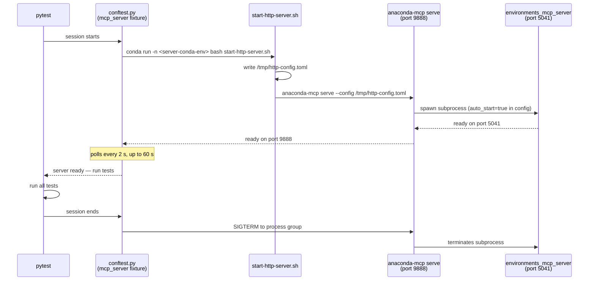

# HTTP Transport Tests

Tests validate MCP tool behavior by calling the server over **Streamable HTTP** —
direct API calls via httpx, no LLM client in the loop. Deterministic and repeatable.

**Stack under test:**

```
test process (httpx)  ──HTTP──▶  mcp-compose :9888  ──HTTP──▶  environments_mcp_server :5041
```

---

## What these tests cover

| Test | Issue | Checks |
|------|-------|--------|
| `test_err_003a_by_name_error_description` | KI-010 | `conda_install_packages(environment=<name>)` must NOT return "environment not found" when the environment exists |
| `test_err_003a_by_name_returns_error` | KI-010 | must return `is_error=true` for a nonexistent package (no silent pip fallback) |
| `test_err_003b_by_prefix_does_not_hang` | KI-010 | `conda_install_packages(prefix=<path>)` must respond within 60 s |
| `test_ki002_list_environments_reports_correct_name` | KI-002 | `conda_list_environments` must return the correct name for each env |
| `test_ki003_remove_environment_by_name` | KI-003 | `conda_remove_environment(environment_name=<name>)` must resolve the correct prefix and remove the env |
| `test_hang_001_remove_nonexistent_env_does_not_hang` | KI-011 | `conda_remove_environment` error response must arrive within 60 s across 20 repeated calls |
| `test_hang_002_install_into_nonexistent_env_does_not_hang` | KI-011 | `conda_install_packages` error response must arrive within 60 s across 20 repeated calls |
| `test_hang_003_session_survives_error_response` | KI-011 | the server must remain functional after forwarding an error — subsequent calls must also complete |

Reproduced on 2026-03-05, macOS, `environments-mcp-server 1.0.0rc1`.
See [KNOWN_ISSUES.md](../_ai_docs/KNOWN_ISSUES.md) for KI-002, KI-003, KI-010, KI-011.
See [hang_issue/](../_ai_docs/hang_issue/) for the KI-011 root-cause analysis and fix plan.

---

## Setup (once)

### 1. Create the QA conda environment

```bash
conda env create -f tests/qa/http_tools/environment.yml
```

This creates `anaconda-mcp-qa` with `pytest`, `pytest-html`, and `httpx`.
It does **not** need `anaconda-mcp` installed — the server runs separately.

If the environment already exists and needs updating:

```bash
conda env update -f tests/qa/http_tools/environment.yml --prune
```

---

## Running tests

Always use `python -m pytest` (not bare `pytest`) to avoid picking up a
Homebrew/system pytest that shadows the conda env's installation.

### Option A — pre-started server (default)

#### macOS / Linux

```bash
# Terminal 1: start the server
# Replace <server-env> with the conda env where anaconda-mcp is installed
# (e.g. anaconda-mcp-rc-py313, anaconda-mcp-rc2-mcpc-py313-1, etc.)
conda activate <server-env>
./tests/qa/_ai_docs/scripts/start-http-server.sh

# Terminal 2: run the tests
conda activate anaconda-mcp-qa
python -m pytest tests/qa/http_tools/ -v
```

#### Windows

> **Note:** The `anaconda-mcp` CLI is not directly executable on Windows due to a missing `.exe` wrapper (see [PI-001](../_ai_docs/KNOWN_ISSUES.md#pi-001)). Use `python -m anaconda_mcp` as the workaround.

**PowerShell:**

```powershell
# Terminal 1: start the server
conda activate anaconda-mcp-rc-py311
.\tests\qa\_ai_docs\scripts\start-http-server.ps1

# Terminal 2: run the tests
conda activate anaconda-mcp-qa
python -m pytest tests/qa/http_tools/ -v
```

**Anaconda Prompt (CMD):**

```cmd
REM Terminal 1: start the server
conda activate anaconda-mcp-rc-py311
tests\qa\_ai_docs\scripts\start-http-server.cmd

REM Terminal 2: run the tests
conda activate anaconda-mcp-qa
python -m pytest tests/qa/http_tools/ -v
```

**Simple STDIO mode (no config file):**

```cmd
cd %USERPROFILE%
conda activate anaconda-mcp-rc-py311
python -m anaconda_mcp serve --delay 5
```

> **Important (Windows):** Run the server from a directory that does NOT contain a `.env` file with test variables. The `environments_mcp_server` uses pydantic-settings which reads `.env` files automatically. Test directories like `C:\projects\anaconda-desktop` may have `.env` files that cause validation errors. Use `cd %USERPROFILE%` or `cd $HOME` before starting the server.

### Option B — auto-start server

The test session starts and stops the server automatically using
`tests/qa/_ai_docs/scripts/start-http-server.sh`. The script runs
`anaconda-mcp serve` and auto-starts `environments_mcp_server` as a
subprocess, so the target conda env must have both installed.

**One-time setup** — the server env needs the `anaconda-mcp` CLI and its
runtime dependencies:

```bash
# Step 1: create the env with runtime dependencies
conda env create -f environment.yml --name anaconda-mcp-rc-py313
# or update an existing env:
conda env update -n anaconda-mcp-rc-py313 -f environment.yml

# Step 2: install the anaconda-mcp project into the env
conda run -n anaconda-mcp-rc-py313 pip install -e .
```

**Run with auto-start:**

```bash
conda activate anaconda-mcp-qa
python -m pytest tests/qa/http_tools/ -v --start-server

# Explicit env name
python -m pytest tests/qa/http_tools/ -v \
  --start-server \
  --server-conda-env anaconda-mcp-rc-py313

# With report metadata
python -m pytest tests/qa/http_tools/ -v \
  --start-server \
  --server-conda-env anaconda-mcp-rc-py313 \
  --transport http \
  --python-version 3.13
```

**What happens automatically** when `--start-server` is set:



---

## CLI options

| Option | Default | Description |
|--------|---------|-------------|
| `--server-url` | `http://localhost:8888/mcp` | MCP server endpoint. Also reads `MCP_SERVER_URL` env var. |
| `--transport` | `http` | Transport label for the HTML report (only `http` supported). |
| `--python-version` | — | Server Python version label for the report (e.g. `3.13`). |
| `--start-server` | off | Auto-start the server before the session; stop it after. |
| `--server-conda-env` | `anaconda-mcp-rc-py313` | Conda env with `anaconda-mcp` (used with `--start-server`). Also reads `MCP_SERVER_CONDA_ENV` env var. |

### Other examples

```bash
# Different port
python -m pytest tests/qa/http_tools/ -v --server-url http://localhost:9999/mcp

# Remote server
python -m pytest tests/qa/http_tools/ -v --server-url http://myserver:8888/mcp
```

### Verbose logging for debugging hangs

When debugging KI-011 or other hang issues, use verbose logging to see detailed HTTP request/response timing:

```bash
# INFO level — see request/response timing and session info
python -m pytest tests/qa/http_tools/ -v --log-cli-level=INFO

# DEBUG level — full request/response headers and bodies
python -m pytest tests/qa/http_tools/ -v --log-cli-level=DEBUG -s

# Single test with maximum verbosity
python -m pytest tests/qa/http_tools/test_env_name_resolution.py::TestEnvironmentNameResolution::test_ki003_remove_environment_by_name \
  -v --log-cli-level=DEBUG -s
```

Example log output when debugging a hang:
```
[CALL] tool=conda_remove_environment args={'environment_name': 'guard-env-remove-test'} session_id=abc12345... timeout=60s
[TIMING] request started at t=0
[TIMING] SIGALRM set for 60s
...
[TIMEOUT] SIGALRM fired after 60.0s — no response received, likely KI-011 hang
```

---

## HTML report

Generated after every run at `tests/qa/http_tools/reports/report.html`.
Open in any browser — includes pass/fail per test, assertion diffs, and
server metadata in the header.

---

## Expected results

| Test | Bug present | Bug fixed |
|------|-------------|-----------|
| `test_err_003a_by_name_error_description` | **FAIL** | PASS |
| `test_err_003a_by_name_returns_error` | PASS | PASS |
| `test_err_003b_by_prefix_does_not_hang` | PASS | PASS |
| `test_ki002_list_environments_reports_correct_name` | **FAIL** | PASS |
| `test_ki003_remove_environment_by_name` | **FAIL** | PASS |
| `test_hang_001_remove_nonexistent_env_does_not_hang` | **FAIL** (ReadTimeout after 60 s) | PASS |
| `test_hang_002_install_into_nonexistent_env_does_not_hang` | **FAIL** (ReadTimeout after 60 s) | PASS |
| `test_hang_003_session_survives_error_response` | **FAIL** (ReadTimeout after 60 s) | PASS |

Under Option A, a failed KI-011 hang test leaves mcp-compose in a permanently
corrupted state. Restart the server manually before the next run to avoid
cascading failures.

For the STDIO transport tests, see [`tests/qa/stdio_tools/`](../stdio_tools/README.md).

---

## File structure

```
tests/qa/http_tools/
├── environment.yml                        ← QA conda env (pytest + httpx + pytest-html + pytest-timeout)
├── conftest.py                            ← CLI options, server fixture, shared fixtures
├── test_guard_install_nonexistent_pkg.py  ← KI-010 regression tests
├── test_env_name_resolution.py            ← KI-002, KI-003 regression tests
├── test_guard_proxy_error_hang.py         ← KI-011 regression tests (HTTP transport)
├── common/                                ← shared MCP client, constants, validators
└── reports/report.html                    ← generated, gitignored
```

---

## Windows-specific notes

### Server startup scripts

| Platform | Script | Usage |
|----------|--------|-------|
| macOS/Linux | `start-http-server.sh` | `./tests/qa/_ai_docs/scripts/start-http-server.sh 8888` |
| Windows (PowerShell) | `start-http-server.ps1` | `.\tests\qa\_ai_docs\scripts\start-http-server.ps1 8888` |
| Windows (CMD/Anaconda Prompt) | `start-http-server.cmd` | `tests\qa\_ai_docs\scripts\start-http-server.cmd 8888` |

### Known issues on Windows

| Issue | Description | Workaround |
|-------|-------------|------------|
| [PI-001](../_ai_docs/KNOWN_ISSUES.md#pi-001) | `anaconda-mcp` CLI not executable (missing `.exe` wrapper) | Use `python -m anaconda_mcp` |
| `.env` file conflicts | `environments_mcp_server` reads `.env` files via pydantic-settings, causing validation errors if test variables are present | Run server from `%USERPROFILE%` or a directory without `.env` |
| PowerShell execution policy | Scripts may be blocked by default | Run `Set-ExecutionPolicy -Scope CurrentUser -ExecutionPolicy RemoteSigned` |

### VS Code MCP integration (Windows)

To use `anaconda-mcp` as an MCP server in VS Code on Windows, create `.vscode/mcp.json`:

```json
{
    "servers": {
        "anaconda-mcp": {
            "command": "C:\\Users\\<username>\\anaconda3\\envs\\anaconda-mcp-rc-py311\\python.exe",
            "args": ["-m", "anaconda_mcp", "serve", "--delay", "5"],
            "cwd": "C:\\Users\\<username>",
            "env": {
                "ANACONDA_MCP_PYTHON_EXECUTABLE": "C:\\Users\\<username>\\anaconda3\\envs\\anaconda-mcp-rc-py311\\python.exe"
            }
        }
    }
}
```

The `cwd` setting is important to avoid loading test `.env` files from project directories.
