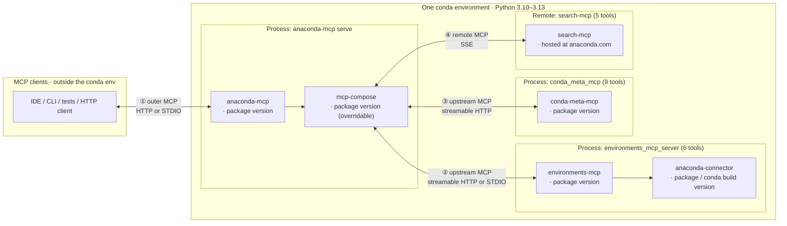

# Stack architecture — `mcp_tools`

What the system under test looks like: how products are wired together, what transports connect them, and what version options exist on each layer.

---

## Products and conda environment

The **whole server-side chain** runs inside **one conda environment** (passed as `--server-conda-env`):

- **Python:** single interpreter for all imports — typically **3.10–3.13**; must match all package pins.
- **Versions:** independently pinned `anaconda-mcp`, `mcp-compose`, `environments-mcp`, `anaconda-connector` (conda/pip/editable). Must be mutually compatible at runtime.
- **Transports ① and ②:** configuration choices, not separate installs — see diagram below.



- **①** — transport between the **MCP client** and **`anaconda-mcp`**: streamable HTTP or STDIO.
- **②** — transport between **`mcp-compose`** and **`environments_mcp_server`**: streamable HTTP or STDIO. Independent of ①.
- **③** — transport between **`mcp-compose`** and **`conda_meta_mcp`**: streamable HTTP.
- **④** — transport between **`mcp-compose`** and **`search-mcp`**: SSE (remote server at anaconda.com).
- **`environments-mcp` → `anaconda-connector`** — Python API for conda operations; not a third MCP wire.
- **`mcp-compose`** ships as a dependency of `anaconda-mcp`; it can be **overridden** (fork / git) to test transport fixes without changing `anaconda-mcp` itself.

### Version options per product

| Product | How to change the version |
|---------|--------------------------|
| **`anaconda-mcp`** | Release or editable checkout (`pip install -e …`) in the server env |
| **`mcp-compose`** | Transitive dep; override with `pip install` (fork / git) — see [`README.md`](../README.md) |
| **`environments-mcp`** | Release or editable in the **same** env as `anaconda-mcp` |
| **`anaconda-connector-conda`** | Conda/pip pin; must be importable as `anaconda_connector_conda` or tools fail to register |
| **`conda-meta-mcp`** | Install from conda-forge: `conda install -c conda-forge conda-meta-mcp` |
| **`search-mcp`** | Remote service; no local install needed. Requires authentication (see below). |

---

## Server execution model

MCP servers fall into two categories based on where they run:

### Local servers (auto-started by mcp-compose)

**environments-mcp** and **conda-meta-mcp** are **local servers** that mcp-compose spawns as subprocesses:

```
mcp-compose (parent process)
├── environments_mcp_server (subprocess on port 4041)
└── conda_meta_mcp (subprocess on port 4042)
```

Configuration in `mcp_compose.toml`:
```toml
[[servers.proxied.streamable-http]]
name = "conda"
url = "http://localhost:4041/mcp"
auto_start = true
command = ["python", "-m", "environments_mcp_server", "start", "--transport", "streamable-http", "--port", "4041"]
startup_delay = 5

[[servers.proxied.streamable-http]]
name = "conda-meta"
url = "http://localhost:4042/mcp"
auto_start = true
command = ["python", "-m", "conda_meta_mcp.cli", "run", "--transport", "streamable-http", "--port", "4042"]
startup_delay = 5
```

**Key implications**:
1. Both packages must be installed in the **same conda environment** as anaconda-mcp
2. The `command` uses the same Python interpreter that runs mcp-compose
3. `startup_delay` gives the subprocess time to initialize before mcp-compose sends requests
4. Port allocation is deterministic: environments-mcp=4041, conda-meta-mcp=4042

### Remote server (hosted service)

**search-mcp** is a **remote server** hosted at `anaconda.com`:

```toml
[[servers.proxied.streamable-http]]
name = "search"
url = "https://anaconda.com/api/search/mcp"
auth_token = "{{ANACONDA_TOKEN}}"
auth_type = "bearer"
auto_start = false  # remote, not spawned locally
```

**Key implications**:
1. No local installation required
2. Requires authentication token (from `anaconda login` or `ANACONDA_AUTH_API_KEY` env var)
3. Network connectivity to anaconda.com required
4. Tests for search-mcp tools are auth-aware (skip or adapt when logged out)

### Port allocation summary

| Server | Port | Execution |
|--------|------|-----------|
| anaconda-mcp (mcp-compose) | 2391 | Parent process |
| environments-mcp | 4041 | Local subprocess |
| conda-meta-mcp | 4042 | Local subprocess |
| search-mcp | — | Remote (anaconda.com) |

---

## Authentication model

Tests interact with servers that have different authentication requirements:

| Server | Auth requirement | Tools affected |
|--------|------------------|----------------|
| environments-mcp | None | All 6 tools work without auth |
| conda-meta-mcp | None | All 9 tools work without auth |
| search-mcp | Required for some | 2 auth-required, 3 auth-enhanced |

### Auth detection priority

The test harness detects authentication state at session start:

1. **Keyring token** — from `anaconda login` (preferred for local dev)
2. **Environment credentials** — `ANACONDA_USER_EMAIL` + `ANACONDA_USER_PASSWORD` (for CI with OAuth flow)
3. **No auth** — tests for auth-required tools are skipped

### Auth-aware test markers

```python
@pytest.mark.auth_independent   # Works without auth (15 tools)
@pytest.mark.auth_required      # Skipped when logged out (2 tools)
@pytest.mark.auth_enhanced      # Works but returns different results (3 tools)
```

See [`test_design.md`](test_design.md) for tool-by-marker mapping

---

## Two-hop transport matrix (`--mcp-profile`)

Each `--mcp-profile` value fixes both **①** and **②** independently.
Canonical TOML is generated from [`tests/qa/shared/mcp_compose_profiles.py`](../../shared/mcp_compose_profiles.py) — tests do **not** select transport by editing the packaged `mcp_compose.toml`.

| Profile | ① client → anaconda-mcp | ② mcp-compose → environments-mcp | Why we care |
|---------|--------------------------|--------------------------------------|-------------|
| `http-http` | Streamable HTTP | Streamable HTTP | Standard remote / "browser-like" path; matches `start-http-server.sh` |
| `stdio-http` | STDIO | Streamable HTTP | IDE-style outer STDIO with HTTP upstream — exercises both proxy styles |
| `stdio-stdio` | STDIO | STDIO | All-stdio; less upstream HTTP churn; used for hang / stress regressions |

**Not covered by default:** `http-stdio` (HTTP outer, STDIO upstream) is valid for mcp-compose but omitted until the product explicitly needs it — see `mcp_compose_profiles.py`.

---

See [`configuration.md`](configuration.md) for CLI options and CI setup, [`test_design.md`](test_design.md) for how profiles translate to fixtures.
