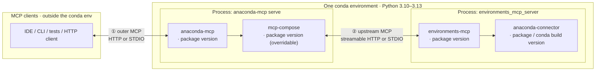

# Stack architecture — `mcp_tools`

What the system under test looks like: how products are wired together, what transports connect them, and what version options exist on each layer.

---

## Products and conda environment

The **whole server-side chain** runs inside **one conda environment** (passed as `--server-conda-env`):

- **Python:** single interpreter for all imports — typically **3.10–3.13**; must match all package pins.
- **Versions:** independently pinned `anaconda-mcp`, `mcp-compose`, `environments-mcp`, `anaconda-connector` (conda/pip/editable). Must be mutually compatible at runtime.
- **Transports ① and ②:** configuration choices, not separate installs — see diagram below.

- **①** — transport between the **MCP client** and **`anaconda-mcp`**: streamable HTTP or STDIO.
- **②** — transport between **`mcp-compose`** and **`environments_mcp_server`**: streamable HTTP or STDIO. Independent of ①.
- **`environments-mcp` → `anaconda-connector`** — Python API for conda operations; not a third MCP wire.
- **`mcp-compose`** ships as a dependency of `anaconda-mcp`; it can be **overridden** (fork / git) to test transport fixes without changing `anaconda-mcp` itself.

### Version options per product

| Product | How to change the version |
|---------|--------------------------|
| **`anaconda-mcp`** | Release or editable checkout (`pip install -e …`) in the server env |
| **`mcp-compose`** | Transitive dep; override with `pip install` (fork / git) — see [`README.md`](../README.md) |
| **`environments-mcp`** | Release or editable in the **same** env as `anaconda-mcp` |
| **`anaconda-connector-conda`** | Conda/pip pin; must be importable as `anaconda_connector_conda` or tools fail to register |

---

## Two-hop transport matrix (`--mcp-profile`)

Each `--mcp-profile` value fixes both **①** and **②** independently.
Canonical TOML is generated from [`tests/qa/shared/mcp_compose_profiles.py`](../../shared/mcp_compose_profiles.py) — tests do **not** select transport by editing the packaged `mcp_compose.toml`.

| Profile | ① client → anaconda-mcp | ② mcp-compose → environments-mcp | Why we care |
|---------|--------------------------|--------------------------------------|-------------|
| `http-http` | Streamable HTTP | Streamable HTTP | Standard remote / "browser-like" path; matches `start-http-server.sh` |
| `stdio-http` | STDIO | Streamable HTTP | IDE-style outer STDIO with HTTP upstream — exercises both proxy styles |
| `stdio-stdio` | STDIO | STDIO | All-stdio; less upstream HTTP churn; used for hang / stress regressions |

**Not covered by default:** `http-stdio` (HTTP outer, STDIO upstream) is valid for mcp-compose but omitted until the product explicitly needs it — see `mcp_compose_profiles.py`.

---

See [`configuration.md`](configuration.md) for CLI options and CI setup, [`test_design.md`](test_design.md) for how profiles translate to fixtures.
