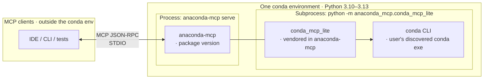

# Stack architecture — `mcp_tools`

What the system under test looks like: how products are wired together and what version options exist on each layer.

---

## Products and conda environment

The **whole server-side chain** runs inside **one conda environment** (passed as `--server-conda-env`):

- **Python:** single interpreter for all imports — typically **3.10–3.13**; must match all package pins.
- **Versions:** `anaconda-mcp` plus its transitive dependencies in the server env. Must be mutually compatible at runtime.
- **Transport:** native stdio between the test process and `anaconda-mcp serve`.

- The QA harness spawns **`anaconda-mcp serve`** directly and speaks MCP JSON-RPC over stdio.
- The vendored **`anaconda_mcp.conda_mcp_lite`** tools are mounted in-process by the native FastMCP server.
- **`conda_mcp_lite` → `conda` CLI** — shells out to the user's discovered conda executable; not a third MCP wire.

### Version options per product

| Product | How to change the version |
|---------|--------------------------|
| **`anaconda-mcp`** | Release or editable checkout (`pip install -e …`) in the server env |

---

## Native stdio profile (`--mcp-profile`)

`--mcp-profile` is now a report label only. Native serve is stdio-only, and both supported slugs use the same process path.

| Profile | Transport | Why we keep it |
|---------|-----------|----------------|
| `stdio-stdio` | STDIO → native `anaconda-mcp serve` | Canonical CI/report slug |
| `stdio` | STDIO → native `anaconda-mcp serve` | Short local alias |

---

See [`configuration.md`](configuration.md) for CLI options and CI setup, [`test_design.md`](test_design.md) for how profiles translate to fixtures.
