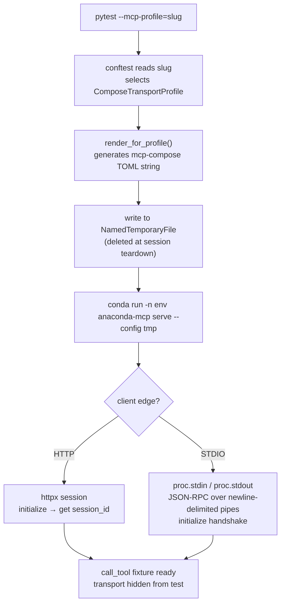
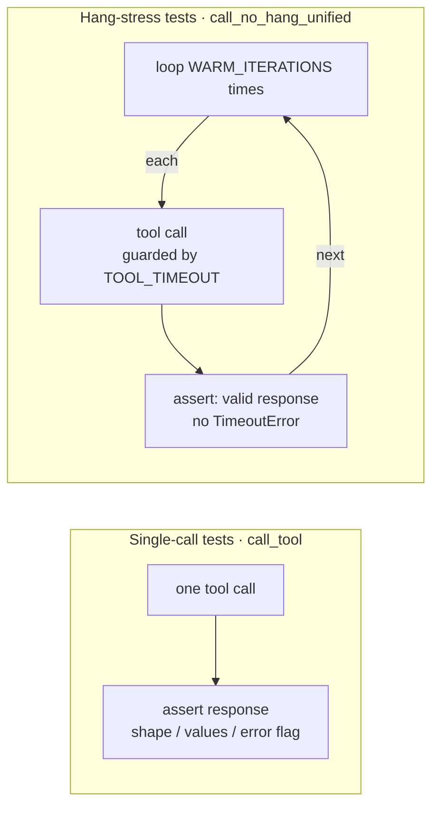

# Test design — `mcp_tools`

**Audience:** QA engineers and developers running or extending the unified MCP tool suite.

**In scope:** functional MCP tool calls over each transport profile + hang / stress regressions (`hang_stress` mark).

**Out of scope:** LLM behaviour, end-to-end user workflows through Claude Desktop UI, installation and packaging.

Stack and transport matrix: [`architecture.md`](architecture.md). CLI options and CI: [`configuration.md`](configuration.md). Logs: [`reporting.md`](reporting.md).

---

## 1. How `--mcp-profile` works under the hood

Selecting a profile triggers a chain in `conftest.py` that hides all transport detail from the tests themselves:

- **TOML generation** is deterministic: same profile + ports → same config. Source: [`mcp_compose_profiles.py`](../../shared/mcp_compose_profiles.py).
- **STDIO stderr** is redirected to a `NamedTemporaryFile`; on failure, `conftest` appends the tail to the HTML report — see [`reporting.md`](reporting.md).

### Fixture scopes

| Fixture | Scope | Used by |
|---------|-------|---------|
| `mcp_server` / `stdio_mcp_module` | `module` | `call_tool` — shared across all tests in a file |
| `stdio_server` | `function` | `call_no_hang_unified` — fresh process per hang-stress test |
| `session_id` | `module` | HTTP only; `None` for STDIO |

---

## 2. Design rationale

### Why test at the MCP protocol level?

| Reason | Detail |
|--------|--------|
| **Deterministic** | No LLM variability — same input always produces the same output |
| **Fast feedback** | Seconds per test vs minutes for E2E flows through a desktop UI |
| **CI-friendly** | Runs in GitHub Actions without a GUI or LLM API calls |
| **Regression-focused** | Catches known issues (KI-002, KI-003, KI-010, KI-011) reliably and repeatably |
| **Transport-agnostic logic** | Same assertions run for every profile — only the adapter changes |

### Why deterministic single-call tests for tool behaviour?

Each tool has a defined contract: given a specific input, it must return a specific shape of response (`is_error`, `tool_result`, message). A single call is enough to verify that contract. Deterministic inputs (known env name, known package, nonexistent prefix) make failures unambiguous — no retries, no timing, no accumulated state.

This also makes it straightforward to distinguish where a failure originates: if the same test fails on `http-http` and `stdio-stdio` alike, the problem is in `environments_mcp_server` (tool implementation or `anaconda-connector`); if it fails on one profile only, the fault is in the transport layer — mcp-compose or the outer transport framing.

### Why support variability on each layer?

Tool behaviour must be correct regardless of *how* the call travels to `environments_mcp_server`. A bug can live in any hop — outer transport framing, mcp-compose proxy session handling, upstream connection pooling, or the tool implementation itself. Running the same test logic across the full transport matrix and against independently-versioned packages isolates *where* a regression lives, not just *that* something broke.

---

## 3. Tools and scenarios

### environments-mcp (6 tools)

| Tool | Happy path | Error path | Hang stress |
|------|:----------:|:----------:|:-----------:|
| `conda_list_environments` | ✓ | | ✓ |
| `conda_install_packages` | ✓ | ✓ | ✓ |
| `conda_remove_environment` | ✓ | ✓ | ✓ |
| `conda_create_environment` | ✓ | ✓ | |
| `conda_list_environment_packages` | ✓ | ✓ | |
| `conda_remove_packages` | ✓ | ✓ | |

### conda-meta-mcp (9 tools)

| Tool | Happy path | Error path | Hang stress |
|------|:----------:|:----------:|:-----------:|
| `conda-meta_info` | ✓ | | |
| `conda-meta_cache_maintenance` | ✓ | | |
| `conda-meta_cli_help` | ✓ | | |
| `conda-meta_file_path_search` | ✓ | | |
| `conda-meta_import_mapping` | ✓ | ✓ | |
| `conda-meta_package_insights` | ✓ | | |
| `conda-meta_package_search` | ✓ | ✓ | |
| `conda-meta_pypi_to_conda` | ✓ | | |
| `conda-meta_repoquery` | ✓ | ✓ | ✓ |

### search-mcp (5 tools)

| Tool | Happy path | Error path | Hang stress |
|------|:----------:|:----------:|:-----------:|
| `search_search_packages` | ✓ | ✓ | ✓ |
| `search_search_documentation` | ✓ | ✓ | |
| `search_search_forum` | ✓ | ✓ | |
| `search_search_collections_and_files` | ✓ | | |
| `search_search_environments` | ✓ | | |

---

## 4. Two test types

| | Single-call | Hang-stress |
|-|-------------|-------------|
| **Fixture** | `call_tool` (module-scoped server) | `call_no_hang_unified` (function-scoped fresh server for STDIO) |
| **Iterations** | 1 | `WARM_ITERATIONS = 20` |
| **Timeout guard** | `TOOL_CALL_WALL_SECONDS` (wall clock) | `TOOL_TIMEOUT = 60 s` per iteration |
| **Marks** | `regression`, `slow` | `hang_stress`, `regression`, `slow` |
| **Skip with** | — | `--skip-hang-stress` / `MCP_QA_SKIP_HANG_STRESS=1` |

**Why iterations?** [KI-011](../../../_ai_docs/_tracking/KNOWN_ISSUES.md#ki-011-mcp-compose-proxy-hangs-and-corrupts-session-on-tool-error) ([DESK-1409](https://anaconda.atlassian.net/browse/DESK-1409), [DESK-1355](https://anaconda.atlassian.net/browse/DESK-1355)) — in production, the proxy hang required ~47 minutes of LLM use to trigger. The root cause is mcp-compose proxy state accumulated across calls, invisible to a single-call test. `WARM_ITERATIONS=20` with a small `ITERATION_DELAY` between calls replicates enough accumulated state to surface the regression in minutes.

---

## 5. Marks

| Mark | Meaning | How to select / skip |
|------|---------|----------------------|
| `regression` | Guards a known bug or confirmed defect. Always run before a release. | `-m regression` |
| `slow` | Takes longer than a trivial assertion (conda operations, server startup). | `-m "not slow"` to exclude |
| `hang_stress` | Repeats tool calls N times to surface proxy-state bugs (KI-011). Safe to skip for a quick smoke run; must pass before release. | `--skip-hang-stress` / `MCP_QA_SKIP_HANG_STRESS=1` / `-m "not hang_stress"` |

For per-test detail (which KI each test guards, reproduction notes), read the module docstring directly — e.g. `test_guard_proxy_error_hang.py`.

---

## 6. Related documents

| Document | Content |
|----------|---------|
| [`README.md`](../README.md) | Quick start, envs, run commands |
| [`architecture.md`](architecture.md) | Stack diagram, transport matrix, version options |
| [`configuration.md`](configuration.md) | CLI flags, env vars, examples, CI matrix |
| [`reporting.md`](reporting.md) | pytest-html report, log extras, stderr tails |
| [`_ai_docs/tech_details/LOCAL-DEV-SETUP.md`](../../../_ai_docs/tech_details/LOCAL-DEV-SETUP.md) | Editable installs, troubleshooting |
| [`_ai_docs/_tracking/KNOWN_ISSUES.md`](../../../_ai_docs/_tracking/KNOWN_ISSUES.md) | Bug references for regression tests |
