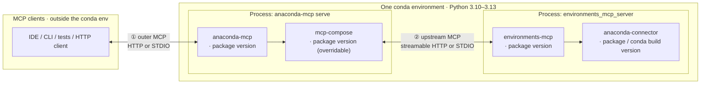

# Test design — `mcp_tools`

**Audience:** QA engineers and developers running or extending the unified MCP tool suite.

**Scope:** Functional MCP tool calls over each transport profile + hang / stress regressions (marked `hang_stress`).
See test modules under `tests/qa/mcp_tools/` for the full list; see [`reporting.md`](reporting.md) for HTML report and log locations.

**This doc covers:** what we test, how the stack is wired, which knobs exist at each layer, and why the transport matrix matters.
Install commands and env setup live in [`README.md`](../README.md) and [`_ai_docs/tech_details/`](../../../_ai_docs/tech_details/).

---

## 1. Stack: conda env, versions, transports

The **whole server-side chain** runs inside **one conda environment** (passed as `--server-conda-env`):

- **Python:** single interpreter for all imports — typically **3.10–3.13**; must match all package pins.
- **Versions:** independently pinned `anaconda-mcp`, `mcp-compose`, `environments-mcp`, `anaconda-connector` (conda/pip/editable). Must be mutually compatible at runtime.
- **Transports ① and ②:** configuration choices, not separate installs — see diagram below.

The QA suite does **not** brute-force every version cross-product. It **does** cover the **transport matrix** (§2) because proxy and framing bugs surfaced per hop.

- **①** — transport between the **MCP client** and **`anaconda-mcp`**: streamable HTTP or STDIO.
- **②** — transport between **`mcp-compose`** and **`environments_mcp_server`**: streamable HTTP or STDIO. Independent of ①.
- **`environments-mcp` → `anaconda-connector`** — Python API for conda operations inside the EMS process; not a third MCP wire.
- **`mcp-compose`** ships as a dependency of `anaconda-mcp`; it can be **overridden** (fork / git) to test transport fixes without changing `anaconda-mcp` itself.

---

## 2. Two-hop transport matrix (`--mcp-profile`)

Each `--mcp-profile` value fixes both **①** and **②** independently.
Canonical TOML is generated from [`tests/qa/shared/mcp_compose_profiles.py`](../../shared/mcp_compose_profiles.py) — tests do **not** select transport by editing the packaged `mcp_compose.toml`.

| Profile | ① client → anaconda-mcp | ② mcp-compose → environments-mcp | Why we care |
|---------|--------------------------|--------------------------------------|-------------|
| `http-http` | Streamable HTTP | Streamable HTTP | Standard remote / "browser-like" path; matches `start-http-server.sh` |
| `stdio-http` | STDIO | Streamable HTTP | IDE-style outer STDIO with HTTP upstream — exercises both proxy styles |
| `stdio-stdio` | STDIO | STDIO | All-stdio; less upstream HTTP churn; used for hang / stress regressions |

**Not covered by default:** `http-stdio` (HTTP outer, STDIO upstream) is valid for mcp-compose but omitted until the product explicitly needs it — see `mcp_compose_profiles.py`.

---

## 3. Options at each layer

### 3.1 Test harness (pytest CLI / env)

| Option / env var | Purpose |
|------------------|---------|
| `--mcp-profile` / `MCP_PROFILE` | Transport matrix row (§2) |
| `--server-url` / `MCP_SERVER_URL` | MCP endpoint when **① is HTTP** (`http-http`) |
| `--compose-port` / `MCP_COMPOSE_PORT` | Port in generated **http-http** composer config |
| `--downstream-port` / `MCP_DOWNSTREAM_PORT` | EMS streamable-http port for **②** where applicable |
| `--server-conda-env` / `MCP_SERVER_CONDA_ENV` | Conda env that holds all server products (§1) |
| `--start-server` | Auto-start HTTP server via `start-http-server.sh` (`http-http` only) |
| `--skip-hang-stress` / `MCP_QA_SKIP_HANG_STRESS` / `-m "not hang_stress"` | Skip long hang-regression tests |
| `--transport` | Legacy report label — prefer `--mcp-profile` |

Implementation: [`conftest.py`](../conftest.py) (`pytest_addoption`).

### 3.2 `anaconda-mcp` + `mcp-compose` (versions and config)

| Knob | What varies |
|------|-------------|
| **`anaconda-mcp` version** | Release or editable checkout in the server env. |
| **`mcp-compose` version** | Transitive dep; override with `pip install` (fork / git) for transport fixes — see [`README.md`](../README.md). |
| **`[transport]` in generated TOML** | Enables **①** outer STDIO vs streamable HTTP. |
| **Proxied server blocks** | `streamable-http` vs `stdio` blocks set **②** toward `environments_mcp_server`. |
| **Ports / `command`** | Downstream port and `python -m environments_mcp_server start --transport …`. |

### 3.3 `environments-mcp` (`EMS`) + `anaconda-connector` (versions)

| Knob | What varies |
|------|-------------|
| **`environments-mcp` version** | Release or editable in the **same** env as `anaconda-mcp`. |
| **EMS process transport** | Follows **②** (streamable-http with port, or stdio). |
| **`anaconda-connector-conda` version** | Conda/pip pin; must import as `anaconda_connector_conda` or tools fail to register. |
