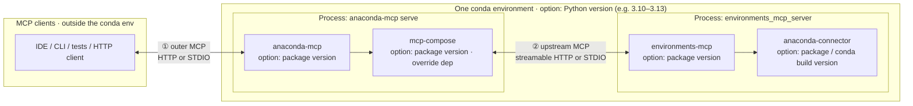

# Test design — `mcp_tools`

**Audience:** QA engineers and developers running or extending the unified MCP tool suite.

**Purpose:** Describe *what* we exercise, *which knobs* exist at each layer, and *why* the matrix matters—without duplicating step-by-step install commands (those stay in the main [`README.md`](../README.md) and [`tests/qa/_ai_docs/tech_details/`](../../../_ai_docs/tech_details/)).

---

## 1. End-user stack: conda env, versions, transports

The **whole server-side chain** below runs in **one conda environment** you choose (e.g. `conda run -n …`). **Options on that environment:**

| Option | Meaning |
|--------|---------|
| **Python** | Single interpreter for all imports — typically **3.10–3.13**; must match what your pins support. |
| **Per-product versions** | Independently pinned **`anaconda-mcp`**, **`mcp-compose`**, **`environments-mcp`**, **`anaconda-connector`** (conda/pip/editable). They must be mutually compatible at runtime. |

**MCP transports** (edges **①** and **②**) are **not** extra installs: they are configuration choices. Two **independent** pairs: **①** client ↔ `anaconda-mcp` (outer); **②** `mcp-compose` ↔ `environments_mcp_server` (upstream). The **`environments-mcp` → `anaconda-connector`** link is the Python/conda API inside the EMS process — **not** a third MCP wire.

The QA suite does **not** brute-force every version cross-product. It **does** cover the **transport matrix** (§2) because proxy and framing bugs showed up per hop.



- **①** — How the **MCP client** talks to **`anaconda-mcp`** (streamable HTTP vs STDIO).
- **②** — How **`mcp-compose`** reaches **`environments_mcp_server`** (separate OS process in typical setups; **same conda env** for imports).
- **`mcp-compose`** is usually a **dependency** of `anaconda-mcp`; you can still **override** its version (fork / git) for transport fixes.
- Use **`<br/>`** in Mermaid labels (not `\n`).

---

## 2. Two-hop transport matrix (`--mcp-profile`)

Canonical TOML is generated from [`tests/qa/shared/mcp_compose_profiles.py`](../../shared/mcp_compose_profiles.py). Each profile fixes **① outer** and **② upstream**:

```text
(MCP client) --①--> (anaconda-mcp / mcp-compose) --②--> (environments_mcp_server)
```

| Profile | ① Client → anaconda-mcp | ② mcp-compose → environments-mcp | Why we care |
|---------|---------------------------|-------------------------------------|-------------|
| `http-http` | Streamable HTTP | Streamable HTTP | Common remote / “browser-like” path; matches `start-http-server.sh` style |
| `stdio-http` | STDIO | Streamable HTTP | IDE-style outer STDIO with HTTP upstream—exercises both proxy styles |
| `stdio-stdio` | STDIO | STDIO | All-stdio; less upstream HTTP churn (e.g. hang / stress regressions) |

**Not covered by default:** `http-stdio` (HTTP outer, STDIO upstream) is valid for mcp-compose but omitted until needed—see `mcp_compose_profiles.py`.

---

## 3. Options at each layer

### 3.1 Test harness (pytest CLI / env)

| Option / variable | Purpose |
|-------------------|--------|
| `--mcp-profile` / `MCP_PROFILE` | Selects the ① + ② matrix row (§2) |
| `--server-url` / `MCP_SERVER_URL` | MCP URL when **① is HTTP** (`http-http`) |
| `--compose-port` / `MCP_COMPOSE_PORT` | Port in generated **http-http** composer config |
| `--downstream-port` / `MCP_DOWNSTREAM_PORT` | Port for **streamable-http** upstream to EMS where applicable |
| `--server-conda-env` / `MCP_SERVER_CONDA_ENV` | Conda env that contains **all** server products (§1) |
| `--start-server` | Auto-start HTTP server via `start-http-server.sh` (`http-http` only) |
| `--skip-hang-stress` / `MCP_QA_SKIP_HANG_STRESS` / `-m "not hang_stress"` | Skip long hang-regression tests |
| `--transport` | Legacy report label; prefer `--mcp-profile` |

Implementation: [`conftest.py`](../conftest.py) (`pytest_addoption`).

### 3.2 `anaconda-mcp` + `mcp-compose` (config and versions)

| Knob | What varies |
|------|-------------|
| **`anaconda-mcp` version** | Release or editable checkout in the server env. |
| **`mcp-compose` version** | Transitive dependency; **override** with `pip install` (fork / git) for transport fixes—see main [`README.md`](../README.md). |
| **Generated mcp-compose TOML** | Tests write a **temp** file from `mcp_compose_profiles`; they do **not** select transport by editing the packaged [`src/anaconda_mcp/mcp_compose.toml`](../../../../src/anaconda_mcp/mcp_compose.toml). |
| **`[transport]`** | Enables **①** outer STDIO vs streamable HTTP. |
| **Proxied server blocks** | **`streamable-http`** vs **`stdio`** blocks configure **②** toward EMS. |
| **Ports / `command`** | Downstream port and `python -m environments_mcp_server start --transport …`. |

### 3.3 `environments-mcp` + `anaconda-connector`

| Knob | What varies |
|------|-------------|
| **`environments-mcp` version** | Release or editable in the **same** env as `anaconda-mcp`. |
| **EMS process transport** | Matches **②** (streamable-http with port, or stdio). |
| **`anaconda-connector` / `anaconda-connector-conda` version** | Conda/pip pin; must import as `anaconda_connector_conda` or tool registration can fail. |

---

## 4. What the suite asserts (summary)

- **Functional:** MCP tool calls over the selected profile (list envs, resolve, etc.—see test modules under `tests/qa/mcp_tools/`).
- **Regression / stress:** Hang-related tests (`hang_stress`) exercise repeated calls through mcp-compose; STDIO timeouts define “hang” for those tests—see [`reporting.md`](reporting.md) for where stderr tails appear in HTML reports.

---

## 5. Related documents

| Document | Content |
|----------|---------|
| [`README.md`](../README.md) | Quick start, envs, commands |
| [`reporting.md`](reporting.md) | pytest-html, log extras, stderr capture |
| [`tests/qa/_ai_docs/tests/automation/TESTS_API_TOOLS.md`](../../../_ai_docs/tests/automation/TESTS_API_TOOLS.md) | Automation / CI notes |
| [`tests/qa/_ai_docs/tech_details/LOCAL-DEV-SETUP.md`](../../../_ai_docs/tech_details/LOCAL-DEV-SETUP.md) | Editable installs, troubleshooting |
| [`tests/qa/_ai_docs/tech_details/INSTALL_OPTIONS.md`](../../../_ai_docs/tech_details/INSTALL_OPTIONS.md) | Alternative install stacks |
