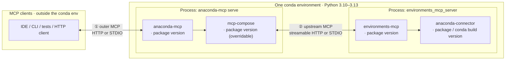
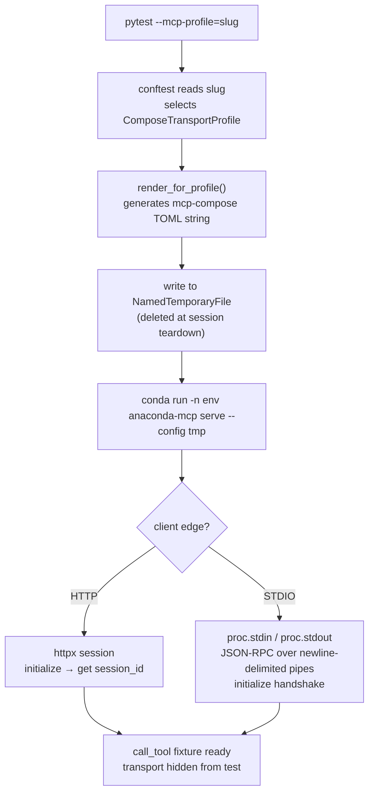
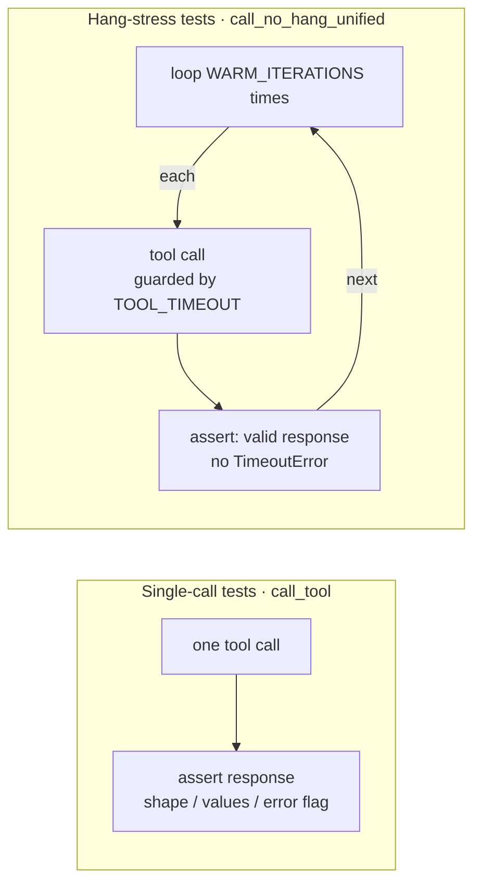

# Test design — `mcp_tools`

**Audience:** QA engineers and developers running or extending the unified MCP tool suite.

**Scope:** Functional MCP tool calls over each transport profile + hang / stress regressions (marked `hang_stress`).
See test modules under `tests/qa/mcp_tools/` for the full list; see [`reporting.md`](reporting.md) for HTML report and log locations.

**This doc covers:** what we test, how the stack is wired, which knobs exist at each layer, and why the transport matrix matters.
Install commands and env setup live in [`README.md`](../README.md).

---

## 1. Stack: conda env, versions, transports

The **whole server-side chain** runs inside **one conda environment** (passed as `--server-conda-env`):

- **Python:** single interpreter for all imports — typically **3.10–3.13**; must match all package pins.
- **Versions:** independently pinned `anaconda-mcp`, `mcp-compose`, `environments-mcp`, `anaconda-connector` (conda/pip/editable). Must be mutually compatible at runtime.
- **Transports ① and ②:** configuration choices, not separate installs — see diagram below.

The QA suite does **not** brute-force every version cross-product. It **does** cover the **transport matrix** (§2) because proxy and framing bugs surfaced per hop.

- **①** — transport between the **MCP client** and **`anaconda-mcp`**: streamable HTTP or STDIO.
- **②** — transport between **`mcp-compose`** and **`environments_mcp_server`**: streamable HTTP or STDIO. Independent of ①.
- **`environments-mcp` → `anaconda-connector`** — Python API for conda operations inside the EMS process; not a third MCP wire.
- **`mcp-compose`** ships as a dependency of `anaconda-mcp`; it can be **overridden** (fork / git) to test transport fixes without changing `anaconda-mcp` itself.

---

## 2. Two-hop transport matrix (`--mcp-profile`)

Each `--mcp-profile` value fixes both **①** and **②** independently.
Canonical TOML is generated from [`tests/qa/shared/mcp_compose_profiles.py`](../../shared/mcp_compose_profiles.py) — tests do **not** select transport by editing the packaged `mcp_compose.toml`.

| Profile | ① client → anaconda-mcp | ② mcp-compose → environments-mcp | Why we care |
|---------|--------------------------|--------------------------------------|-------------|
| `http-http` | Streamable HTTP | Streamable HTTP | Standard remote / "browser-like" path; matches `start-http-server.sh` |
| `stdio-http` | STDIO | Streamable HTTP | IDE-style outer STDIO with HTTP upstream — exercises both proxy styles |
| `stdio-stdio` | STDIO | STDIO | All-stdio; less upstream HTTP churn; used for hang / stress regressions |

**Not covered by default:** `http-stdio` (HTTP outer, STDIO upstream) is valid for mcp-compose but omitted until the product explicitly needs it — see `mcp_compose_profiles.py`.

---

## 3. Options at each layer

### 3.1 Test harness (pytest CLI / env)

Every flag has an equivalent **env var** that takes effect when the flag is not passed. Use env vars when:
- **CI / pipeline matrix** — pipeline tools (GitHub Actions, Jenkins) inject env vars per job natively.
- **Persistent session** — `export MCP_SERVER_CONDA_ENV=anaconda-mcp-server` once, run pytest many times.
- **`conda run` without activation** — env vars can be prepended to `conda run -n … pytest …`; CLI flags cannot be set from outside the env the same way.

| CLI flag | Env var | Required? | Default | Purpose |
|----------|---------|-----------|---------|---------|
| `--mcp-profile` | `MCP_PROFILE` | No | `http-http` | Transport matrix row (§2): `http-http`, `stdio-http`, `stdio-stdio` |
| `--server-url` | `MCP_SERVER_URL` | No | `http://localhost:9888/mcp` | MCP endpoint — used only when **① is HTTP** (`http-http`) |
| `--compose-port` | `MCP_COMPOSE_PORT` | No | `9888` | Outer HTTP port embedded in generated `http-http` composer config |
| `--downstream-port` | `MCP_DOWNSTREAM_PORT` | No | `5041` | EMS streamable-http port for **②** (ignored for `stdio-stdio`) |
| `--server-conda-env` | `MCP_SERVER_CONDA_ENV` | **Yes for STDIO profiles and `--start-server`** | `anaconda-mcp-server` | Conda env that holds all server products (§1) |
| `--start-server` | `MCP_QA_START_SERVER` | No | `0` (set to `1` to enable) | Auto-start HTTP server via `start-http-server.sh` (`http-http` only); requires `--server-conda-env` |
| `--skip-hang-stress` | `MCP_QA_SKIP_HANG_STRESS` | No | `0` (set to `1` to enable) | Skip `hang_stress`-marked tests; also: `-m "not hang_stress"` |

Implementation: [`conftest.py`](../conftest.py) (`pytest_addoption`).

**Examples:**

| Scenario | Command |
|----------|---------|
| `http-http` — auto-start server, default URL / ports | `pytest tests/qa/mcp_tools -o addopts= --mcp-profile=http-http --start-server --server-conda-env anaconda-mcp-server` |
| `http-http` — external server, custom URL | `pytest tests/qa/mcp_tools -o addopts= --mcp-profile=http-http --server-url http://localhost:9888/mcp` |
| `stdio-stdio` — minimal (no URL needed) | `pytest tests/qa/mcp_tools -o addopts= --mcp-profile=stdio-stdio --server-conda-env anaconda-mcp-server` |
| `stdio-stdio` — skip hang-stress for a faster run | `pytest tests/qa/mcp_tools -o addopts= --mcp-profile=stdio-stdio --server-conda-env anaconda-mcp-server --skip-hang-stress` |
| Any profile — env var style, no env activation needed | `MCP_PROFILE=stdio-stdio MCP_SERVER_CONDA_ENV=anaconda-mcp-server MCP_QA_SKIP_HANG_STRESS=1 conda run -n anaconda-mcp-qa pytest tests/qa/mcp_tools -o addopts=` |
| `http-http` — auto-start via env vars | `MCP_PROFILE=http-http MCP_QA_START_SERVER=1 MCP_SERVER_CONDA_ENV=anaconda-mcp-server conda run -n anaconda-mcp-qa pytest tests/qa/mcp_tools -o addopts=` |

### 3.2 `anaconda-mcp` + `mcp-compose`

| Version | How to change |
|---------|---------------|
| **`anaconda-mcp`** | Install a release or editable checkout (`pip install -e …`) in the server env. |
| **`mcp-compose`** | Transitive dep of `anaconda-mcp`; override with `pip install` (fork / git) to test transport fixes — see [`README.md`](../README.md). |

Transport (① outer) and downstream connection (② upstream, ports) are set by `--mcp-profile` and the port flags in §3.1. The conftest generates the mcp-compose TOML automatically — no manual editing needed.

### 3.3 `environments-mcp` + `anaconda-connector`

| Version | How to change |
|---------|---------------|
| **`environments-mcp`** | Install a release or editable checkout in the **same** env as `anaconda-mcp`. |
| **`anaconda-connector-conda`** | Conda/pip pin; must be importable as `anaconda_connector_conda` — missing import causes tools to fail to register. |

Transport for `environments_mcp_server` (② upstream) is driven by `--mcp-profile`; it is not configured separately.

---

## 4. How `--mcp-profile` works under the hood

Selecting a profile triggers a chain in `conftest.py` that hides all transport detail from the tests themselves:

- **TOML generation** is deterministic: same profile + ports → same config. Source: [`mcp_compose_profiles.py`](../../shared/mcp_compose_profiles.py).
- **STDIO stderr** is redirected to a `NamedTemporaryFile`; on failure, `conftest` appends the tail to the pytest-html report — see [`reporting.md`](reporting.md).
- **Fixture scopes:**

| Fixture | Scope | Used by |
|---------|-------|---------|
| `mcp_server` / `stdio_mcp_module` | `module` | `call_tool` — shared across all tests in a file |
| `stdio_server` | `function` | `call_no_hang_unified` — fresh process per hang-stress test |
| `session_id` | `module` | HTTP only; `None` for STDIO |

---

## 5. What we test and how

### 5.1 Tools and scenarios

| Tool | Happy path | Error path | Hang stress |
|------|:----------:|:----------:|:-----------:|
| `conda_list_environments` | ✓ | | ✓ |
| `conda_install_packages` | ✓ | ✓ | ✓ |
| `conda_remove_environment` | | ✓ | ✓ |
| `conda_create_environment` | ✓ | | |

### 5.2 Two test types

| | Single-call | Hang-stress |
|-|-------------|-------------|
| **Fixture** | `call_tool` (module-scoped server) | `call_no_hang_unified` (function-scoped fresh server for STDIO) |
| **Iterations** | 1 | `WARM_ITERATIONS = 20` |
| **Timeout guard** | `TOOL_CALL_WALL_SECONDS` (wall clock) | `TOOL_TIMEOUT = 60 s` per iteration |
| **Marks** | `regression`, `slow` | `hang_stress`, `regression`, `slow` |
| **Skip with** | — | `--skip-hang-stress` / `MCP_QA_SKIP_HANG_STRESS=1` |

**Why iterations?** [KI-011](../../../_ai_docs/_tracking/KNOWN_ISSUES.md#ki-011-mcp-compose-proxy-hangs-and-corrupts-session-on-tool-error) ([DESK-1409](https://anaconda.atlassian.net/browse/DESK-1409), [DESK-1355](https://anaconda.atlassian.net/browse/DESK-1355)) — in production, the proxy hang required ~47 minutes of LLM use to trigger. The root cause is mcp-compose proxy state accumulated across calls, invisible to a single-call test. `WARM_ITERATIONS=20` with a small `ITERATION_DELAY` between calls replicates enough accumulated state to surface the regression in minutes.

### 5.3 Marks and how to use them

| Mark | Meaning | How to select / skip |
|------|---------|----------------------|
| `regression` | Guards a known bug or confirmed defect. Always run before a release. | `-m regression` |
| `slow` | Takes longer than a trivial assertion (conda operations, server startup). | `-m "not slow"` to exclude |
| `hang_stress` | Repeats tool calls N times to surface proxy-state bugs (KI-011). Safe to skip for a quick smoke run; must pass before release. | `--skip-hang-stress` / `MCP_QA_SKIP_HANG_STRESS=1` / `-m "not hang_stress"` |

For per-test detail (which KI each test guards, reproduction notes), read the module docstring directly — e.g. `test_guard_proxy_error_hang.py`.
